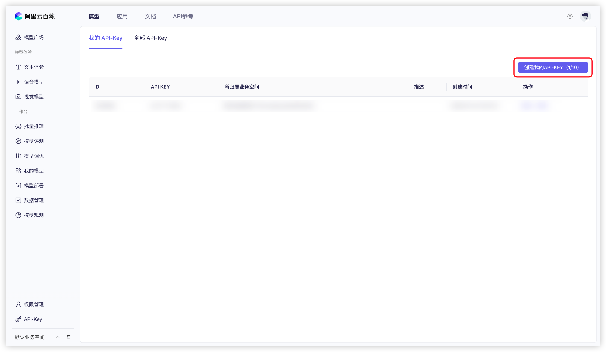
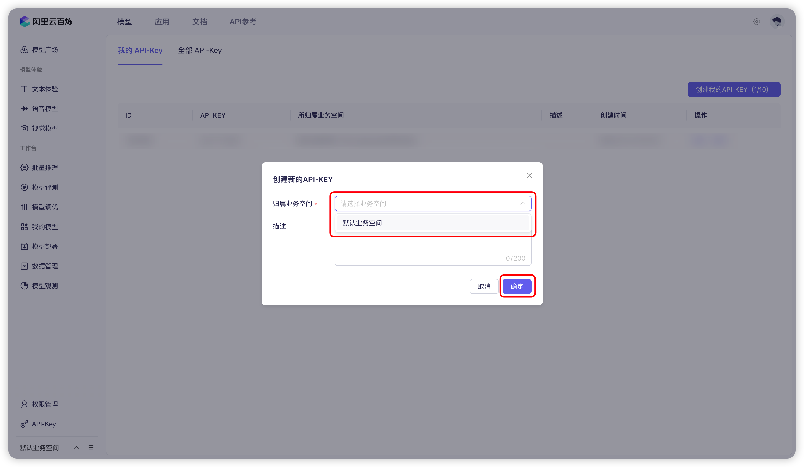
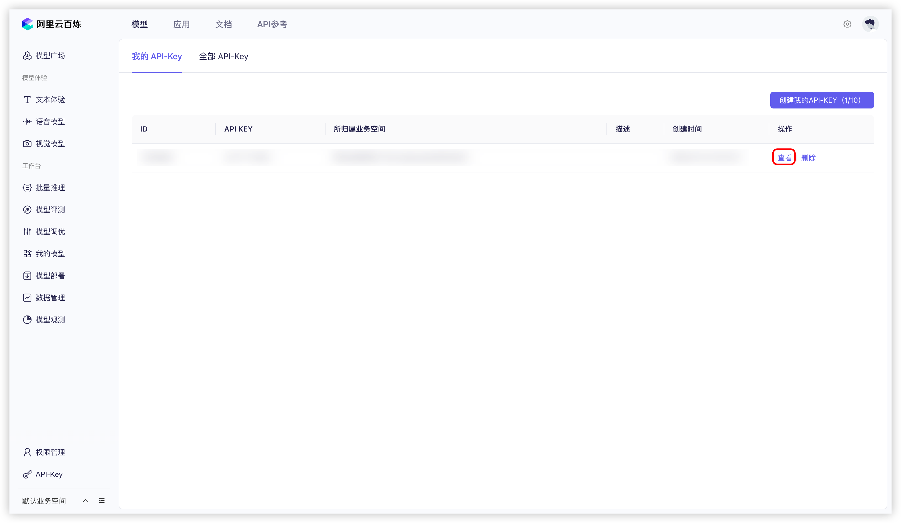
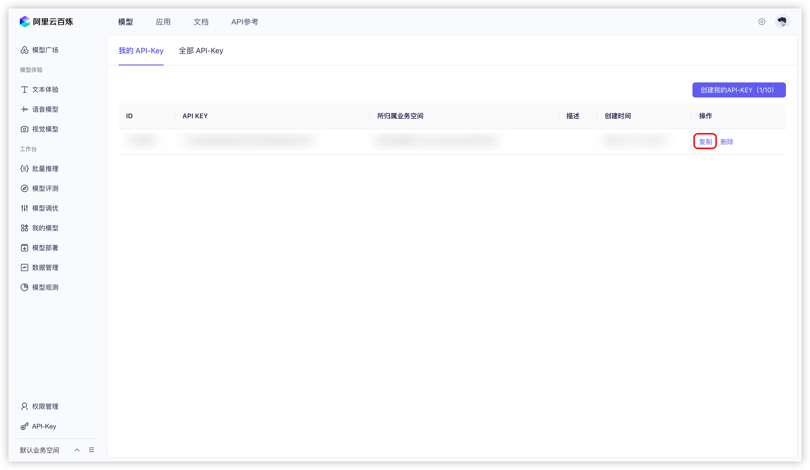
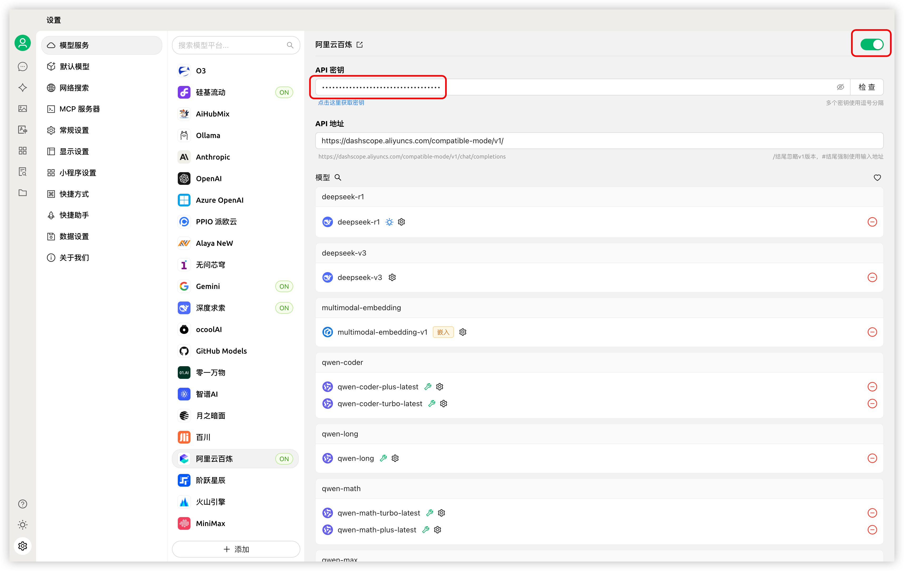


Этот документ переведен с китайского языка с помощью ИИ и еще не был проверен.


# Alibaba Cloud Bailian

1. Войдите в [Alibaba Cloud Bailian](https://bailian.console.aliyun.com/?tab=model#/api-key). Если у вас нет учётной записи Alibaba Cloud, необходимо зарегистрироваться.

2. Нажмите кнопку `创建我的 API-KEY` в правом верхнем углу.
  <figure><figcaption>Создание API-ключа в Alibaba Cloud Bailian</figcaption></figure>
  
3. В открывшемся окне выберите пространство по умолчанию (или создайте своё), при необходимости заполните описание.
  <figure><figcaption>Окно создания API-ключа в Alibaba Cloud Bailian</figcaption></figure>
  
4. Нажмите кнопку `确定` в правом нижнем углу.

5. В списке появится новая запись, нажмите кнопку `查看` справа.
   <figure><figcaption>Просмотр API-ключа в Alibaba Cloud Bailian</figcaption></figure>
   
6. Нажмите кнопку `复制`.
    <figure><figcaption>Копирование API-ключа в Alibaba Cloud Bailian</figcaption></figure>

7. Перейдите в Cherry Studio, в разделе `设置` → `模型服务` → `阿里云百炼` найдите поле `API 密钥`, вставьте скопированный ключ.
    <figure><figcaption>Добавление API-ключа в Cherry Studio</figcaption></figure>
    
8. Настройте параметры согласно инструкции в разделе [Модельные сервисы](../../cherrystudio/preview/settings/providers.md), после чего сервис будет готов к использованию.

Если в списке моделей отсутствуют модели Alibaba Cloud Bailian, убедитесь, что вы добавили модели согласно инструкции в разделе [Модельные сервисы](../../cherrystudio/preview/settings/providers.md) и включили этого провайдера.
