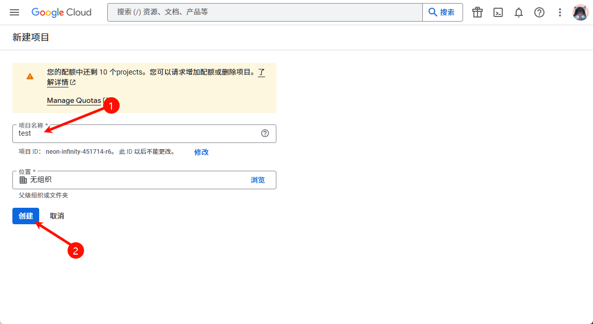
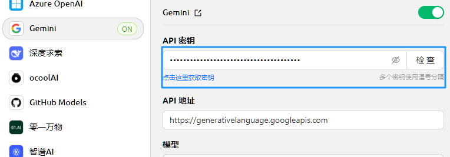


Этот документ переведен с китайского языка с помощью ИИ и еще не был проверен.


# Google Gemini

## Получение API-ключа

* Перед получением API-ключа для Gemini у вас должен быть проект Google Cloud (если он уже есть, этот шаг можно пропустить)
* Перейдите в [Google Cloud](https://console.cloud.google.com/projectcreate), создайте проект, введите название проекта и нажмите "Создать проект"

<figure><figcaption></figcaption></figure>

* На официальной [странице API-ключа](https://aistudio.google.com/app/apikey?hl=zh-cn) нажмите `密钥 创建API密钥` (Создать API-ключ)

<figure><figcaption></figcaption></figure>

* Скопируйте сгенерированный ключ и откройте [настройки провайдеров](broken-reference) в CherryStudio
* Найдите провайдера Gemini и введите полученный ключ

<figure><figcaption></figcaption></figure>

* Нажмите "Управление" или "Добавить" внизу, подключите поддерживаемые модели и активируйте переключатель провайдера в правом верхнем углу для начала использования.


- В Китае (кроме Тайваня) сервис Google Gemini недоступен напрямую — требуется самостоятельно решить вопрос с прокси;
