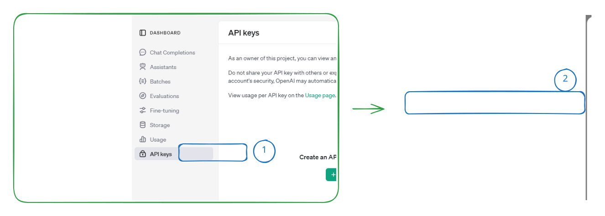
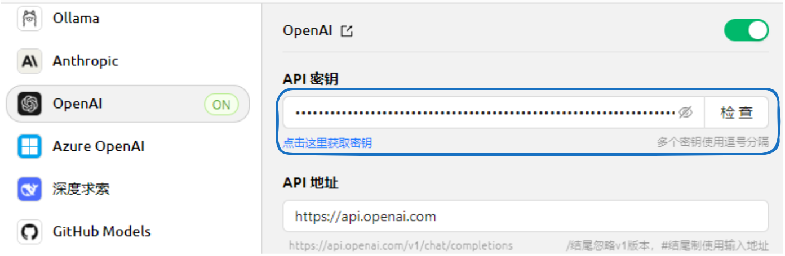

# OpenAI


Этот документ переведен с китайского языка с помощью ИИ и еще не был проверен.


## Получение API Key

* На официальной странице [API Key](https://platform.openai.com/api-keys) нажмите <mark style="background-color:green;">`+ Create new secret key`</mark>

* Скопируйте сгенерированный ключ и откройте [настройки провайдеров](../../pre-basic/settings/providers.md) в CherryStudio
* Найдите провайдера OpenAI и вставьте полученный ключ

<figure><figcaption></figcaption></figure>

* Нажмите "Управление" или "Добавить", подключите поддерживаемые модели и активируйте переключатель провайдера в правом верхнем углу для начала использования.


- В Китае (за исключением Тайваня) сервисы OpenAI недоступны напрямую; требуется самостоятельно решить вопрос с прокси.
- Необходимо наличие положительного баланса.
