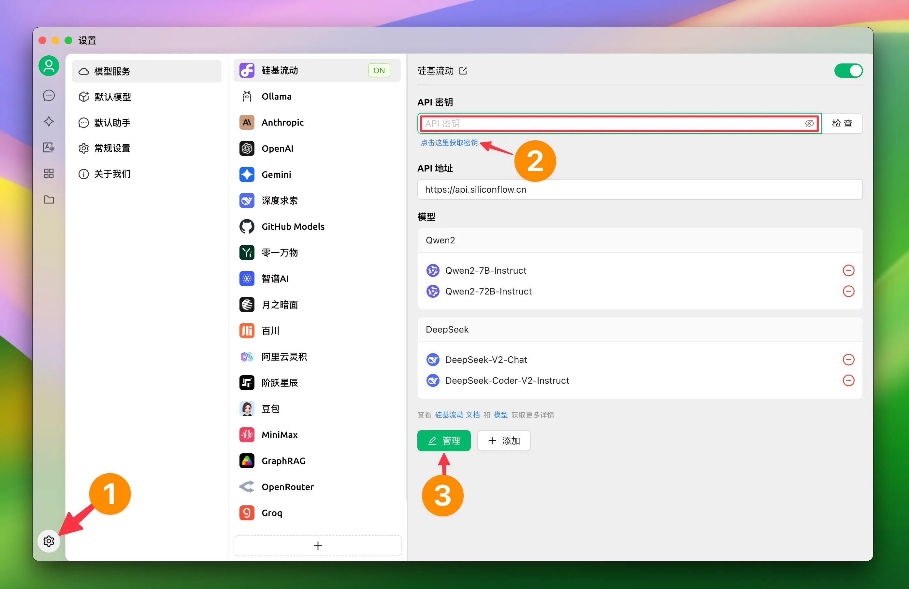
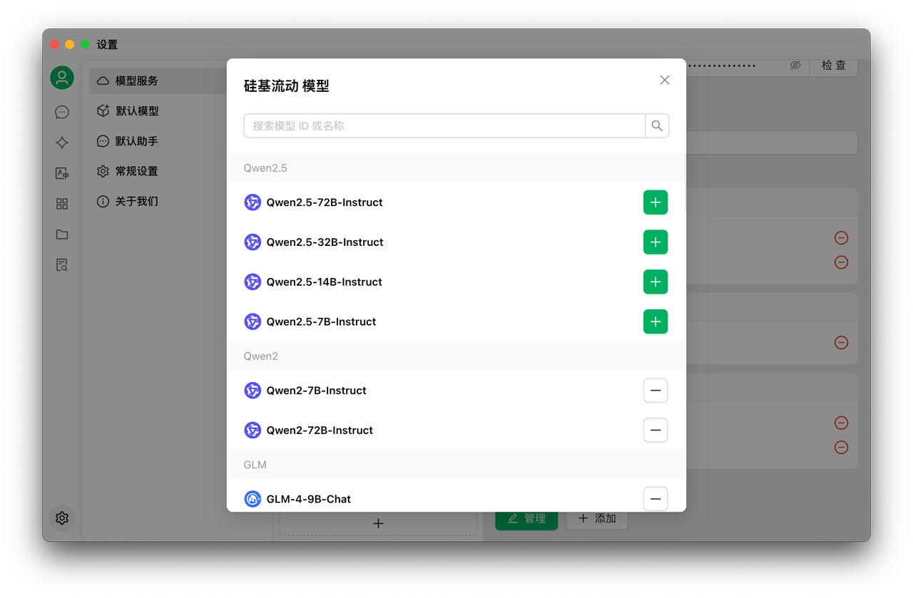
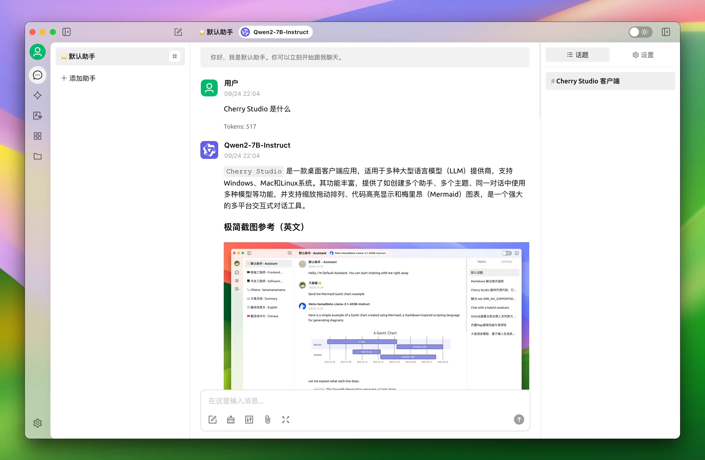

# Silicon Flow

## 1. Настройка модельного сервиса SiliconCloud 

#### 1.2 Нажмите настройки в левом нижнем углу и выберите【Silicon Flow】в разделе модельных сервисов 

<figure><figcaption></figcaption></figure>

#### 1.2 Перейдите по ссылке для получения API-ключа SiliconCloud 

1. Войдите в [SiliconCloud](https://cloud.siliconflow.cn/) (при первом входе система автоматически зарегистрирует аккаунт)
2. Перейдите в раздел [API-ключи](https://cloud.siliconflow.cn/account/ak), чтобы создать новый или скопировать существующий ключ

<figure><figcaption></figcaption></figure>

#### 1.3 Нажмите "Управление" для добавления моделей 

<figure><figcaption></figcaption></figure>

## 2. Использование модельного сервиса 

1. Нажмите кнопку "Диалог" в левом меню
2. Введите текст в поле ввода, чтобы начать чат
3. Модель можно сменить, выбрав её название в верхнем меню

<figure><figcaption></figcaption></figure>