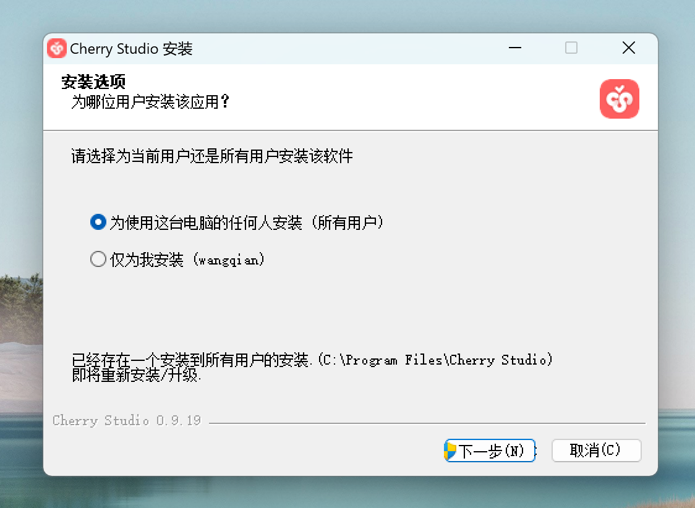

# Часто задаваемые вопросы


Этот документ переведен с китайского языка с помощью ИИ и еще не был проверен.


## Распространённые коды ошибок

* **4xx (ошибки клиента)**: Обычно возникают из-за синтаксических ошибок запроса, сбоев аутентификации или авторизации.
* **5xx (ошибки сервера)**: Обычно вызваны проблемами на стороне сервера (сбои, таймауты обработки запросов).

| Код ошибки | Возможные причины                                                                                                                                                                                                                                                                                                                                                                                                                                                                                         | Решение                                                                                                                                                                                                                                                                                                                                                                                                                                                                                                                                                                                                                                                                                                                 |
| ---------- | ---------------------------------------------------------------------------------------------------------------------------------------------------------------------------------------------------------------------------------------------------------------------------------------------------------------------------------------------------------------------------------------------------------------------------------------------------------------------------------------------------------- | ----------------------------------------------------------------------------------------------------------------------------------------------------------------------------------------------------------------------------------------------------------------------------------------------------------------------------------------------------------------------------------------------------------------------------------------------------------------------------------------------------------------------------------------------------------------------------------------------------------------------------------------------------------------------------------------------------------------------- |
| **400**    | Ошибка формата тела запроса                                                                                                                                                                                                                                                                                                                                                                                                                                                                                | 
Проверьте возвращённое сообщение об ошибке или <a href="questions.md#kong-zhi-tai-bao-cuo-cha-kan-fang-fa">откройте консоль</a> для просмотра ошибки. Действуйте согласно инструкциям.

<a href="questions.md#kong-zhi-tai-bao-cuo-cha-kan-fang-fa"><mark style="color:purple;">[Ситуация 1]</mark>: Для моделей Gemini может потребоваться привязка карты; <mark style="color:purple;">[Ситуация 2]</mark>: Превышен допустимый размер данных (особенно для визуальных моделей); <mark style="color:purple;">[Ситуация 3]</mark>: Использованы неподдерживаемые параметры. Проверьте с чистым ассистентом; <mark style="color:purple;">[Ситуация 4]</mark>: Превышен лимит контекста. Очистите контекст или сократите количество сообщений.</a>
          |
| **401**    | Сбой аутентификации: модель не поддерживается или аккаунт заблокирован                                                                                                                                                                                                                                                                                                                                                                                                                                     | Проверьте статус аккаунта у провайдера                                                                                                                                                                                                                                                                                                                                                                                                                                                                                                                                                                                                                                                                                  |
| **403**    | Отсутствие прав для операции                                                                                                                                                                                                                                                                                                                                                                                                                                                                               | Следуйте инструкциям в сообщении об ошибке или в [консоли](questions.md#kong-zhi-tai-bao-cuo-cha-kan-fang-fa)                                                                                                                                                                                                                                                                                                                                                                                                                                                                                                                                                                                                           |
| **404**    | Ресурс не найден                                                                                                                                                                                                                                                                                                                                                                                                                                                                                           | Проверьте путь запроса                                                                                                                                                                                                                                                                                                                                                                                                                                                                                                                                                                                                                                                                                                  |
| **422**    | Семантическая ошибка при корректном формате                                                                                                                                                                                                                                                                                                                                                                                                                                                                | Часто возникает при ошибках в JSON (пустые значения, неверный тип данных)                                                                                                                                                                                                                                                                                                                                                                                                                                                                                                                                                                                                                                               |
| **429**    | Превышен лимит запросов                                                                                                                                                                                                                                                                                                                                                                                                                                                                                    | Превышены лимиты RPM/TPM. Сделайте паузу                                                                                                                                                                                                                                                                                                                                                                                                                                                                                                                                                                                                                                                                                |
| **500**    | Внутренняя ошибка сервера                                                                                                                                                                                                                                                                                                                                                                                                                                                                                  | При постоянных ошибках обратитесь к провайдеру                                                                                                                                                                                                                                                                                                                                                                                                                                                                                                                                                                                                                                                                          |
| **501**    | Функция не реализована                                                                                                                                                                                                                                                                                                                                                                                                                                                                                     |                                                                                                                                                                                                                                                                                                                                                                                                                                                                                                                                                                                                                                                                                                                         |
| **502**    | Недействительный ответ от вышестоящего сервера                                                                                                                                                                                                                                                                                                                                                                                                                                                             |                                                                                                                                                                                                                                                                                                                                                                                                                                                                                                                                                                                                                                                                                                                         |
| **503**    | Сервис недоступен (перегрузка/техобслуживание)                                                                                                                                                                                                                                                                                                                                                                                                                                                             |                                                                                                                                                                                                                                                                                                                                                                                                                                                                                                                                                                                                                                                                                                                         |
| **504**    | Таймаут ответа от вышестоящего сервера                                                                                                                                                                                                                                                                                                                                                                                                                                                                     |                                                                                                                                                                                                                                                                                                                                                                                                                                                                                                                                                                                                                                                                                                                         |

***

## Как проверить ошибки в консоли

* Нажмите <kbd>Ctrl</kbd> + <kbd>Shift</kbd> + <kbd>I</kbd> в клиенте Cherry Studio (на Mac: <kbd>Command</kbd> + <kbd>Option</kbd> + <kbd>I</kbd>)


- Окно Cherry Studio должно быть активным для запуска консоли
- Консоль необходимо открыть до выполнения запросов (тесты, диалоги)


* В консоли перейдите в <mark style="color:blue;">`Network`</mark> → Найдите последний запрос с красным <mark style="color:red;">`×`</mark> и именем:  – <mark style="color:red;">`completions`</mark> (ошибки диалогов/перевода)  – <mark style="color:red;">`generations`</mark> (ошибки генерации изображений) → Изучите полный ответ в разделе <mark style="color:blue;">`Response`</mark>.

> Если ошибка неясна, отправьте скриншот экрана в [официальный чат](https://t.me/CherryStudioAI).

<figure><figcaption></figcaption></figure>

Метод работает для: диалогов, тестирования моделей, создания базы знаний, генерации изображений. Важно открывать консоль перед выполнением запроса.·


Имена в колонке Name:
- Диалоги/переводы: <mark style="color:red;">`completions`</mark>
- Генерация изображений: <mark style="color:red;">`generations`</mark>
- Создание базы знаний: <mark style="color:red;">`embeddings`</mark>


***

## Ошибки отображения формул

* **Формула отображается как код**: Проверьте использование ограничителей:
> **Формат ограничителей**\
> _Встроенные формулы_\
> · `$формула$` или `\(формула\)`\
> \
> _Отдельные формулы_\
> · `$$формула$$` или `\[формула\]`\
> Пример: `$$\sum_{i=1}^n x_i$$`\
> $$\sum_{i=1}^n x_i$$
* **Искажение формул с кириллицей**: Смените движок рендеринга на KateX.

***

## Ошибки создания базы знаний/свёрток

1. **Модель недоступна**: Убедитесь, что модель поддерживается провайдером и активна.
2. **Использована не-embeddings модель**

***

## Проблемы распознавания изображений

1. Убедитесь, что модель **поддерживает обработку изображений** (имеет иконку 👁️).
2. Для моделей с поддержкой изображений включите опцию "Image" в настройках модели у провайдера.
3. **Проверьте спецификации модели** у провайдера — не все модели поддерживают визуальные функции.