# Развертывание и настройка SearXNG

CherryStudio поддерживает веб-поиск через SearXNG — проект с открытым исходным кодом, который можно развернуть локально или на сервере, что отличается от других конфигураций, требующих API-провайдеров.

**Ссылка на проект SearXNG:** [SearXNG](https://github.com/searxng/searxng)

## Преимущества SearXNG

* Открытый исходный код, бесплатный, не требует API
* Относительно высокая конфиденциальность
* Высокая степень кастомизации

## Локальное развертывание

### I. Прямое развертывание через Docker

Поскольку SearXNG не требует сложной настройки окружения, можно обойтись без docker compose. Достаточно просто предоставить свободный порт. Самый быстрый способ — использовать Docker для загрузки и развертывания образа.

#### 1. Установка и настройка [docker](https://www.docker.com/)

<figure>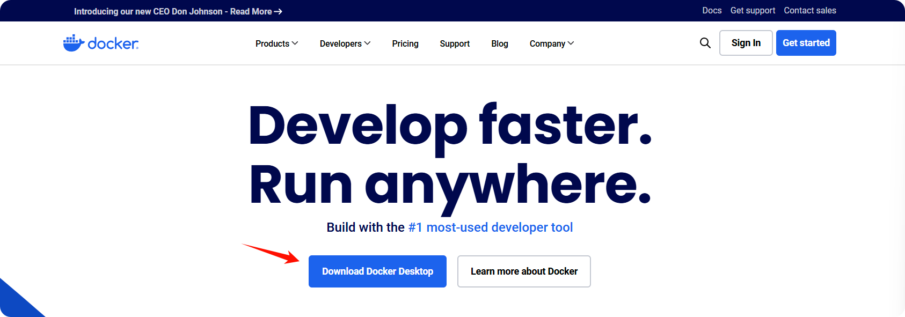<figcaption></figcaption></figure>

После установки выберите путь для хранения образов:

<figure>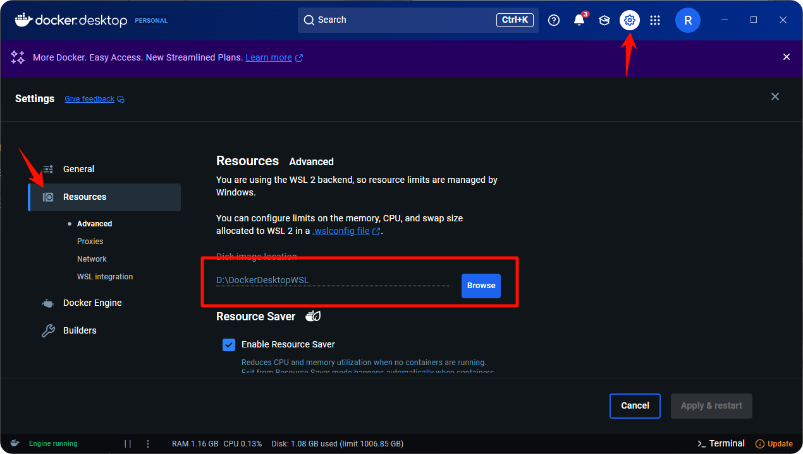<figcaption></figcaption></figure>

#### 2. Поиск и загрузка образа SearXNG

Введите в поиск **searxng**:

<figure>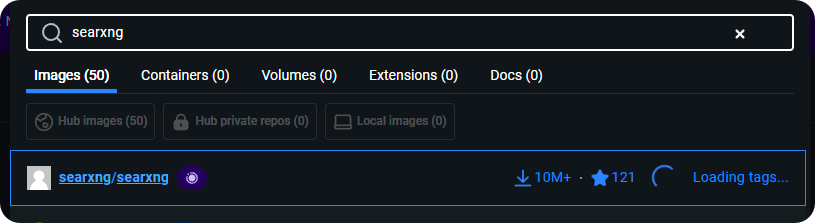<figcaption></figcaption></figure>

Загрузите образ:

<figure>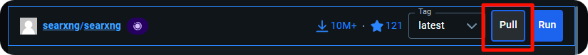<figcaption></figcaption></figure>

<figure>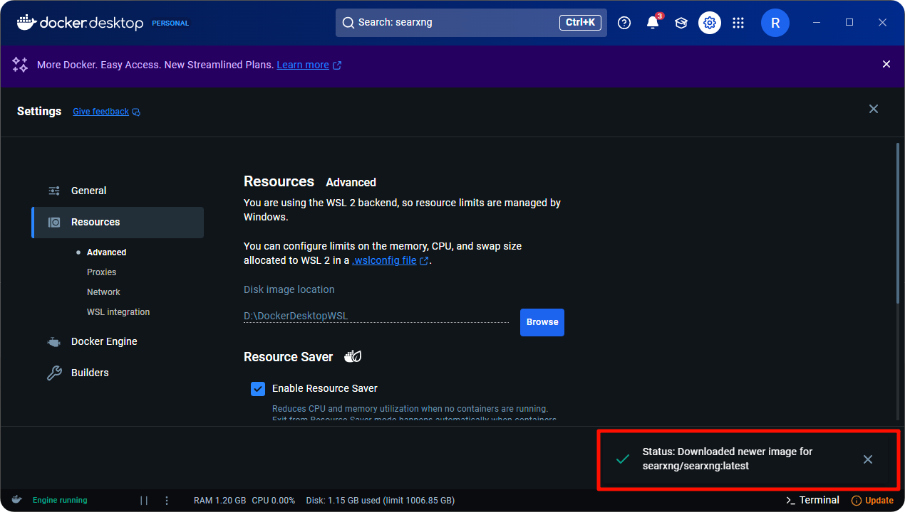<figcaption></figcaption></figure>

#### 3. Запуск образа

После успешной загрузки перейдите на вкладку **Images**:

<figure>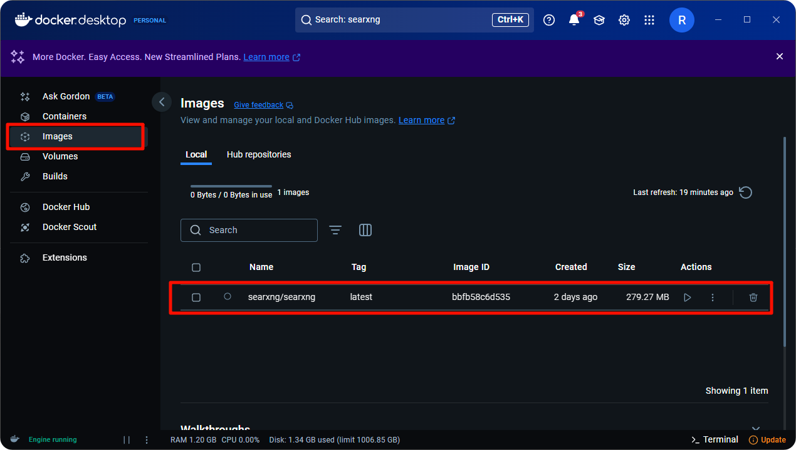<figcaption></figcaption></figure>

Выберите загруженный образ и нажмите "Run":

<figure>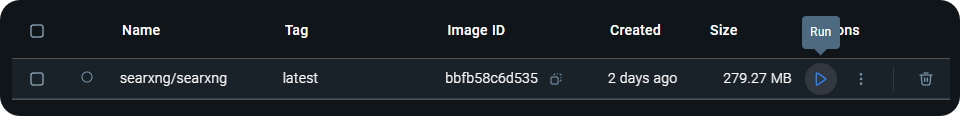<figcaption></figcaption></figure>

Откройте настройки для конфигурации:

<figure>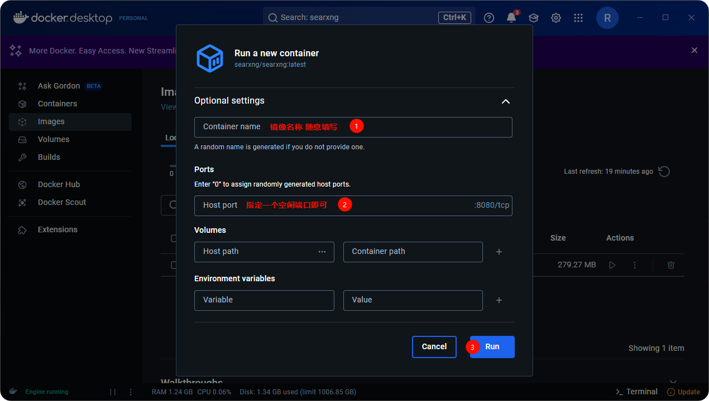<figcaption></figcaption></figure>

В качестве примера используем порт `8085`:

<figure>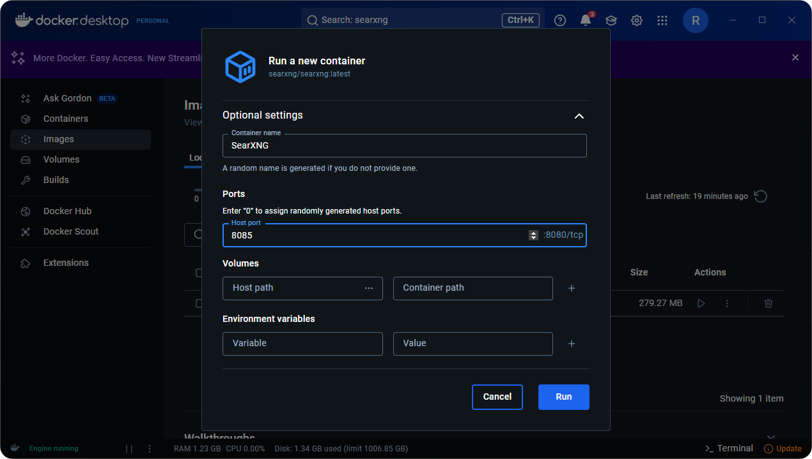<figcaption></figcaption></figure>

После успешного запуска нажмите на ссылку для открытия интерфейса SearXNG:

<figure>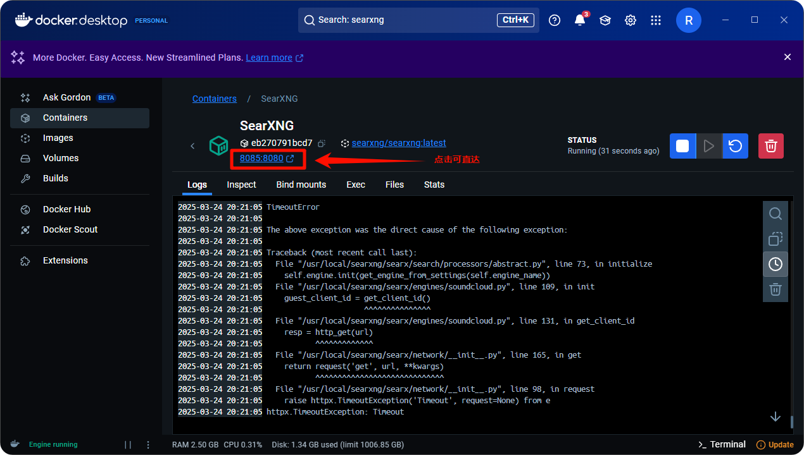<figcaption></figcaption></figure>

Появление этой страницы означает успешное развертывание:

<figure>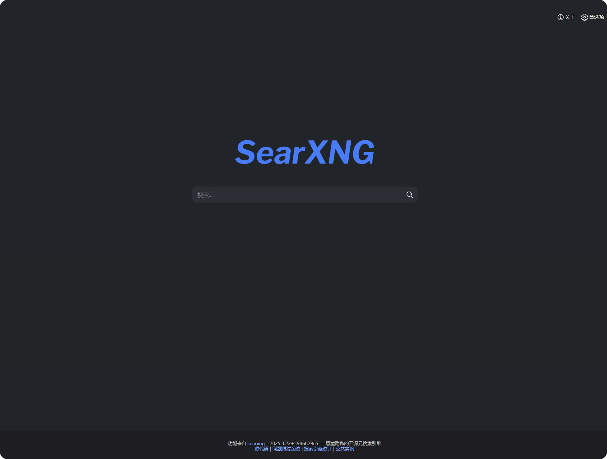<figcaption></figcaption></figure>

## Развертывание на сервере

Учитывая, что установка Docker в Windows — довольно сложный процесс, пользователи могут развернуть SearXNG на сервере, чтобы предоставить к нему доступ другим. К сожалению, SearXNG пока не поддерживает аутентификацию, из-за чего злоумышленники могут сканировать и злоупотреблять вашим экземпляром.

Поэтому Cherry Studio теперь поддерживает [HTTP Basic Authentication (RFC7617)](https://developer.mozilla.org/zh-CN/docs/Web/HTTP/Guides/Authentication). Если вы развертываете SearXNG в публичной сети, **обязательно** настройте HTTP Basic Auth через обратный прокси (например, Nginx). Далее приведен краткий гайд, требующий базовых знаний администрирования Linux.

### Развертывание SearXNG

Аналогично используем Docker для развертывания. Предположим, что вы установили последнюю версию Docker CE по [официальной инструкции](https://docs.docker.com/engine/install). Команды ниже подходят для свежей установки на Debian:

```bash
sudo apt update
sudo apt install git -y

# Клонируем официальный репозиторий
cd /opt
git clone https://github.com/searxng/searxng-docker.git
cd /opt/searxng-docker

# Установите false, если у сервера низкая пропускная способность
export IMAGE_PROXY=true

# Редактируем конфиг
cat <<EOF > /opt/searxng-docker/searxng/settings.yml
# see https://docs.searxng.org/admin/settings/settings.html#settings-use-default-settings
use_default_settings: true
server:
  # base_url is defined in the SEARXNG_BASE_URL environment variable, see .env and docker-compose.yml
  secret_key: $(openssl rand -hex 32)
  limiter: false  # can be disabled for a private instance
  image_proxy: $IMAGE_PROXY
ui:
  static_use_hash: true
redis:
  url: redis://redis:6379/0
search:
  formats:
    - html
    - json
EOF
```

Если нужно изменить порт или использовать локальный nginx, отредактируйте `docker-compose.yaml`:

```yaml
version: "3.7"

services:
# Удалите блок ниже, если используете локальный Nginx вместо Caddy
  caddy:
    container_name: caddy
    image: docker.io/library/caddy:2-alpine
    network_mode: host
    restart: unless-stopped
    volumes:
      - ./Caddyfile:/etc/caddy/Caddyfile:ro
      - caddy-data:/data:rw
      - caddy-config:/config:rw
    environment:
      - SEARXNG_HOSTNAME=${SEARXNG_HOSTNAME:-http://localhost}
      - SEARXNG_TLS=${LETSENCRYPT_EMAIL:-internal}
    cap_drop:
      - ALL
    cap_add:
      - NET_BIND_SERVICE
    logging:
      driver: "json-file"
      options:
        max-size: "1m"
        max-file: "1"
# Удалите блок выше, если используете локальный Nginx вместо Caddy
  redis:
    container_name: redis
    image: docker.io/valkey/valkey:8-alpine
    command: valkey-server --save 30 1 --loglevel warning
    restart: unless-stopped
    networks:
      - searxng
    volumes:
      - valkey-data2:/data
    cap_drop:
      - ALL
    cap_add:
      - SETGID
      - SETUID
      - DAC_OVERRIDE
    logging:
      driver: "json-file"
      options:
        max-size: "1m"
        max-file: "1"

  searxng:
    container_name: searxng
    image: docker.io/searxng/searxng:latest
    restart: unless-stopped
    networks:
      - searxng
    # По умолчанию пробрасывается на порт 8080 хоста. Для порта 8000 измените на "127.0.0.1:8000:8080"
    ports:
      - "127.0.0.1:8080:8080"
    volumes:
      - ./searxng:/etc/searxng:rw
    environment:
      - SEARXNG_BASE_URL=https://${SEARXNG_HOSTNAME:-localhost}/
      - UWSGI_WORKERS=${SEARXNG_UWSGI_WORKERS:-4}
      - UWSGI_THREADS=${SEARXNG_UWSGI_THREADS:-4}
    cap_drop:
      - ALL
    cap_add:
      - CHOWN
      - SETGID
      - SETUID
    logging:
      driver: "json-file"
      options:
        max-size: "1m"
        max-file: "1"

networks:
  searxng:

volumes:
# Удалите блок ниже, если используете локальный Nginx
  caddy-data:
  caddy-config:
# Удалите блок выше, если используете локальный Nginx
  valkey-data2:
```

Запустите через `docker compose up -d`. Логи можно посмотреть командой `docker compose logs -f searxng`.

### Настройка Nginx обратного прокси и HTTP Basic Auth

При использовании панелей управления (например, Baota или 1Panel) обратитесь к их документации по добавлению сайта и настройке Nginx. Затем найдите раздел конфигурации и внесите изменения:

```conf
server
{
    listen 443 ssl;

    # Укажите ваше доменное имя
    server_name search.example.com;

    # index index.html;
    # root /data/www/default;

    # Для SSL необходимы эти строки
    ssl_certificate    /path/to/your/cert/fullchain.pem;
    ssl_certificate_key    /path/to/your/cert/privkey.pem;

    # HSTS
    # add_header Strict-Transport-Security "max-age=31536000; includeSubDomains; preload";

    # Обратный прокси
    location / {
        # Добавьте эти две строки
        auth_basic "Please enter your username and password";
        auth_basic_user_file /etc/nginx/conf.d/search.htpasswd;

        proxy_http_version 1.1;
        proxy_set_header Connection "";
        proxy_redirect off;
        proxy_set_header Host $host;
        proxy_set_header X-Forwarded-For $proxy_protocol_addr;
        proxy_pass http://127.0.0.1:8000;
        client_max_body_size 0;
    }

    # access_log  ...;
    # error_log  ...;
}
```

Предположим, конфиги Nginx хранятся в `/etc/nginx/conf.d`. Сохраните там же файл паролей.

Выполните команду (замените `example_name` и `example_password`):

```bash
echo "example_name:$(openssl passwd -5 'example_password')" > /etc/nginx/conf.d/search.htpasswd
```

Перезагрузите Nginx (или перечитайте конфиги).

Откройте страницу — должна появиться запрос на аутентификацию. Введите указанные учетные данные для проверки.

<figure>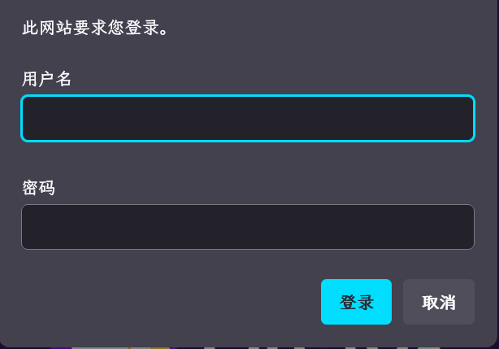<figcaption></figcaption></figure>

## Настройка в Cherry Studio

После успешного развертывания SearXNG перейдите к настройкам CherryStudio.

В разделе настроек веб-поиска выберите Searxng:

<figure>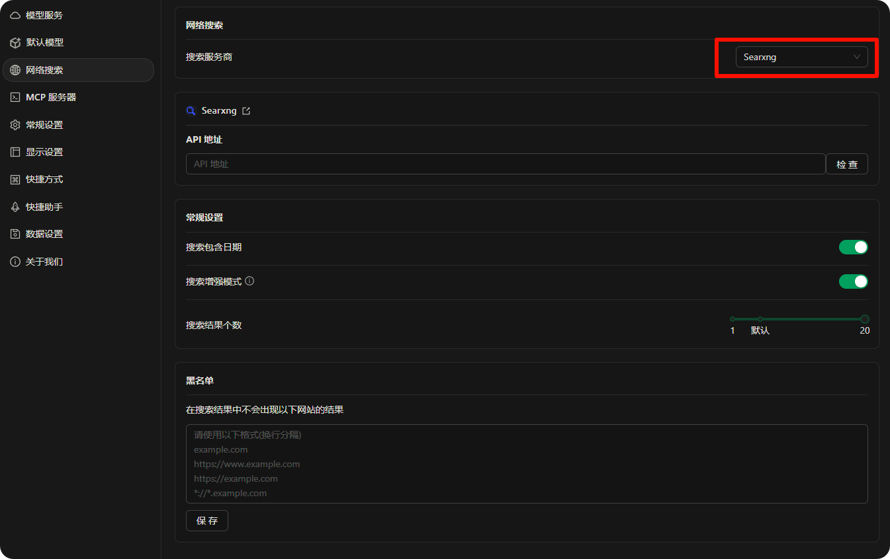<figcaption></figcaption></figure>

При вводе локального адреса может появиться ошибка проверки — это нормально:

<figure>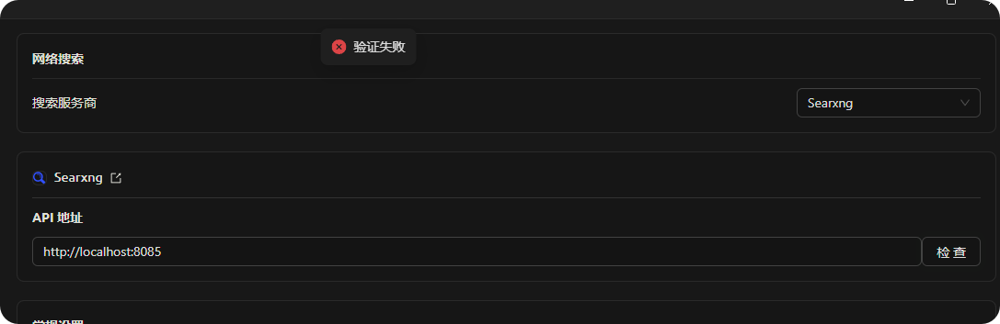<figcaption></figcaption></figure>

Стандартная конфигурация не поддерживает формат JSON, поэтому данные не могут быть получены. Требуется изменить конфиг.

В Docker перейдите на вкладку Files и найдите папку с тегами:

<figure>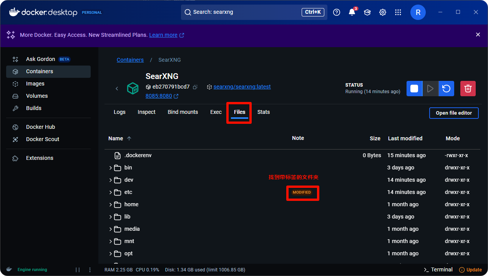<figcaption></figcaption></figure>

Прокрутите вниз до другой папки с тегами:

<figure>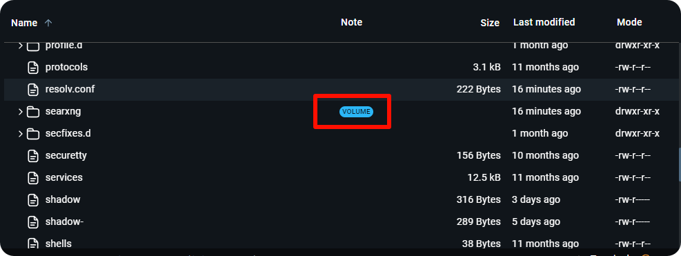<figcaption></figcaption></figure>

Найдите файл конфигурации **settings.yml**:

<figure>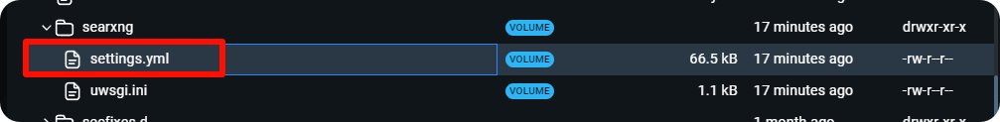<figcaption></figcaption></figure>

Откройте редактор:

<figure>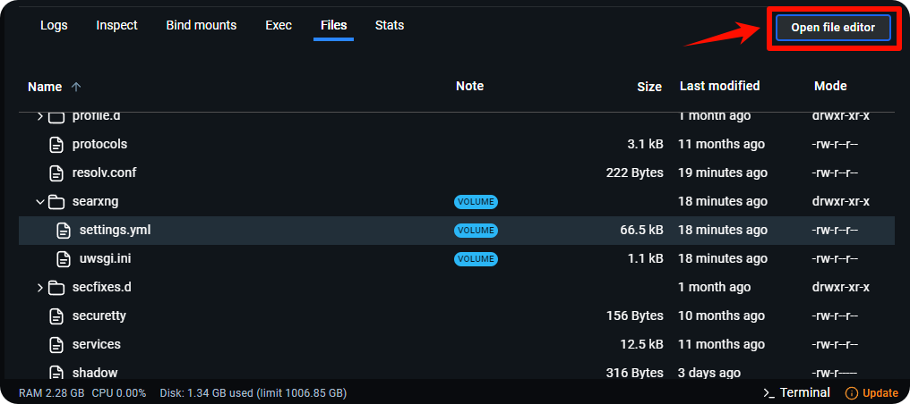<figcaption></figcaption></figure>

На строке 78 виден только один тип данных html:

<figure>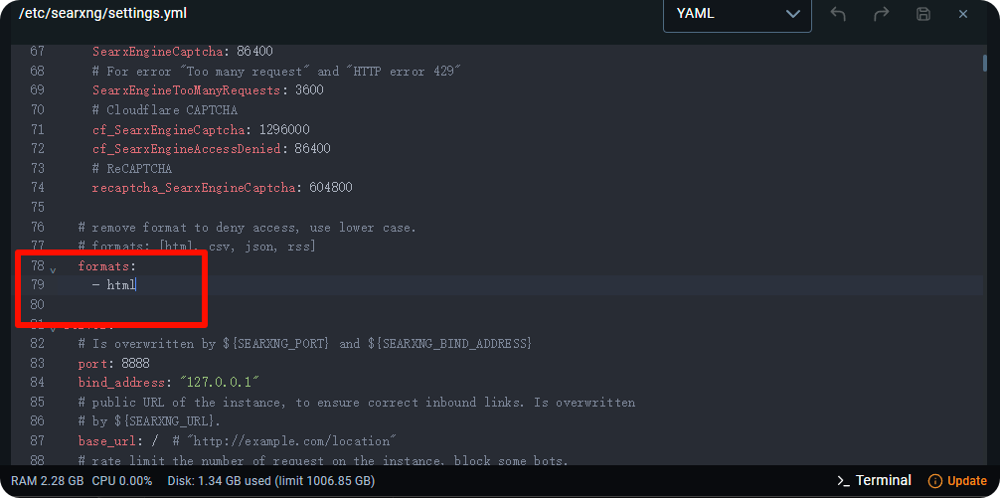<figcaption></figcaption></figure>

Добавьте тип json, сохраните и перезапустите образ:

<figure>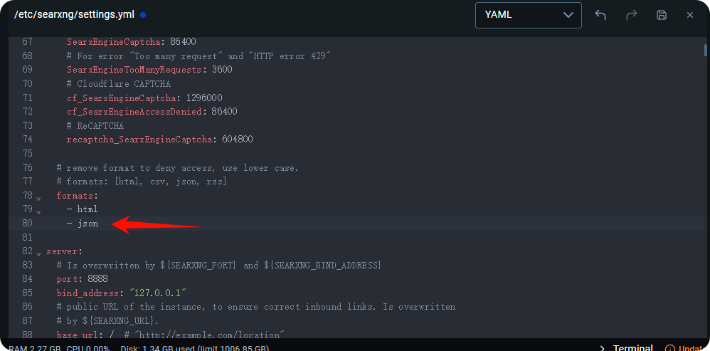<figcaption></figcaption></figure>

<figure>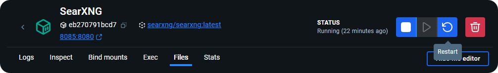<figcaption></figcaption></figure>

Повторно проверьте в Cherry Studio — проверка пройдена:

<figure>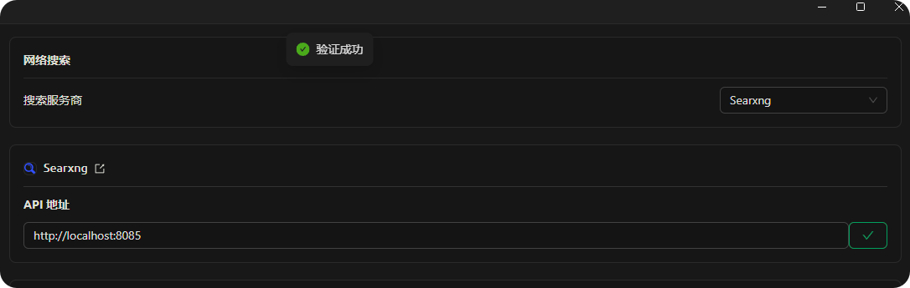<figcaption></figcaption></figure>

Адрес можно указать локальный: <http://localhost>:порт\
Или Docker: <http://host.docker.internal>:порт

Для серверной конфигурации с обратным прокси и включенным форматом json, при проверке с включенной HTTP Basic Auth будет возвращена ошибка 401:

<figure>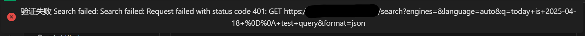<figcaption></figcaption></figure>

Добавьте HTTP Basic Auth в клиенте, введя ранее установленные учетные данные:

<figure>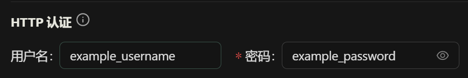<figcaption></figcaption></figure>

Проверка должна завершиться успешно.

### Дополнительные настройки

Теперь SearXNG может выполнять веб-поиск. Для кастомизации поисковых систем потребуется ручная настройка:

Эти настройки не влияют на интеграцию с крупными языковыми моделями:

<figure>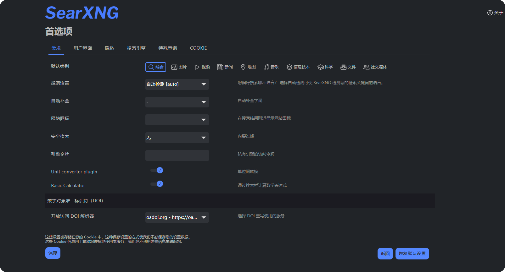<figcaption></figcaption></figure>

Чтобы настроить интеграцию с языковыми моделями, измените конфигурационный файл:

<figure>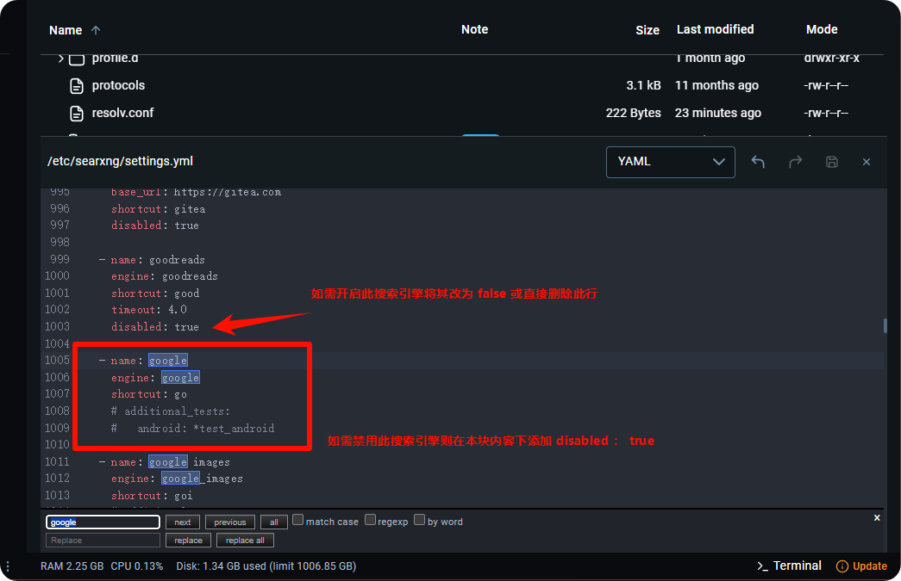<figcaption></figcaption></figure>

<figure>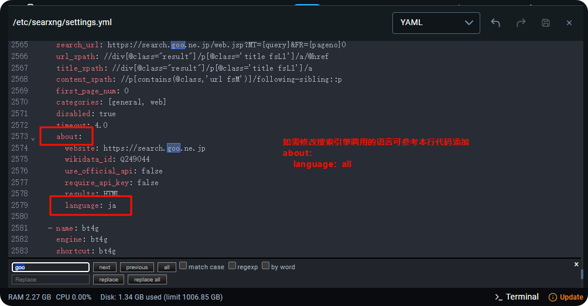<figcaption></figcaption></figure>

Пример языкового конфига:

<figure>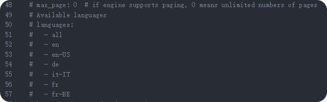<figcaption></figcaption></figure>

Для редактирования больших блоков скопируйте содержимое в локальный редактор, а затем вставьте обратно.

## Распространенные причины сбоя проверки

### Не добавлен формат JSON

Добавьте json в настройках:

<figure>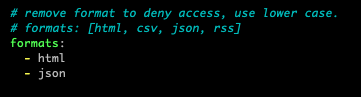<figcaption></figcaption></figure>

### Неправильная настройка поисковой системы

Cherry Studio по умолчанию использует движки, поддерживающие web и general. Google недоступен в некоторых регионах. Чтобы принудительно использовать Baidu, добавьте конфиг:

```
use_default_settings:
  engines:
    keep_only:
      - baidu
engines:
  - name: baidu
    engine: baidu 
    categories: 
      - web
      - general
    disabled: false
```

### Слишком высокая частота запросов

Ограничитель в SearXNG блокирует API. Установите limiter в false:

<figure>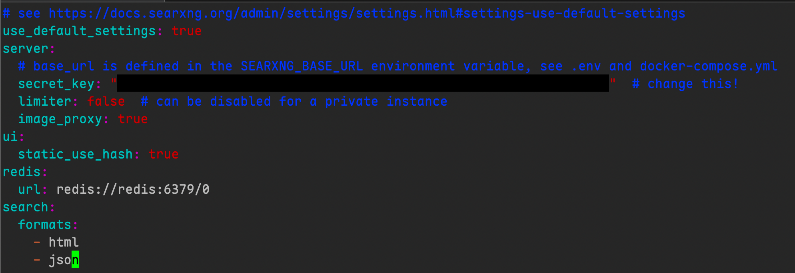<figcaption></figcaption></figure>