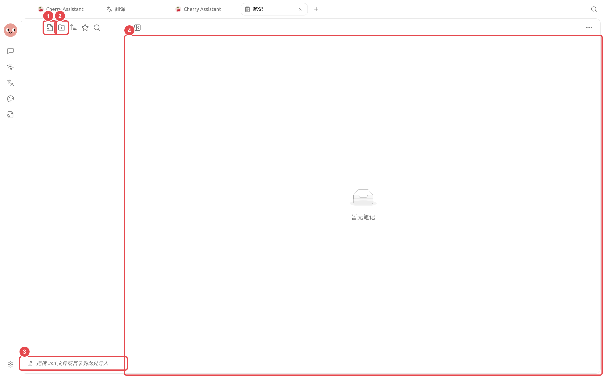
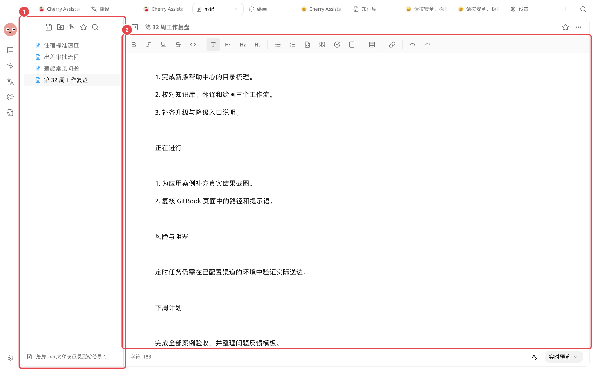

# Generación de informes semanales a partir de notas

El responsable del proyecto ha acumulado notas de reuniones, actualizaciones de progreso y tareas sueltas durante la semana. Su objetivo es organizarlas el viernes en un informe semanal con una estructura estable y hechos verificables. La clave es estandarizar primero el método de registro y luego permitir que el Agent lo consolide, en lugar de dejar que adivine el estado de la información faltante.

<figure><figcaption><p>Registrar de forma continua con la misma estructura facilita la verificación del estado y de los responsables al momento de organizar la información al final de la semana. </p></figcaption></figure>

<figure><figcaption><p>① En el panel izquierdo se conservan los registros originales y la revisión de la semana; ② En el panel derecho, el informe semanal ya contiene contenido real, por lo que se puede continuar editando manualmente, previsualizando y exportando. </p></figcaption></figure>

## Flujo de trabajo



### 1. Estandarizar el método de registro

Registre los elementos en la misma carpeta de notas diariamente, incluyendo al menos la fecha, el resultado, el responsable y el estado. No marque como entregadas las tareas que aún no están completadas.



### 2. Revisión manual inicial el viernes

Combine los elementos duplicados y complete las cifras clave y los enlaces. Coloque el contexto de largo plazo en la base de conocimientos y deje los cambios de la semana en la nota actual.



### 3. Solicitar al Agent que genere un borrador

Solicite que la salida se estructure en "Completado esta semana, En curso, Riesgos, Planes para la próxima semana" y que, si faltan datos, se enumeren los elementos pendientes de completar.



### 4. Revisar y exportar

Confirme el estado, las cifras y los responsables, luego finalice el documento en [Notas] y expórtelo. El formato estable puede convertirse en una habilidad para reutilizarla la semana siguiente.



## Tarea de ejemplo

```
Lee las notas de esta semana y genera un borrador del informe semanal. Agrupa los mismos asuntos, pero conserva los cambios de estado por fecha y no supongas que algo está terminado. Incluye responsables, cifras o próximos pasos ausentes en «Pendiente de completar».
```

## Combinaciones recomendadas y criterios de finalización

| Elemento | Práctica recomendada |
| ----- | --------------------------------- |
| Entrada diaria | Registre las notas por fecha o proyecto, escribiendo solo hechos y tareas pendientes |
| Agent | Utilice una estructura fija para el informe semanal y genérelo después de leer las notas de la semana |
| Salida | Escriba el informe semanal en un archivo independiente, sin sobrescribir las notas originales |
| Criterio de finalización | Cada avance debe poder rastrearse hasta la nota original; las tareas incompletas deben tener un responsable o un siguiente paso; no se deben añadir datos sin fundamento |

Es adecuado para organizar el trabajo ya registrado en un informe semanal, pero no es adecuado para que el Agent adivine los logros de la semana basándose en recuerdos fragmentarios.


Antes de configurar la generación automática de informes semanales en horarios fijos, ejecute el proceso manualmente durante varias semanas. Solo cuando el formato de entrada sea estable y el manejo de la información faltante sea confiable, cree la tarea programada.

