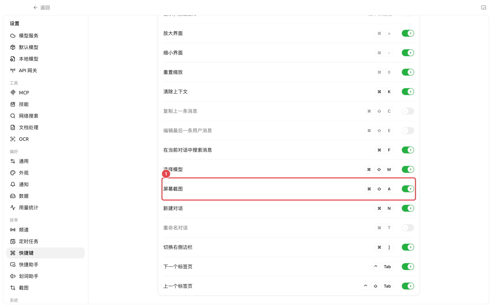
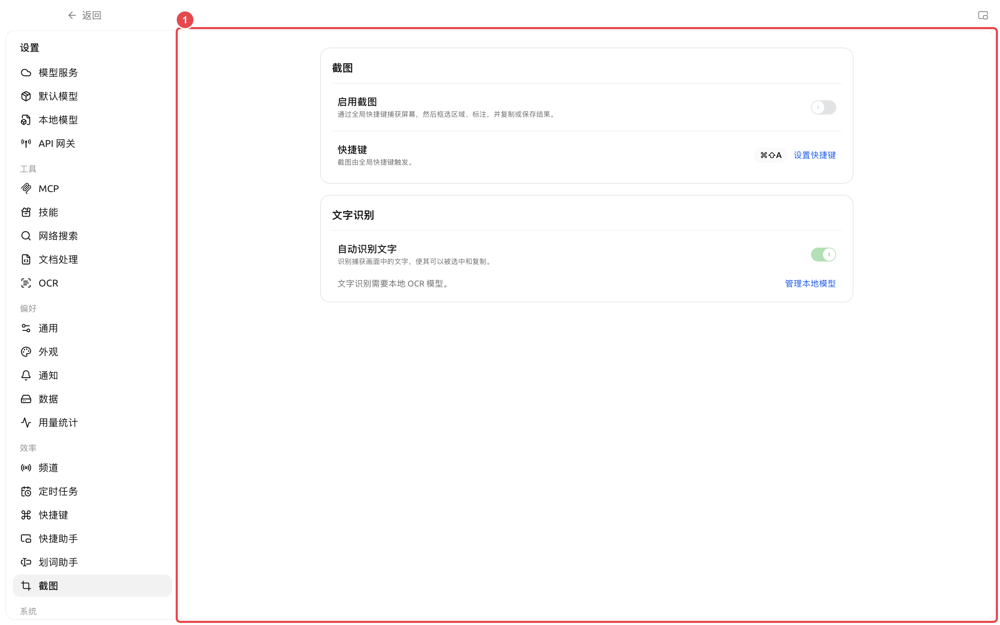

# Captura de pantalla, anotación y OCR

Cherry Studio permite capturar áreas de la pantalla mediante un atajo de teclado global, añadir rectángulos, flechas, pincel, texto o mosaico, y copiar o guardar el resultado. Si se habilita el OCR local, también es posible seleccionar y copiar directamente el texto de la captura.

### Objetivo y requisitos previos

* Ruta: [Configuración] → [Captura de pantalla];
* En macOS, la primera vez se debe permitir la grabación de pantalla; después de autorizar, reinicie la aplicación según las instrucciones de la página;
* Para el OCR, debe descargar el modelo de reconocimiento de texto en [Configuración] → [Modelos locales];
* La función de captura de pantalla está desactivada por defecto, y el reconocimiento automático de texto está activado por defecto, pero el OCR no se ejecutará si el modelo no está listo.

### Términos

| Término | Significado |
| ----- | ------------------------------- |
| Atajo de teclado global | Atajo de teclado que se puede activar incluso si el foco actual no está en Cherry Studio |
| OCR | Reconoce el texto en una imagen como texto que se puede seleccionar y copiar |
| Mosaico | Oculta cuentas, rutas, claves u otras áreas sensibles en la captura |

### Ruta de operación

[Configuración] → [Captura de pantalla] → Activar [Habilitar captura de pantalla] → Presionar el atajo de captura → Seleccionar área → Anotar o reconocer texto → Copiar o guardar.

### Pasos de operación



#### 1. Habilitar la captura de pantalla y verificar permisos

Abra [Configuración] → [Captura de pantalla] y active [Habilitar captura de pantalla]. Si en macOS aparece [Permiso de grabación de pantalla], seleccione [Ir a autorizar]; una vez completada la autorización, haga clic en [Reiniciar ahora].



#### 2. Configurar el atajo de teclado

El atajo de teclado predeterminado es `Command+Shift+A` en macOS, y `Ctrl+Shift+A` en Windows y Linux. Haga clic en [Configurar atajo de teclado] para saltar a la fila correspondiente; si el sistema u otra aplicación ya lo está utilizando, la página mostrará una advertencia de conflicto.



#### 3. Seleccionar y anotar

Después de presionar el atajo de teclado, arrastre para seleccionar el área. Use [Rectángulo], [Flecha], [Pincel] y [Texto] para marcar puntos clave, y use [Mosaico] para ocultar información sensible; el panel de propiedades permite ajustar el color, el grosor de línea y el tamaño de fuente.



#### 4. Copiar texto o imagen

Cuando el modelo OCR está listo, la página reconocerá el texto automáticamente; también puede hacer clic en [Reconocer texto]. Seleccione directamente el texto o elija [Copiar todo el texto]; después de completar las anotaciones, elija [Copiar y cerrar] o [Guardar imagen].



### Resultado esperado

La captura solo incluye el área seleccionada; las anotaciones son claras y la información sensible está oculta; después de copiar, puede pegar la imagen en la aplicación de destino, o pegar el texto OCR como texto editable.

### Capturas de pantalla clave

<figure><figcaption>
① [Captura de pantalla] es un atajo de teclado global modificable; después de modificarlo, pruébelo una vez en una ventana que no sea de Cherry Studio. 
</figcaption></figure>

### Descripción de la configuración

| Elemento de configuración | Valor predeterminado del producto | Punto de partida sugerido | Función | Escenarios aplicables | Notas |
| ------ | ---------------------- | ------------- | ----------- | ------------ | -------------- |
| Habilitar captura de pantalla | Desactivado | Activar cuando sea necesario | Registra el atajo de teclado global de captura | Capturas diarias, tutoriales, informes de problemas | macOS requiere permiso de grabación de pantalla |
| Atajo de captura de pantalla | `Command/Ctrl+Shift+A` | Mantener el predeterminado, cambiarlo solo si hay conflicto | Dispara la captura desde cualquier aplicación | Uso frecuente entre aplicaciones | No se activará si hay conflicto con otras aplicaciones |
| Reconocimiento automático de texto | Activado | Mantener activado si copia frecuentemente texto de capturas | Ejecuta OCR automáticamente después de la captura | Capturas de errores, tablas, texto de interfaz | Requiere descargar el modelo OCR local |

<figure><figcaption></figcaption></figure>

### Caso de usuario

Un tester captura un error de configuración, usa un rectángulo para enmarcar el mensaje de error, usa mosaico para ocultar la cuenta y la ruta local, y luego lo copia al asistente de informes de problemas. A continuación, copia el código de error de la misma captura y lo pega en los pasos de reproducción, evitando errores de entrada manual.

### Preguntas frecuentes

¿Qué hacer si el atajo de teclado no responde? 

Confirme que [Habilitar captura de pantalla] esté activado y verifique si aparece una advertencia de conflicto junto al atajo de teclado. En macOS, también debe verificar el permiso de grabación de pantalla y reiniciar después de autorizar; en Windows y Linux, puede intentar usar una combinación que no esté ocupada por el sistema.

¿Por qué no puedo copiar el texto? 

Abra [Configuración] → [Modelos locales] y confirme que el estado del modelo OCR sea "Listo". No se puede reconocer el texto durante el proceso de anotación; primero complete o deshaga la anotación actual y luego ejecute el OCR.

### Referencias

* Informes de problemas y sugerencias de funciones
* Barra de herramientas de entrada y herramientas de eficiencia
