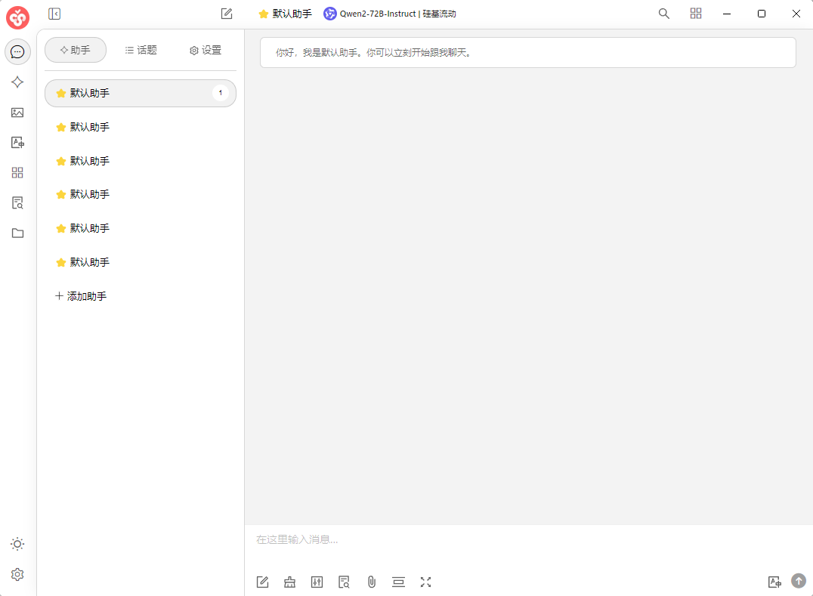
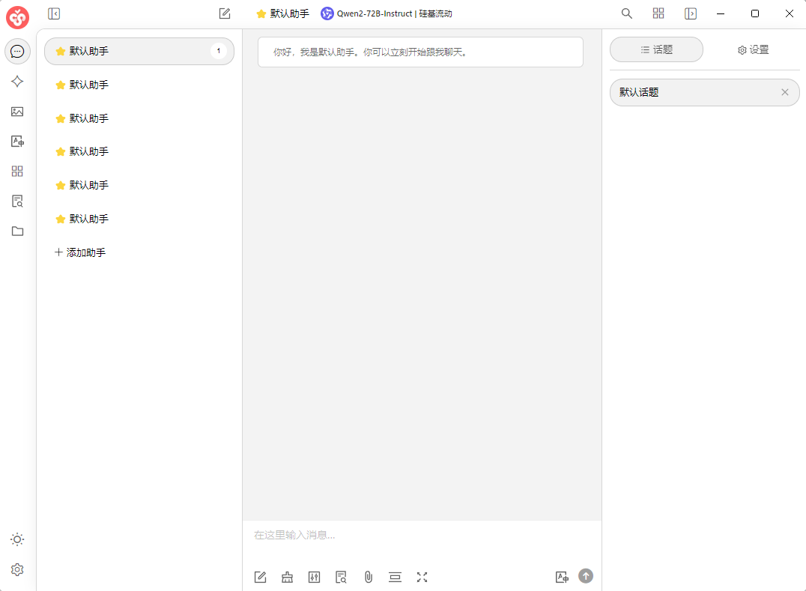
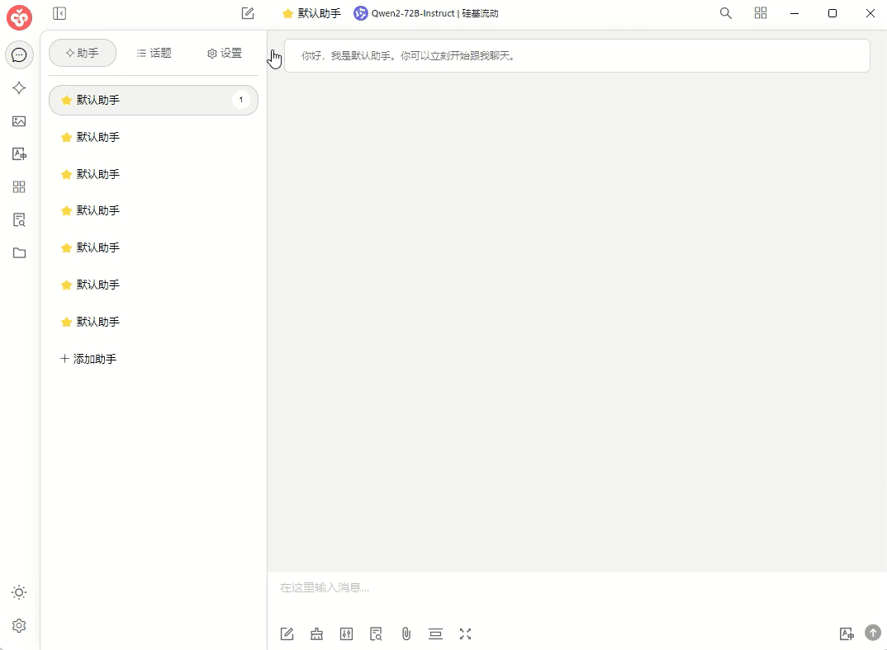
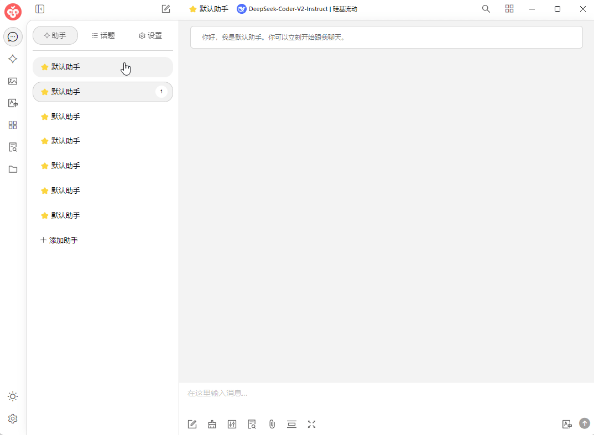
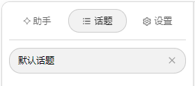
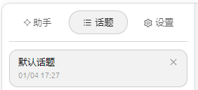

# Configuración de visualización


Este documento ha sido traducido del chino por IA y aún no ha sido revisado.


En esta página puedes configurar el tema de color del software, el diseño de la página o [CSS personalizado](../../../personalization-settings/css.md) para realizar configuraciones personalizadas.

### Selección de tema

Puedes establecer aquí el modo de color de la interfaz por defecto (modo claro, modo oscuro o seguir el sistema)

### Configuración de temas

Esta configuración se refiere al diseño de la interfaz de conversación.

#### Posición del tema



<figure><figcaption></figcaption></figure>



<figure><figcaption></figcaption></figure>



#### Cambiar automáticamente al tema

Cuando esta opción está activada, al hacer clic en el nombre del asistente, la página cambiará automáticamente a la página del tema correspondiente.



<figure><figcaption></figcaption></figure>



<figure><figcaption></figcaption></figure>



#### Mostrar tiempo del tema

Cuando está activado, muestra la hora de **creación** del tema debajo del tema.



<figure><figcaption></figcaption></figure>



<figure><figcaption></figcaption></figure>



### CSS personalizado

Esta configuración permite realizar cambios y ajustes personalizados de manera flexible en la interfaz. Para métodos específicos, consulta [CSS personalizado](../../../personalization-settings/css.md) en el tutorial avanzado.