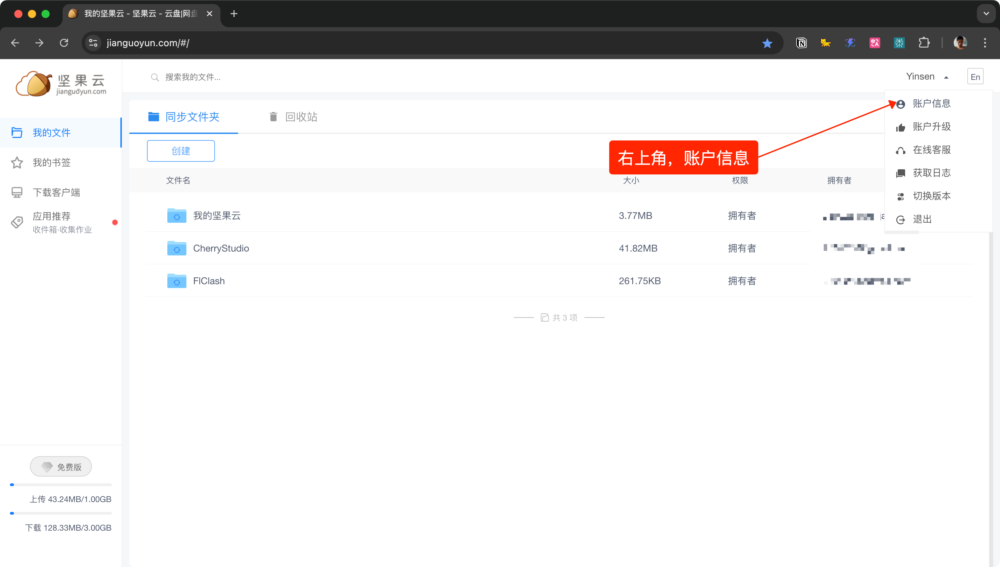
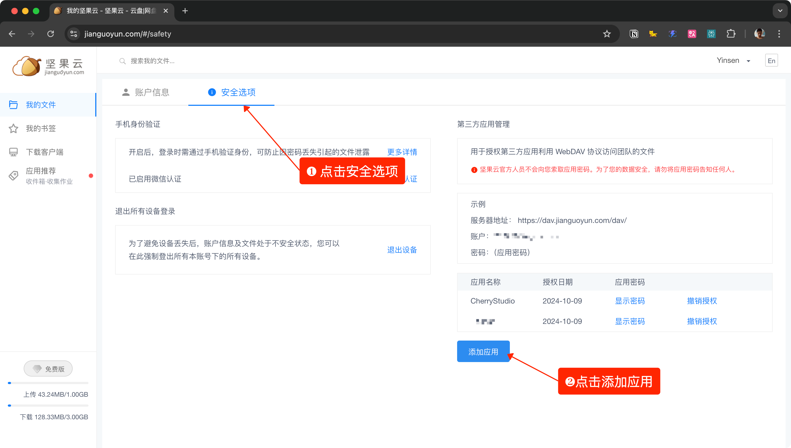
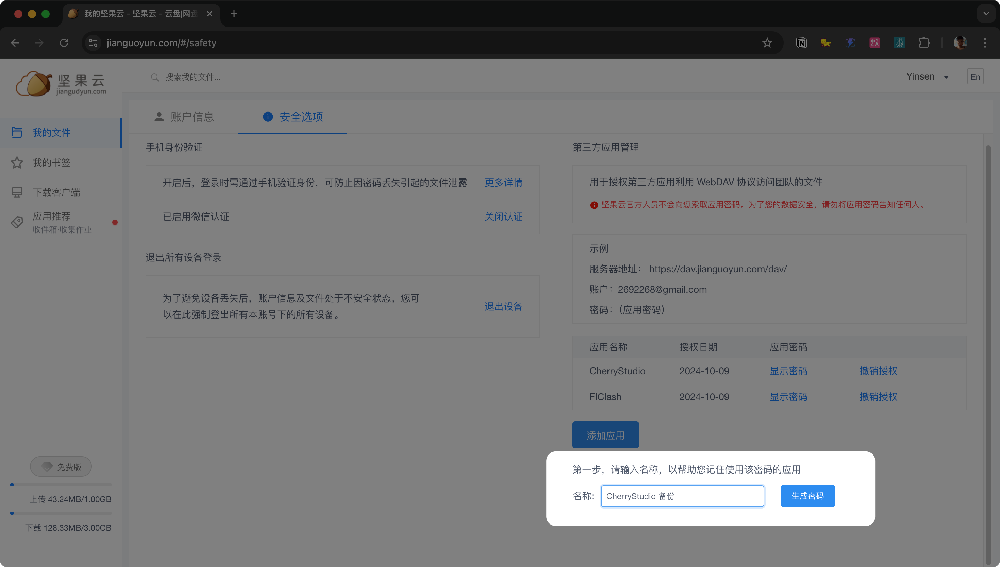
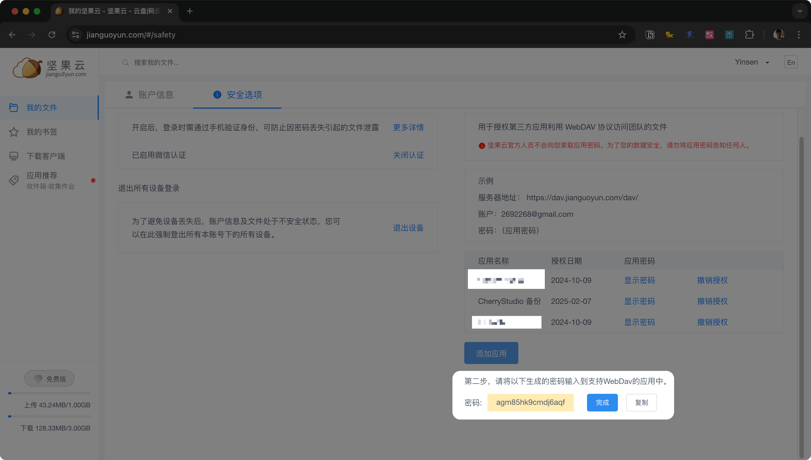
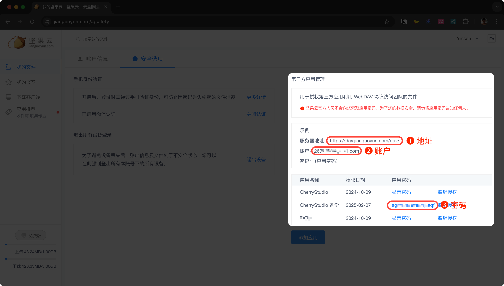
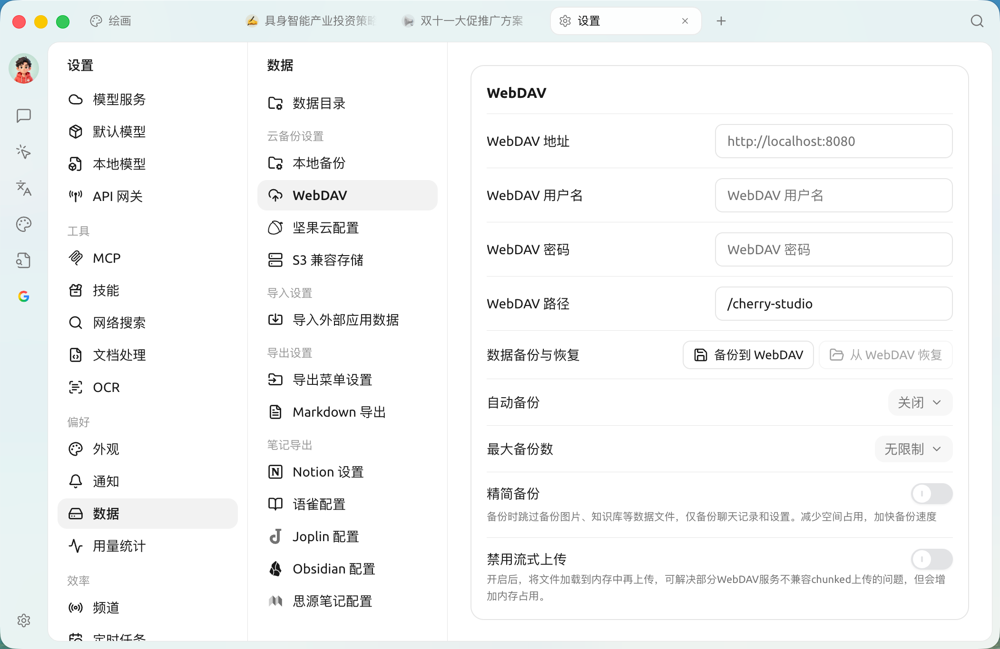
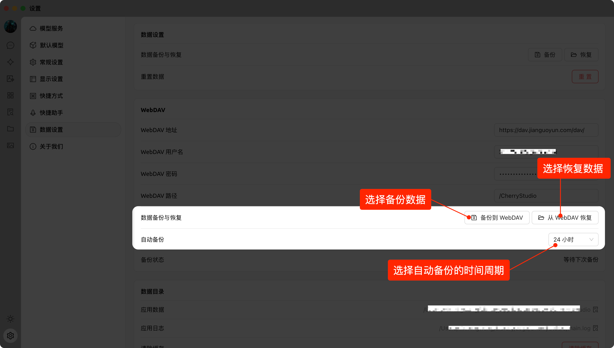

# Respaldo WebDAV


Este documento ha sido traducido del chino por IA y aún no ha sido revisado.


Cherry Studio admite copias de seguridad de datos mediante WebDAV. Puedes elegir un servicio WebDAV adecuado para realizar copias de seguridad en la nube.

Basado en WebDAV, puedes lograr sincronización de datos entre múltiples dispositivos mediante el método: `Computadora A`  → (respaldo) →  `WebDAV`  → (restauración) →  `Computadora B`.

#### Tomando Nutstore como ejemplo

1. Inicia sesión en Nutstore, haz clic en el nombre de usuario en la esquina superior derecha y selecciona "Información de cuenta":

<figure><figcaption></figcaption></figure>

2. Selecciona "Opciones de seguridad" y haz clic en "Añadir aplicación":

<figure><figcaption></figcaption></figure>

3. Ingresa el nombre de la aplicación y genera una contraseña aleatoria:

<figure><figcaption></figcaption></figure>

4. Copia y guarda la contraseña:

<figure><figcaption></figcaption></figure>

5. Obtén la dirección del servidor, cuenta y contraseña:

<figure><figcaption></figcaption></figure>

6. En la configuración de Cherry Studio → Configuración de datos, completa la información de WebDAV:

<figure><figcaption></figcaption></figure>

7. Selecciona respaldar o restaurar datos, y configura el intervalo de tiempo para copias de seguridad automáticas:

<figure><figcaption></figcaption></figure>


Los servicios WebDAV con menor barrera de entrada suelen ser plataformas de almacenamiento en la nube:

- [Nutstore](https://www.jianguoyun.com/)
- [123Pan](https://www.123pan.com/) (requiere membresía)
- [Aliyun Drive](https://www.alipan.com/) (requiere compra)
- [Box](https://www.box.com/) (espacio gratuito de 10GB, límite de 250MB por archivo)
- [Dropbox](https://www.dropbox.com/) (2GB gratis, ampliable hasta 16GB mediante invitaciones)
- [TeraCloud](https://teracloud.jp/en/) (10GB gratis + 5GB adicionales por invitación)
- [Yandex Disk](https://disk.yandex.com/) (10GB para usuarios gratuitos)

Alternativas que requieren despliegue propio:

- [Alist](https://alist.nn.ci/zh/)
- [Cloudreve](https://cloudreve.org/)
- [Sharelist](https://github.com/reruin/sharelist)
