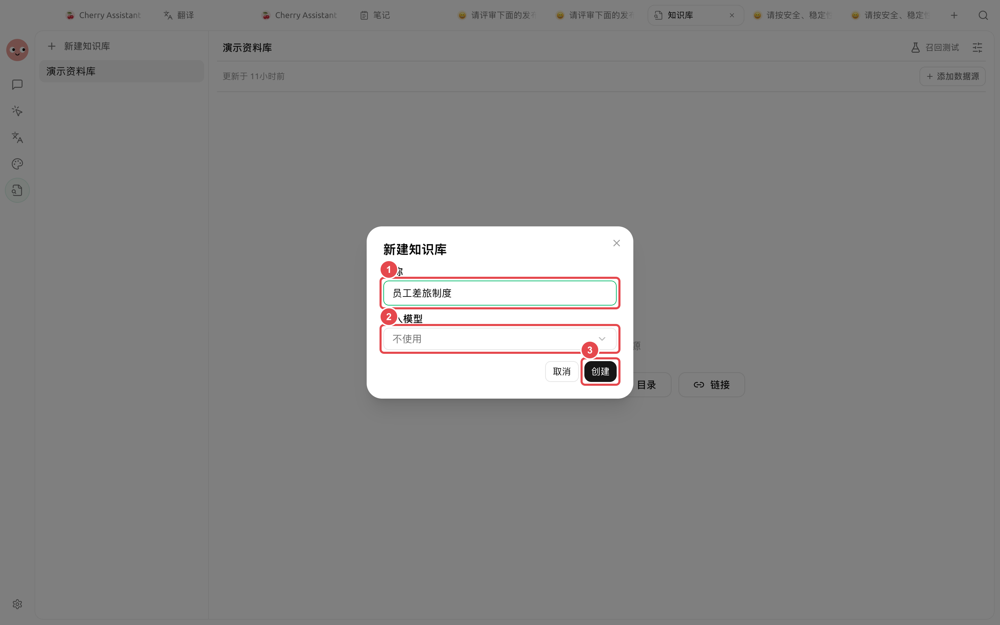
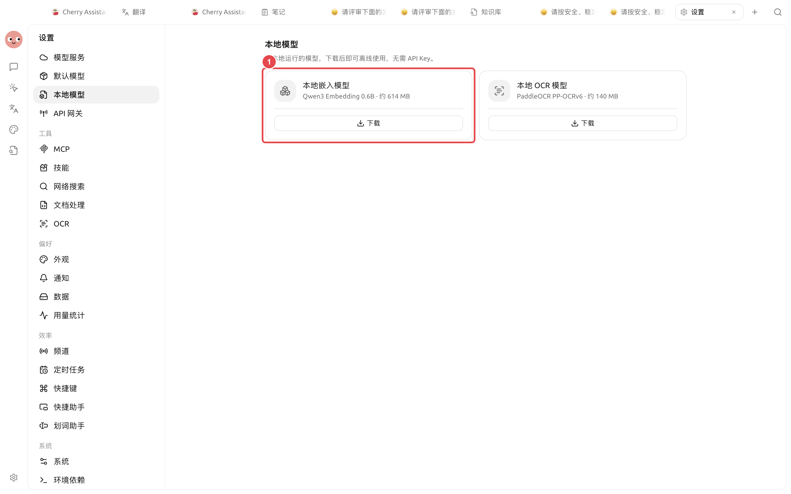

# Crear una base de conocimientos

Las dos decisiones más importantes al crearla son el nombre y el modelo de incrustación. Los materiales se pueden agregar más tarde, pero los límites del nombre y el método de recuperación afectarán el mantenimiento futuro.


Para la primera experiencia, puede establecer el [Modelo de incrustación] en [No usar]. La base de conocimientos aún utilizará la recuperación de palabras clave BM25; basta con completar el flujo de importación y recuperación.


## Tome dos decisiones antes de crear

### El nombre debe indicar el alcance de los materiales

Priorice el formato "objeto + propósito", por ejemplo, [Política de viajes de empleados], [Manual de posventa de producto] o [Materiales de investigación de mercado]. Evite nombres como [Materiales] o [Prueba], que no permiten determinar el alcance del contenido en el futuro.

### Seleccione el método de incrustación

| Opción | Escenarios adecuados | Método de recuperación | Condiciones previas |
| ------ | ------------- | ------------- | ------------ |
| No usar | Primera experiencia, palabras clave claras | Recuperación de palabras clave BM25 | Ninguna |
| Modelo de incrustación en la nube | Las preguntas de los usuarios difieren significativamente del texto original de los materiales | Recuperación híbrida BM25 + vectorial | El servicio del modelo correspondiente debe poder llamarse correctamente |
| Modelo de incrustación local | Desea completar la vectorización en el equipo local | Recuperación BM25 + vectorial local | Primero complete la descarga en [Modelos locales] |

## Pasos de creación



### 1. Abra la ventana de creación

Abra [Bases de conocimientos] en la navegación izquierda y haga clic en el botón de nuevo elemento sobre la lista de bases de conocimientos.



### 2. Ingrese el nombre

Ingrese un nombre que indique el alcance, por ejemplo, [Política de viajes de empleados].



### 3. Seleccione el modelo de incrustación

Seleccione un modelo de incrustación en la nube o local disponible; si no necesita recuperación semántica por ahora, seleccione [No usar].

<figure><figcaption>
El nombre determina el alcance de los materiales; el modelo de incrustación determina si se agrega la recuperación vectorial.
</figcaption></figure>



### 4. Haga clic en Crear

Después de confirmar el nombre y el modelo, haga clic en [Crear]. Al finalizar la creación, entrará en la base de conocimientos vacía.



### 5. Agregue el primer lote de materiales

Haga clic en el botón Agregar materiales, importe uno o dos archivos o notas con respuestas claras y espere a que el procesamiento se complete.



## Uso de modelos de incrustación locales

Abra [Configuración] → [Modelos locales] y descargue un modelo disponible en la sección [Modelos de incrustación]. Los modelos y tamaños de descarga mostrados en la interfaz pueden variar según el entorno de instalación; consulte la lista actual.

<figure><figcaption>
Después de completar la descarga, vuelva a la página de creación o configuración de la base de conocimientos y seleccione ese modelo.
</figcaption></figure>


La incrustación local solo significa que la vectorización se completa en el equipo local. Si el análisis de documentos, la reordenación y el chat utilizan la nube depende de los servicios y modelos seleccionados individualmente.


## Cambio de modelo con materiales existentes

Al habilitar un modelo de incrustación en una base de conocimientos que solo usa BM25, se puede crear un índice vectorial. Al cambiar el modelo de incrustación en una base de conocimientos que ya tiene vectores, la interfaz entrará en el flujo de [Reconstruir base de conocimientos].


Antes de iniciar la reconstrucción, confirme que el nuevo modelo se pueda llamar correctamente. Después de la reconstrucción, complete nuevamente la prueba de recuperación; no cambie el modelo y modifique la segmentación en la misma ronda, ya que no podrá determinar de dónde provienen los cambios en los resultados.


## Descripción de la configuración

| Elemento de configuración | Valor predeterminado del producto | Punto de partida sugerido | Función | Escenarios aplicables | Precauciones |
| ------ | ----- | ----------- | ---------- | ----------- | ------------------ |
| Nombre | Vacío | Objeto + propósito | Distinguir el alcance de los materiales | Todas las bases de conocimientos | Los materiales con permisos o ciclos de vida diferentes deben separarse |
| Modelo de incrustación | No usar | No usar para la primera experiencia | Determina si se agrega la recuperación vectorial | Preguntas coloquiales, muchas expresiones sinónimas | La facturación y el procesamiento de datos de los modelos en la nube dependen del proveedor |
| Modelo de incrustación local | No descargado | Descargar cuando haya necesidad de procesamiento local | Completar la vectorización en el equipo local | Requisitos de privacidad o sin conexión altos | Aún es necesario verificar individualmente los modelos de análisis, reordenación y chat |

## Resultado esperado

* La nueva base de conocimientos aparece en la lista y su nombre la distingue de otras bases de conocimientos.
* Sabe claramente si actualmente se utiliza recuperación de palabras clave o recuperación híbrida.
* El modelo en la nube seleccionado se puede llamar, o el modelo local ya ha completado la descarga.

## Caso de usuario

Xiao Lin creó por primera vez la base de conocimientos [Política de viajes de empleados]. Primero seleccionó [No usar] para el modelo de incrustación, importó tres políticas y completó la prueba de recuperación. Después de que las consultas por palabras clave fueran estables, configuró el modelo de incrustación y comparó los resultados de las preguntas coloquiales usando las mismas preguntas.

El criterio de finalización es: después de mejorar el método de recuperación, las preguntas fijas originales no han empeorado y las preguntas coloquiales encuentran la misma política de manera más estable.

## Preguntas frecuentes

¿Qué hacer si el botón Crear no está disponible?

Verifique si el nombre está vacío y si el modelo seleccionado sigue estando disponible. Si el servicio del modelo no está configurado, puede cambiar a [No usar] para completar la creación.

¿No se encontrará nada en absoluto si no se usa un modelo de incrustación?

No. La base de conocimientos aún utilizará la recuperación de palabras clave BM25; cuanto más se acerquen las palabras de la pregunta a los materiales, más estables suelen ser los resultados.

¿Se debe crear una base de conocimientos separada para cada tema?

Use como criterio "si deberían recuperarse juntos al usarlos". Los materiales con permisos, ciclos de vida o temas completamente diferentes son más adecuados para separarse.

## Continuar leyendo

<table data-view="cards"><thead><tr><th></th><th></th><th data-hidden data-card-target data-type="content-ref"></th></tr></thead><tbody><tr><td><strong>Agregar y organizar materiales</strong></td><td>Importar contenido y manejar conflictos de nombres idénticos.</td><td><a href="sources.md">sources.md</a></td></tr><tr><td><strong>Verificar materiales y recuperación</strong></td><td>Validar resultados con preguntas reales.</td><td><a href="recall-test.md">recall-test.md</a></td></tr><tr><td><strong>Configuración de modelos y recuperación</strong></td><td>Comprender incrustación, reordenación y reconstrucción.</td><td><a href="emb-models-info.md">emb-models-info.md</a></td></tr></tbody></table>
