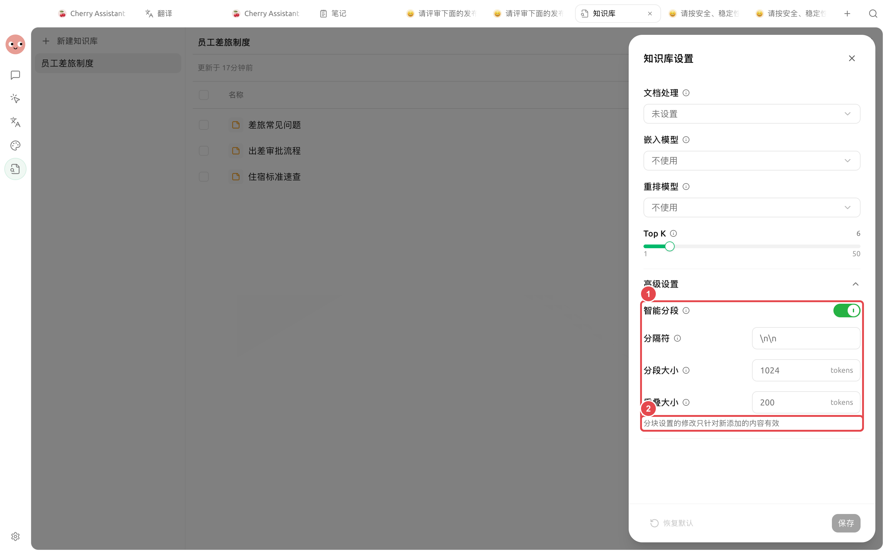
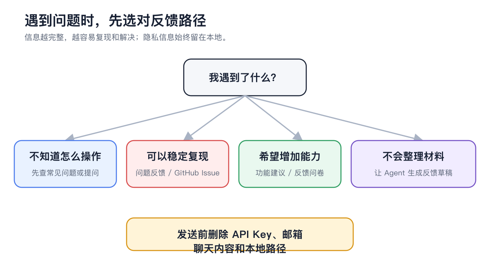

# Preguntas frecuentes

Al enfrentar problemas con la base de conocimientos, primero determine si el fallo ocurre en la capa de importación, análisis, segmentación, recuperación o respuesta. Cambie solo una variable a la vez para saber qué ajuste es realmente efectivo.


El método más rápido para diagnosticar es usar la misma pregunta real para verificar: si el texto contiene la respuesta, si el Chunk es completo, si la recuperación es correcta y si la respuesta es fiel a la fuente.


## Diagnóstico rápido en 5 pasos



### 1. Verificar el estado de los recursos

Los recursos deben estar en estado 【Listo】. Si permanecen en proceso durante mucho tiempo o muestran un error, primero revise el mensaje de error y confirme que el archivo, el procesador y el servicio del modelo estén disponibles.



### 2. Verificar el texto analizado

Abra la vista previa del texto, confirme que la respuesta existe realmente, que el texto escaneado se ha reconocido y que las columnas dobles y las tablas no están desordenadas.



### 3. Verificar los Chunks

Confirme que las condiciones y conclusiones necesarias para la pregunta estén en fragmentos comprensibles; evite que encabezados, pies de página y tablas de contenido ocupen los resultados.

<figure><figcaption>
Si el texto es correcto pero los fragmentos son incompletos, ajuste la segmentación y vuelva a indexar los recursos antiguos.
</figcaption></figure>



### 4. Ejecutar una prueba de recuperación

Revise el nombre de la fuente, la relevancia y el contenido del fragmento. No obtener ningún fragmento correcto y obtener el fragmento correcto pero con un orden bajo son dos problemas diferentes.

<figure><figcaption>
Primero demuestre que la capa de recuperación devuelve la evidencia correcta, luego ajuste el prompt de la conversación.
</figcaption></figure>



### 5. Verificar la conversación o el Agent

Si la recuperación es correcta pero la respuesta es incorrecta, confirme que se ha seleccionado o vinculado la base de conocimientos, exija que la respuesta se base únicamente en las fuentes y divida la pregunta en elementos de hechos más pequeños.



## ¿Dónde reportar el problema?

<figure><figcaption>
Complete primero la mínima investigación; si se puede reproducir de forma estable, adjunte los pasos anonimizados, el error y el resultado esperado.
</figcaption></figure>


No publique API Keys, contenido de archivos internos, correos electrónicos o rutas locales sensibles en capturas de pantalla, registros o recursos de ejemplo.


## Creación e importación

¿Se puede crear una base de conocimientos sin un modelo de incrustación?

Sí. Al elegir 【No usar】, se utilizará la búsqueda por palabras clave BM25. Añada un modelo de incrustación solo si necesita coincidir con diferentes expresiones.

¿Qué fuentes y formatos de archivo se admiten?

Las fuentes incluyen archivos, notas de Cherry Studio, directorios locales y enlaces web. Los formatos de archivo incluyen PDF, DOCX, DOC, PPTX, XLSX, XLS, Markdown, TXT, CSV, HTML y EPUB.

¿Cuántos elementos se pueden añadir a la vez?

Máximo 20 elementos en una selección interactiva. Puede añadir más recursos por lotes o utilizar la entrada de directorio.

¿Elegir 【Mantener todo】 o 【Reemplazar】 para recursos con el mismo nombre?

Generalmente se elige 【Reemplazar】 al actualizar reglamentos, manuales o instantáneas de notas. Solo elija 【Mantener todo】 si realmente necesita que coexistan versiones, y añada la fecha o versión al nombre.

¿Qué hacer si un recurso se queda atascado en "Procesando"?

Verifique si el archivo se puede abrir, si el procesador y OCR están disponibles y si el servicio del modelo está configurado. Determine si el fallo ocurre en la lectura, el análisis o la incrustación según el mensaje de error.

## Análisis y recuperación

¿Por qué un PDF escaneado no tiene texto?

Los escaneos requieren OCR. Abra 【Configuración】→【Procesamiento de documentos】, seleccione un OCR disponible y vuelva a indexar el documento. Para diseños complejos, intente un procesador de documentos especializado.

¿Por qué los resultados no cambian después de modificar la configuración de Chunk?

La nueva configuración no reprocessa automáticamente los recursos antiguos. Ejecute 【Volver a indexar】 en las entradas relevantes y vuelva a probar con la misma pregunta.

¿Qué hacer si la prueba de recuperación no devuelve ningún resultado?

Verifique en orden: el estado de los recursos, si el texto contiene la respuesta, si las palabras clave del texto original coinciden, si la incrustación se completó, si el umbral de reordenamiento es demasiado alto y si Top K es demasiado bajo.

¿Qué hacer si la fuente es correcta pero el fragmento es incompleto?

Revise los Chunks y confirme si las condiciones y conclusiones están separadas. Aumente adecuadamente el Chunk o la superposición, o organice los recursos de origen con estructura desordenada en notas claras y vuelva a indexar.

¿Qué hacer si el resultado correcto aparece demasiado al final?

Primero elimine recursos duplicados y obsoletos, luego considere el modelo de incrustación. Si los candidatos son aproximadamente correctos pero el orden es inestable, puede añadir reordenamiento y ajustar nuevamente el umbral.

¿A cuánto debe configurarse Top K?

Puede comenzar con 6 y comparar omisiones de recuperación, ruido y tiempo de respuesta usando preguntas fijas. Top K se puede ajustar entre 1 y 50; no aumente el valor como solución general.

## Conversación y Agent

¿Qué hacer si la entrada de la base de conocimientos en la conversación no está disponible?

Seleccione un modelo que admita llamadas a herramientas y elimine los adjuntos del mensaje actual. También confirme que al menos una base de conocimientos contenga recursos listos.

¿Qué hacer si la respuesta no muestra las fuentes?

Confirme que la base de conocimientos está seleccionada en el área de entrada y luego coloque la misma pregunta en la prueba de recuperación. Si la recuperación no tiene fragmentos correctos, primero repare la base de conocimientos.

¿Qué hacer si la recuperación es correcta pero la respuesta sigue siendo imprecisa?

Exija al modelo que responda solo basándose en las citas, divida la tarea en elementos de hechos más pequeños y verifique manualmente las conclusiones importantes. En este caso, el problema suele estar en el prompt, el modelo o la organización del contexto.

¿Por qué el Agent no ve la base de conocimientos?

Abra 【Editar agente】→【Base de conocimientos】, vincule la base de conocimientos objetivo al Agent actual y active 【Búsqueda en base de conocimientos】 en 【Herramientas integradas】.

¿La gestión de la base de conocimientos modifica los recursos?

Sí. 【Gestión de base de conocimientos】 admite añadir, eliminar o actualizar documentos. No lo active para tareas de solo lectura; verifique el objetivo, el impacto y la forma de reversión antes de operaciones de escritura.

## Modelos, datos y copias de seguridad

¿Por qué se requiere reconstruir al cambiar el modelo de incrustación?

Los vectores generados por diferentes modelos de incrustación no se pueden mezclar directamente. Confirme primero que el nuevo modelo esté disponible y mantenga una copia de seguridad completa, luego reconstruya el índice de vectores existente.

¿Cuál es la relación entre el reordenamiento y el umbral de similitud?

El reordenamiento vuelve a puntuar los fragmentos candidatos y el umbral filtra los resultados de baja puntuación después del reordenamiento. Si no se configura el reordenamiento, el umbral de similitud no se mostrará en la configuración de la base de conocimientos.

¿Es completamente offline después de descargar un modelo de incrustación local?

No necesariamente. El análisis, OCR, reordenamiento y chat también deben usar capacidades locales para que el flujo sea completamente offline.

¿Se actualiza automáticamente al modificar el archivo original o la página web?

No. Los archivos, notas y páginas web crean recursos según el contenido en el momento de la importación. Vuelva a añadir el recurso con el mismo nombre, elija 【Reemplazar】 y complete la prueba de recuperación.

¿La copia de seguridad simplificada incluye los archivos de la base de conocimientos?

No incluye los archivos de datos completos de la base de conocimientos. Use una copia de seguridad completa antes de migrar o eliminar, y verifique los recursos y la recuperación después de la restauración.

## Notas de configuración: Línea base de diagnóstico

| Elemento | Punto de partida recomendado | Ajustar solo en qué casos |
| ----- | ------------- | ---------------- |
| Top K | 6 | Si los fragmentos correctos se cortan o hay demasiado ruido |
| Umbral de similitud | Comenzar con 0.0 tras configurar reordenamiento | Si el ruido de baja puntuación es evidente y aún hay margen para fragmentos correctos |
| Chunk | Mantener la segmentación inteligente predeterminada | Si las condiciones y conclusiones están separadas o los fragmentos son demasiado largos |
| Modelo de incrustación | Añadir solo si BM25 no es suficiente | Si las preguntas coloquiales o expresiones sinónimas no coinciden de forma estable |
| Modelo de reordenamiento | Añadir si los candidatos son correctos pero el orden es inestable | No se usa para corregir errores de análisis o texto faltante |

## Caso de usuario

Xiaolin descubrió que la "norma de alojamiento" se respondía incorrectamente en el chat. Primero realizó una prueba de recuperación con la misma pregunta y vio que la fuente correcta no aparecía en absoluto; al abrir el texto, descubrió que el PDF de dos columnas estaba desordenado. Después de cambiar el procesador y volver a indexar, la recuperación fue correcta y la respuesta del chat se normalizó.

Este proceso solo modificó una variable del analizador, por lo que se puede confirmar la causa raíz, en lugar de depender de la suerte al aumentar simultáneamente Top K, Chunk y el umbral.


Si el problema persiste, registre la versión de la aplicación, el sistema operativo, el procesador, los modelos de incrustación y reordenamiento, el error completo, una muestra mínima desidentificada, los resultados de recuperación y la fuente esperada.


## Continuar leyendo

<table data-view="cards"><thead><tr><th></th><th></th><th data-hidden data-card-target data-type="content-ref"></th></tr></thead><tbody><tr><td><strong>Análisis de documentos y OCR</strong></td><td>Resuelva problemas de escaneo, orden incorrecto y pérdida de tablas.</td><td><a href="document-preprocessing.md">document-preprocessing.md</a></td></tr><tr><td><strong>Configuración de modelos y recuperación</strong></td><td>Comprenda las incrustaciones, el reordenamiento, los umbrales y la reconstrucción.</td><td><a href="emb-models-info.md">emb-models-info.md</a></td></tr><tr><td><strong>Datos, privacidad y mantenimiento</strong></td><td>Confirme los límites de las copias de seguridad y los servicios en la nube.</td><td><a href="data.md">data.md</a></td></tr></tbody></table>
