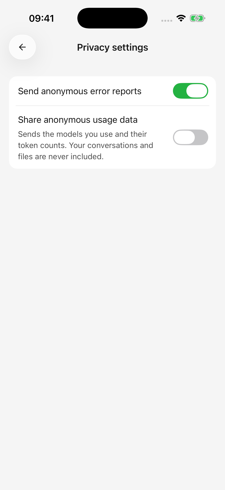

# Datos, privacidad y permisos

Las conversaciones y la configuración se almacenan en el dispositivo actual. Los modelos en la nube y las herramientas conectadas aún reciben la información necesaria para sus solicitudes.

## ¿A dónde van los datos?

| Característica | Datos involucrados |
| --- | --- |
| Chat en la nube/generación de imágenes | El proveedor seleccionado recibe mensajes, los mensajes anteriores incluidos en la solicitud, imágenes, contenido del documento analizado o indicaciones para dibujar. |
| Búsqueda/lectura de página | El servicio seleccionado recibe palabras clave o URL; El material devuelto participa en respuestas modelo. |
| Complementos/herramientas personalizadas | Los servicios conectados procesan solicitudes autorizadas; El contenido recuperado puede proporcionarse al modelo. |
| Calendario, recordatorios, ubicación. | La información del dispositivo autorizado se lee o cambia; Los resultados relevantes pueden participar en las respuestas. |
| Importación de escritorio | Transferencia de direcciones de proveedores seleccionados, claves y configuración de modelos admitidos a través de la red local |

La retención depende de la política de cada servicio y la configuración de la cuenta. El almacenamiento local no hace que una conversación en la nube esté completamente fuera de línea.

## Informes anónimos de uso y errores

El primer uso o una actualización de la política de privacidad le solicita **Aceptar y continuar** o **No estar de acuerdo** después de explicar el uso de datos anónimos. Cambie su elección más adelante en **Configuración → Privacidad**.

* **Compartir datos de uso anónimos:** incluye identidad de instalación, versiones de aplicaciones/sistemas, modelos utilizados y cantidades de tokens; no texto de conversación, archivos o claves API.
* **Enviar informes de errores anónimos:** ayuda a investigar fallas y fallas, con una configuración separada.

Deshabilitar los informes de uso no bloquea los mensajes que envía a los proveedores de modelos ni revoca el acceso al complemento. Administre esas conexiones por separado.

<figure data-mobile-shot="phone"><figcaption>
<strong>iPhone · Interfaz en inglés</strong> · Los informes de errores anónimos y los datos de uso son opciones independientes
</figcaption></figure>

## Autorización de claves y complementos

Las claves API otorgan acceso al servicio de modelo. Manténgalos fuera de las instrucciones de los agentes, capturas de pantalla públicas e informes de problemas. Si está expuesta, revoque la clave en el proveedor y reemplácela en la aplicación.

Las credenciales del complemento integrado utilizan el almacenamiento seguro del dispositivo y no se transfieren mediante la importación de escritorio. Los encabezados de autenticación estática para servidores MCP personalizados se almacenan localmente con la configuración del servidor y también necesitan un manejo cuidadoso.

## Administrar permisos del sistema

Abra **Configuración → Permisos del sistema**. La aprobación de la herramienta y la autorización del sistema operativo pueden aparecer por separado y es posible que ambas sean necesarias.

| Síntoma | Que comprobar |
| --- | --- |
| Solo se ven algunas fotos | Se puede habilitar el acceso a las fotografías seleccionadas; ajustar la selección/permiso del sistema |
| No aparece ningún mensaje después de denegar el acceso | Cambie los permisos de Cherry Studio en la configuración del sistema |
| Se puede leer el calendario, pero no editarlo | Compruebe por separado los permisos de lectura y escritura |
| Sin registros sanitarios | Confirmar que existen registros y que el tipo de datos está autorizado |
| El emparejamiento funciona pero la configuración no se puede cargar | Verifique el acceso a la red local y [importación de escritorio](desktop-sync.md) |

Los interruptores de capacidad del agente controlan si ese agente puede utilizar las herramientas integradas relacionadas; Los permisos del sistema controlan el acceso de la aplicación a los datos del dispositivo. Administre complementos y herramientas MCP personalizadas por separado. Deshabilitar la capacidad de un agente no revoca el permiso del sistema; utilice la configuración del sistema para revocar el acceso. La aprobación automática de herramientas no elude los permisos del sistema. Actualmente, Android no ofrece las herramientas de recordatorio y registro de salud iOS.

## Antes de cambiar de dispositivo o eliminar datos de aplicaciones

El emparejamiento de dispositivos no es una copia de seguridad completa ni una sincronización automática del chat. Importa principalmente la configuración y los modelos del proveedor, no el historial de conversaciones.

[Exportar mensajes y archivos importantes](sharing-and-export.md) antes de desinstalar, borrar datos de aplicaciones o cambiar de dispositivo. Guárdelos fuera de Cherry Studio o en otro dispositivo y confirme que se abran. Una copia guardada únicamente en la biblioteca de archivos de la aplicación puede perderse al borrar los datos de la aplicación. Las imágenes, HTML y Markdown conservan el trabajo, pero no son copias de seguridad restaurables de todas las configuraciones de la aplicación.

## ¿Eliminar el historial deshace las acciones?

No. Eliminar o responder nuevamente no deshace los cambios de calendario, los documentos externos editados ni los mensajes enviados, y no reembolsa los costos del modelo. Inspeccione el resultado real en el servicio correspondiente si es necesario revertirlo.

## ¿Qué debe incluir un informe de error?

Indique las versiones de la aplicación, el dispositivo y el sistema, los pasos, el resultado esperado, el resultado real y el texto del error. Oculte las claves reales, las URL que contengan credenciales, las conversaciones privadas y el contenido de los archivos antes de publicar capturas de pantalla o detalles.
