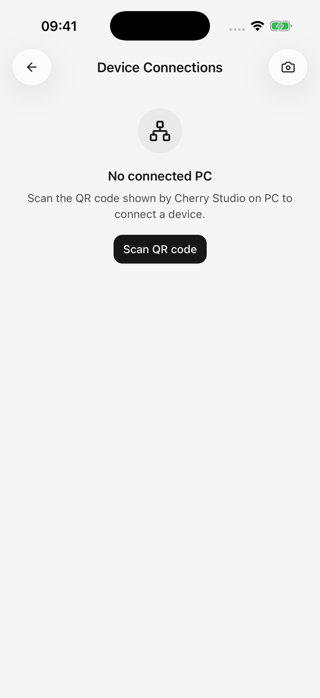

# Importar la configuración desde el ordenador

Reutilice los proveedores de modelos compatibles ya configurados en Cherry Studio en su computadora, sin ingresar cada dirección y clave nuevamente.

**Esto importa la configuración del proveedor y los modelos habilitados, no el historial de conversaciones ni el control remoto de su computadora.** El emparejamiento no permite la sincronización automática continua; ejecútelo nuevamente cuando desee importar cambios.

## Conecte su computadora

1. Conecte ambos dispositivos a la misma red local, como el Wi-Fi de su hogar, y mantenga el Cherry Studio Desktop en funcionamiento.
2. Abra **Conexiones de dispositivos** en el escritorio y muestre su código QR de emparejamiento.
3. En el móvil, abra **Configuración → Conexiones de dispositivos → Escanear código QR**. Permita permisos de cámara y red local cuando se solicite.
4. Escanee y continúe con la selección de proveedor. La incorporación por primera vez ofrece la misma ruta de sincronización del escritorio.

Si la cámara no está disponible, use el campo manual para pegar el contenido del QR de emparejamiento desde el escritorio. Espera datos de emparejamiento, no un enlace a un sitio web normal.

<figure data-mobile-shot="phone"><figcaption>
<strong>iPhone · Interfaz en inglés</strong> · Abra Conexiones del dispositivo y escanee el código de emparejamiento que se muestra en su computadora
</figcaption></figure>

## Seleccionar e importar proveedores

Utilice **Proveedores de sincronización desde el escritorio** en los detalles del dispositivo vinculado. Alternativamente, elija **Sincronización desde la aplicación de escritorio** en el menú de la lista de servicios del modelo y seleccione la computadora.

1. Espere a que se carguen los proveedores de escritorio habilitados.
2. Seleccione los proveedores para importar.
3. Lea el aviso de que las direcciones y claves seleccionadas se reemplazarán mientras permanezcan los modelos existentes.
4. Sincronice y revise los recuentos agregados, actualizados y omitidos.
5. Seleccione un modelo importado en el chat. Durante la incorporación, continúe con el paso de selección del modelo de chat.

## ¿Qué sucede con las configuraciones móviles existentes?

| Artículo | Resultado |
| --- | --- |
| Proveedor seleccionado | Recibe la configuración y las claves del escritorio y se habilita en el móvil |
| Falta el modelo de escritorio habilitado en el móvil | Añadido |
| Mismo modelo ya en el móvil. | Se conservan las configuraciones móviles existentes; sin duplicado |
| Proveedores/modelos solo móviles | Retenido |
| Proveedores/modelos de escritorio deshabilitados | Excluido de la importación |
| Historial de chat y concesiones de cuentas de complementos | No importado |

Si utiliza claves diferentes en computadoras de escritorio y dispositivos móviles, tenga especial cuidado con la primera fila. Se pueden reemplazar las credenciales de un proveedor incluso cuando no sea necesario agregar nuevos modelos.

## ¿Por qué algunos proveedores no están disponibles?

Lea el motivo que se muestra al lado del proveedor:

* **Autenticación no admitida:** un inicio de sesión en una computadora de escritorio puede no proporcionar una clave exportable que se pueda utilizar en un dispositivo móvil. Configure un método compatible por separado en el móvil.
* **No hay clave API utilizable:** asegúrese de que el escritorio tenga al menos una clave válida y habilitada.
* **Configuración ilegible:** actualice el móvil u omita esa entrada e importe las demás.

Se excluyen los servicios de modelos locales como Ollama y LM Studio. El emparejamiento no convierte un modelo que se ejecuta en su computadora en un servicio que se ejecuta en su teléfono.

## Emparejado correctamente, pero no se puede sincronizar

El emparejamiento almacena las credenciales de conexión; Para recuperar la configuración aún se necesita una computadora accesible. Mantenga el escritorio en funcionamiento y verifique la red local compartida, el aislamiento de la red de invitados, el firewall y la configuración del proxy.

En iPhone/iPad, habilite el permiso de red local de Cherry Studio en la configuración del sistema si anteriormente se le negó. Si la aplicación indica que el emparejamiento necesita reparación, escanee un nuevo código QR de escritorio.

## ¿Quitar un dispositivo revoca ambos lados?

**Quitar dispositivo** en dispositivos móviles elimina solo las credenciales de conexión guardadas de ese teléfono. Para revocar también la autorización del escritorio, elimine el dispositivo móvil en las conexiones del dispositivo del escritorio.

La importación de configuración no es una copia de seguridad completa. [Exportar conversaciones y archivos importantes](sharing-and-export.md) por separado.
