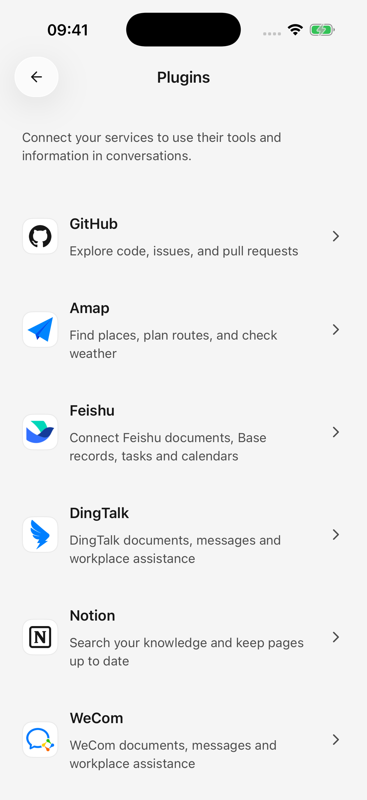
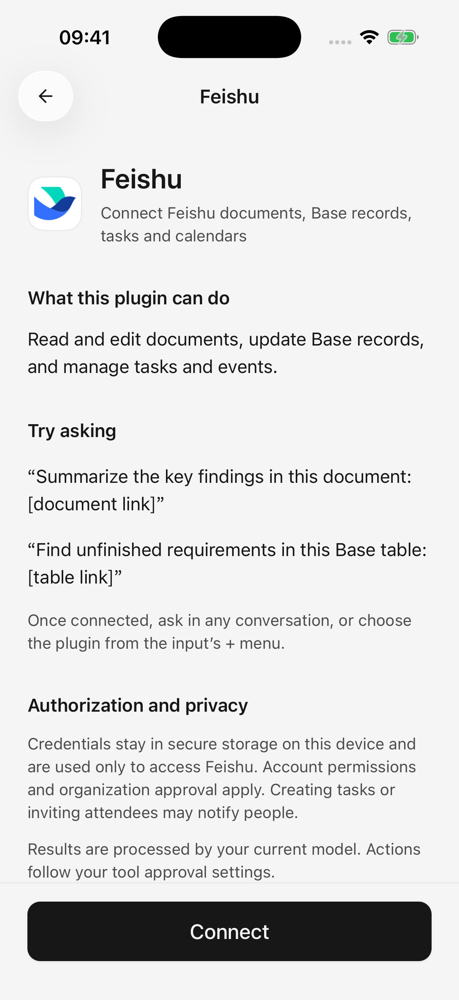

# Complementos y herramientas externas

Los complementos permiten a un agente acceder a otros servicios dentro de su autorización, como leer documentos Feishu, organizar páginas Notion o buscar rutas con Amap.

El modelo interpreta la tarea; el complemento accede al servicio. Seleccione primero un modelo de texto que admita llamadas a herramientas.

## Conectar y usar un complemento

1. Abra **Complementos** en la barra lateral y seleccione un servicio.
2. Lea sus capacidades, ejemplos y permisos, luego toque **Conectar**.
3. Complete la autorización de la cuenta o ingrese la clave de servicio requerida.
4. Regrese a Cherry Studio y confirme la cuenta/espacio de trabajo si se solicita, hasta que muestre **Conectado**.
5. Haz una solicitud específica en el chat. Opcionalmente, utilice **＋ → Complementos** para insertar el complemento de destino y luego agregue su pregunta.

Por ejemplo: "Utilice Feishu para resumir tres conclusiones de este documento: [enlace]". El nombre insertado aparece en el mensaje del redactor y enviado.

Los complementos conectados funcionan entre agentes sin una autorización separada para cada uno. Seleccionar un complemento en el campo de mensaje indica el servicio que se desea utilizar. La opción **＋ → Complementos** en el campo de mensaje del chat está oculta cuando no hay ningún complemento utilizable conectado.

<figure data-mobile-shot="phone"><figcaption>
<strong>iPhone · Interfaz en inglés</strong> · Elija un servicio de la lista de complementos
</figcaption></figure>
<figure data-mobile-shot="phone"><figcaption>
<strong>iPhone · Interfaz en inglés</strong> · Leer capacidades, ejemplos y detalles de autorización antes de conectarse
</figcaption></figure>

## Conexiones comunes

| Complemento | Útil para | Notas de conexión |
| --- | --- | --- |
| Feishu | Documentos, Tablas base, tareas, calendarios. | Configure una aplicación Feishu y autorice su cuenta; Es posible que se requiera la aprobación de la organización. Esta conexión actualmente admite cuentas Feishu, no cuentas Lark internacionales. |
| Notion | Buscar/leer/editar páginas y registros de bases de datos | Autorizar un espacio de trabajo y confirmar la cuenta; Los permisos del espacio de trabajo aún se aplican. |
| GitHub | Leer repositorios/discusiones y gestionar problemas/solicitudes de extracción | Utilice la autorización de la aplicación o un token de acceso personal; el acceso a la organización puede necesitar aprobación |
| Amap | Lugares, servicios cercanos, clima, rutas | Utilice un **Clave de servicio web** de la plataforma Amap; las consultas de ruta no leen automáticamente la ubicación del dispositivo |
| DingTalk | Documentos, calendario, tareas, otras operaciones de oficina. | Autorizar una cuenta y organización; algunas acciones requieren autorización adicional |
| WeCom | Documentos autorizados, hojas de cálculo, cronogramas, otros datos de oficina. | Pegue el enlace de autorización generado en el Asistente de transferencia de archivos de WeCom y ábralo allí, luego regrese a Cherry Studio. |

Una capacidad listada no es una promesa de acceso a la cuenta. Los planes, la configuración de la organización, los permisos de recursos y las cuotas determinan lo que puede usar su cuenta.

### Preparando Feishu

La "aplicación" en este flujo es una configuración de autorización Feishu, no otra aplicación de teléfono para instalar. Siga el enlace **Configurar aplicación** o la guía de configuración de la página de conexión. Si utiliza una aplicación existente, ingrese su ID de aplicación y su secreto de aplicación, habilite los permisos necesarios para documentos/tareas/calendario y luego autorice su cuenta personal.

La conexión puede seguir siendo utilizable aunque solo se haya concedido una parte de los permisos. Para añadir funciones, habilite los permisos correspondientes en la aplicación Feishu, obtenga la aprobación de la organización si es necesaria y actualice la autorización de su cuenta. Volver a conectar no concede los permisos que faltan.

### Aprobación adicional DingTalk

Complete la autorización de acción solicitada en DingTalk, luego regrese y **solicite la operación nuevamente**. La autorización no reproduce automáticamente la acción fallida.

### Enlace WeCom caducado

Los enlaces duran cinco minutos. Genere un nuevo enlace y ábralo dentro de WeCom, en lugar de hacerlo únicamente en un navegador normal.

## ¿Qué puedo hacer después de conectarme?

Comience con una lectura. Reemplace el texto entre corchetes con sus enlaces, nombres o fechas, luego verifique las fuentes y la cobertura del resultado.

| Complemento | Solicitud adaptable | Que comprobar |
| --- | --- | --- |
| Feishu | "Lea este documento: [enlace]. Enumere las conclusiones, las tareas, los propietarios y los plazos. Marque la información que falta como no confirmada; no cree tareas todavía". | Si los propietarios y las fechas son explícitos; La creación de tareas es un siguiente paso independiente. |
| Notion | "Lea esta página: [enlace]. Resuma el progreso reciente del proyecto y conserve los enlaces de origen". | Acceso al espacio de trabajo y si el contenido de la página relevante se leyó en su totalidad |
| GitHub | "Lea las discusiones sobre los temas de la semana pasada en [URL del repositorio], agrúpelas por tema e incluya enlaces". | Visibilidad del repositorio, rango de fechas y si se confirman las conclusiones de la discusión |
| Amap | "Compare el transporte público desde [ciudad y punto de partida] hasta [destino], incluyendo caminatas, transbordos y duración estimada". | Ciudad y dirección para topónimos duplicados; Las estimaciones no son horas de salida en vivo. |
| DingTalk | "Lea este documento: [enlace] y resuma el material sobre [tema]. No lo edite". | Organización y acceso a documentos, más cualquier autorización adicional en DingTalk |
| WeCom | "Lea este documento: [enlace]. Resuma tres conclusiones clave con las fuentes, sin editar". | El acceso a la cuenta autorizada y las herramientas realmente disponibles en la conexión. |

### Convierta notas de documentos en tareas guardadas

Por ejemplo, utilice dos solicitudes con Feishu:

1. "Lea estas notas de la reunión: [enlace]. Enumere las tareas propuestas, los propietarios y los plazos, pero no los cree".
2. Después de verificar: "Cree solo los elementos 1 y 2 como tareas Feishu con los propietarios y las fechas que confirmamos. Devuelva los resultados y los enlaces".

La lectura de documentos, la búsqueda de personas y la creación de tareas deben estar disponibles cuando sea necesario. Resuelva primero los nombres duplicados y las fechas poco claras. Una tabla de tareas en el chat no es prueba de que se hayan guardado las tareas. Las asignaciones e invitaciones también pueden notificar a otras personas.

### Leer y actualizar tablas base o bases de datos.

Proporcione el enlace de la tabla y la vista, luego indique el filtro: "Registros de solo lectura con estado En progreso en esta vista. Enumere los nombres y las fechas límite sin realizar cambios". Un proyecto puede tener varias tablas o vistas con nombres similares.

Antes de editar, identifique el registro y el campo exactos. Solicitar al agente que indique la cobertura cuando los resultados tengan paginación o límites; una consulta no es necesariamente toda la base de datos. La conexión actual Notion no proporciona manejo de archivos adjuntos ni acceso a los agentes Notion.

### ¿Pueden las herramientas trabajar juntas?

Las herramientas conectadas disponibles pueden cooperar en una tarea, por ejemplo, leer un documento y [guardar un archivo de lista de verificación](file-generation.md). Al copiar material entre servicios, especifique el destino y el contenido exacto, luego verifique cada resultado. El éxito en un paso no retrocede automáticamente si otro falla.

Para aprobación, verificaciones de resultados y manejo de fallas, consulte [Permitir que AI use herramientas](using-tools.md).

## Cerré la autorización, pero no está conectado.

Cerrar un navegador no cancela la autorización ni prueba que la conexión se realizó correctamente. Regrese a la página de conexión, use **Abrir página de autorización** o **Verifique nuevamente** si es necesario y finalice la confirmación de la cuenta.

Reinicie las solicitudes caducadas o denegadas. Para cambiar de cuenta, siga las instrucciones para desconectar primero la cuenta existente.

## Desconectar y revocar

Utilice la gestión de conexiones o el menú detallado de **Desconectar**. Eso elimina el acceso local.

Si la revocación remota no está confirmada, utilice **Administrar autorización** en el sitio web del proveedor. La eliminación local y la revocación por parte del proveedor no siempre terminan juntas.

Las credenciales del complemento permanecen en este dispositivo y no se transfieren mediante la importación de la configuración del escritorio; otro teléfono necesita una conexión separada. El modelo puede utilizar el contenido recuperado. Ver [datos y privacidad](data-privacy.md).

## Agregar un servicio MCP personalizado

**MCP** conecta un agente a servicios de herramientas adicionales. Utilícelo cuando ya tenga una dirección de servidor de herramientas remota; Los complementos integrados son más simples cuando satisfacen sus necesidades.

1. Abra **Configuración → MCP → Agregar servidor**.
2. Ingrese la dirección del servidor proporcionada, preferiblemente `https://`.
3. Si se requiere autenticación, complete **Encabezados** con una entrada `Name=Value` por línea, como `Authorization=Bearer your-token`, siguiendo las instrucciones del servicio.
4. Guarde, espere la conexión e inspeccione la lista **Herramientas**. Deshabilite las herramientas no deseadas.
5. Habilite el servidor correspondiente en el editor del agente de destino y luego envíe una nueva solicitud. Si el agente es nuevo, guárdelo primero y vuelva a abrir su editor para configurar las herramientas.

El servidor debe estar conectado y habilitado, la herramienta habilitada globalmente y el servidor correspondiente habilitado para el agente. La aprobación automática no pasa por alto ninguno de esos requisitos.

Este campo acepta direcciones remotas, no comandos de inicio de escritorio como `npx` o `uvx`. iOS puede bloquear `http://` simple; prefiere la dirección segura del servicio.

## Un complemento conectado aún no puede realizar la tarea

Verifique el estado de la conexión y el soporte de llamadas de herramientas modelo. Proporcione el enlace/nombre/intervalo de fechas de destino. Los errores de permisos necesitan reparación en el servicio, no cambios en las instrucciones del agente.

Para las escrituras, primero pídale que lea y enumere los cambios propuestos. Que la ejecución solicite confirmación depende de [aprobación de la herramienta](agents-and-tools.md).
