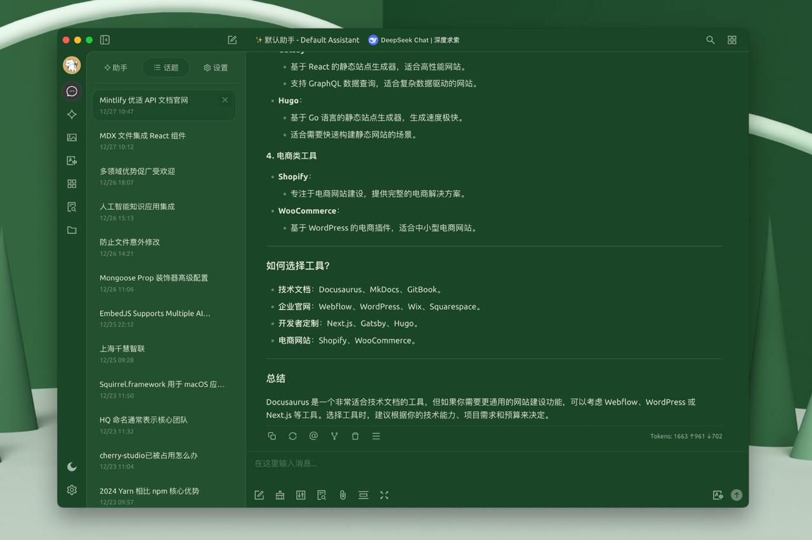

# CSS Personalizado

Mediante CSS personalizado, puedes modificar la apariencia del software para que se ajuste mejor a tus preferencias, como se muestra a continuación:

<figure><figcaption><p>CSS Personalizado</p></figcaption></figure>

```css
:root {
  --color-background: #1a462788;
  --color-background-soft: #1a4627aa;
  --color-background-mute: #1a462766;
  --navbar-background: #1a4627;
  --chat-background: #1a4627;
  --chat-background-user: #28b561;
  --chat-background-assistant: #1a462722;
}

#content-container {
  background-color: #2e5d3a !important;
}
```

### Variables incorporadas

```css
:root {
  font-family: "汉仪唐美人" !important; /* Fuente */
}

/* Color de fuente expandida para pensamiento profundo */
.ant-collapse-content-box .markdown {
  color: red;
}

/* Variables de tema */
:root {
  --color-black-soft: #2a2b2a; /* Color de fondo oscuro */
  --color-white-soft: #f8f7f2; /* Color de fondo claro */
}

/* Tema oscuro */
body[theme-mode="dark"] {
  /* Colores */
  --color-background: #2b2b2b; /* Color de fondo oscuro */
  --color-background-soft: #303030; /* Color de fondo claro */
  --color-background-mute: #282c34; /* Color de fondo neutral */
  --navbar-background: var(-–color-black-soft); /* Color de fondo de la barra de navegación */
  --chat-background: var(–-color-black-soft); /* Color de fondo del chat */
  --chat-background-user: #323332; /* Color de fondo del chat de usuario */
  --chat-background-assistant: #2d2e2d; /* Color de fondo del chat del asistente */
}

/* Estilos específicos del tema oscuro */
body[theme-mode="dark"] {
  #content-container {
    background-color: var(-–chat-background-assistant) !important; /* Color de fondo del contenedor de contenido */
  }

  #content-container #messages {
    background-color: var(-–chat-background-assistant); /* Color de fondo de los mensajes */
  }

  .inputbar-container {
    background-color: #3d3d3a; /* Color de fondo del área de entrada */
    border: 1px solid #5e5d5940; /* Color del borde del área de entrada */
    border-radius: 8px; /* Radio del borde del área de entrada */
  }

  /* Estilos de código */
  code {
    background-color: #e5e5e20d; /* Color de fondo del código */
    color: #ea928a; /* Color de texto del código */
  }

  pre code {
    color: #abb2bf; /* Color de texto del código preformateado */
  }
}

/* Tema claro */
body[theme-mode="light"] {
  /* Colores */
  --color-white: #ffffff; /* Blanco */
  --color-background: #ebe8e2; /* Color de fondo claro */
  --color-background-soft: #cbc7be; /* Color de fondo claro */
  --color-background-mute: #e4e1d7; /* Color de fondo neutral */
  --navbar-background: var(-–color-white-soft); /* Color de fondo de la barra de navegación */
  --chat-background: var(-–color-white-soft); /* Color de fondo del chat */
  --chat-background-user: #f8f7f2; /* Color de fondo del chat de usuario */
  --chat-background-assistant: #f6f4ec; /* Color de fondo del chat del asistente */
}

/* Estilos específicos del tema claro */
body[theme-mode="light"] {
  #content-container {
    background-color: var(-–chat-background-assistant) !important; /* Color de fondo del contenedor de contenido */
  }

  #content-container #messages {
    background-color: var(-–chat-background-assistant); /* Color de fondo de los mensajes */
  }

  .inputbar-container {
    background-color: #ffffff; /* Color de fondo del área de entrada */
    border: 1px solid #87867f40; /* Color del borde del área de entrada */
    border-radius: 8px; /* Radio del borde del área de entrada, ajusta al tamaño que prefieras */
  }

  /* Estilos de código */
  code {
    background-color: #3d39290d; /* Color de fondo del código */
    color: #7c1b13; /* Color de texto del código */
  }

  pre code {
    color: #000000; /* Color de texto del código preformateado */
  }
}
```

Para más variables de tema, consulta el código fuente: [https://github.com/CherryHQ/cherry-studio/tree/main/src/renderer/src/assets/styles](https://github.com/CherryHQ/cherry-studio/tree/main/src/renderer/src/assets/styles)

### Recomendaciones relacionadas

Biblioteca de temas de Cherry Studio: [https://github.com/boilcy/cherrycss](https://github.com/boilcy/cherrycss)

Compartiendo algunos temas de estilo chino para Cherry Studio: [https://linux.do/t/topic/325119/129](https://linux.do/t/topic/325119/129)