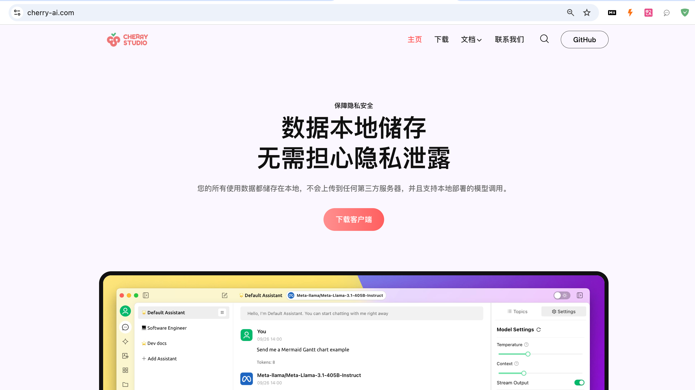
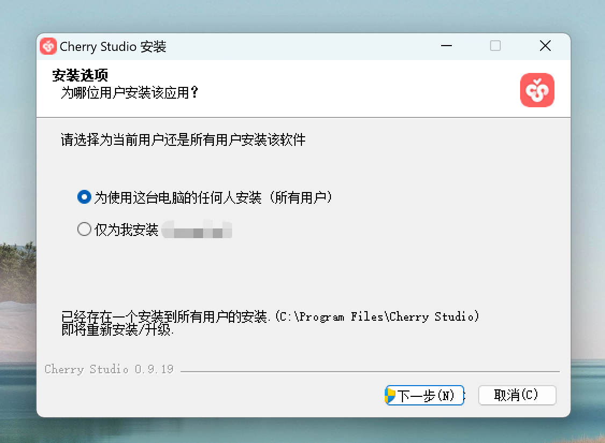
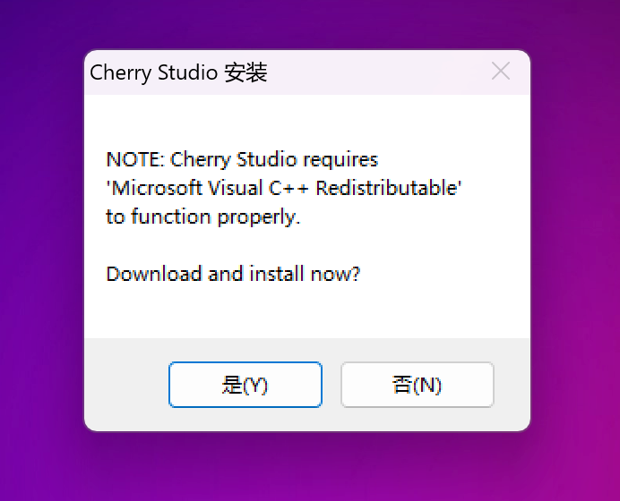

# Windows

## Abrir el sitio web oficial


Nota: Windows 7 no es compatible con la instalación de Cherry Studio.


## Descargar



<figure><figcaption>
Abrir el sitio web oficial
</figcaption></figure>

## Instalar

<figure><figcaption>
Interfaz de instalación del software
</figcaption></figure>

### Bibliotecas de dependencias del software

Este software requiere las bibliotecas en tiempo de ejecución de Visual C++ Redistributable. Si aparece un aviso de instalación, haga clic en "Sí" para instalar las dependencias del software.

O descargue e instálelo manualmente: [https://aka.ms/vs/17/release/vc\_redist.x64.exe](https://aka.ms/vs/17/release/vc_redist.x64.exe)

<figure><figcaption></figcaption></figure>
