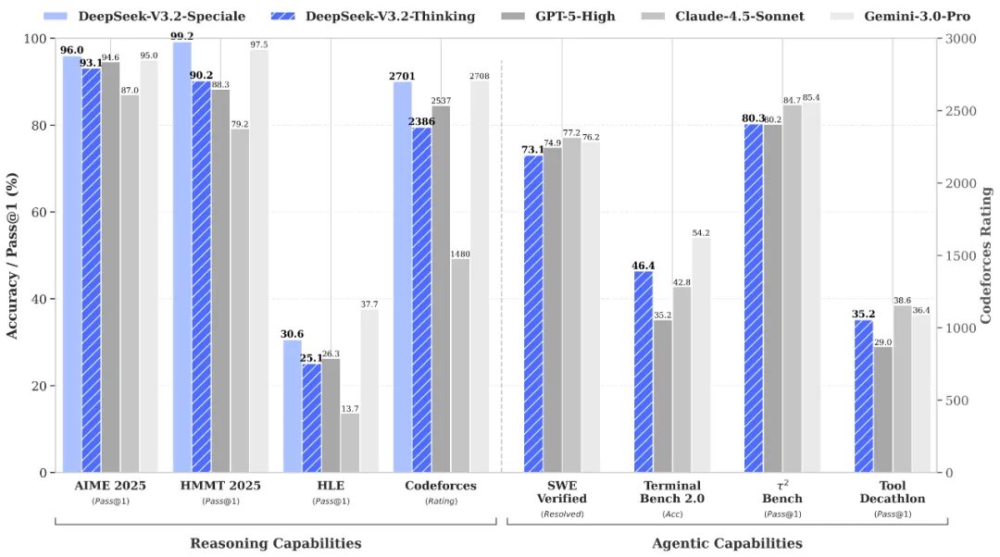
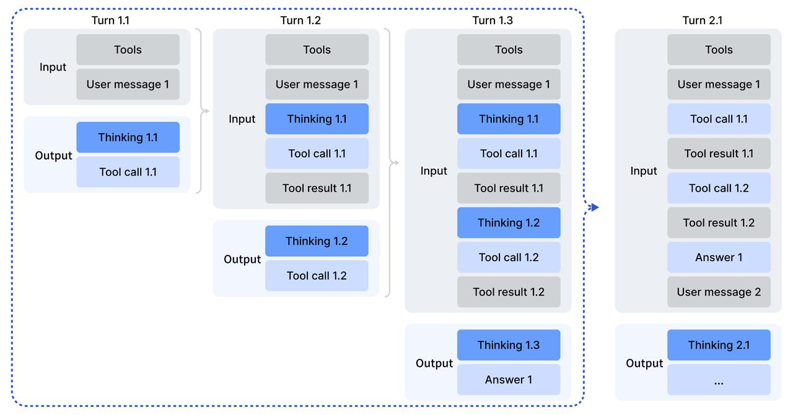
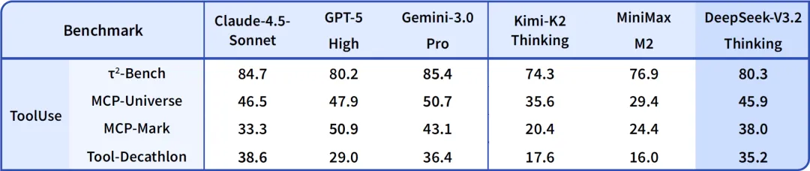
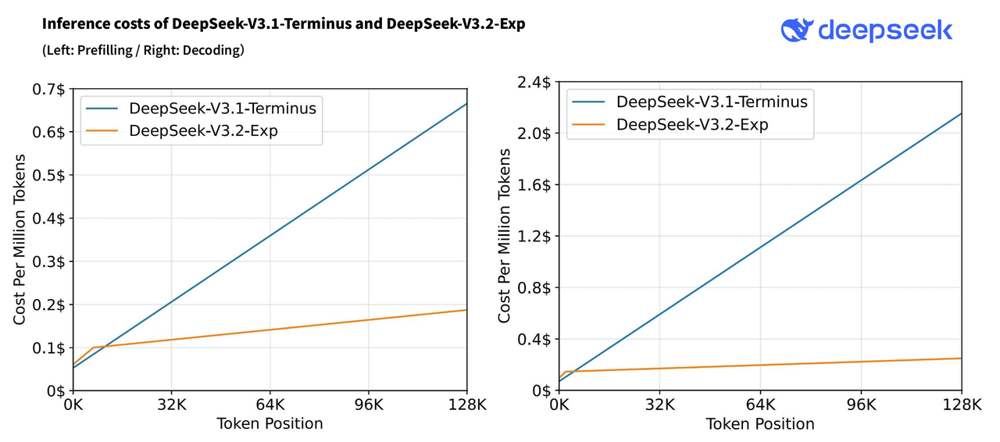

# DeepSeek V3.2

Los usuarios de Cherry Studio ahora pueden experimentar **DeepSeek V3.2** de forma gratuita a través del servicio integrado **CherryIN**. Se trata del modelo insignia de MoE con atención dispersa lanzado por DeepSeek el 1 de diciembre de 2025, que integra por primera vez el "pensamiento" de forma nativa en la invocación de herramientas, siendo la opción ideal para agentes avanzados y escenarios de contexto largo.

***

## ¿Qué es DeepSeek V3.2?

DeepSeek V3.2 se itera a partir de V3.2-Exp, adopta una arquitectura Mixture-of-Experts (MoE) e introduce el mecanismo de atención dispersa **DeepSeek Sparse Attention (DSA)**, lo que reduce significativamente el costo de inferencia en contextos largos manteniendo una escala total de parámetros muy grande.

- Arquitectura: MoE + DeepSeek Sparse Attention (DSA) + Multi-Head Latent Attention (MLA)
- Parámetros totales: 685B
- Parámetros activados por token: aproximadamente 37B
- Número de expertos: 256 expertos por capa
- Licencia de código abierto: MIT
- Fecha de lanzamiento: 1 de diciembre de 2025 (V3.2-Exp se lanzó el 29 de septiembre de 2025)

V3.2 también lanzó la versión **DeepSeek-V3.2-Speciale** orientada a API, que logra un rendimiento de nivel medalla de oro en IMO, CMO, ICPC World Finals e IOI 2025 en tareas de razonamiento complejo.

<figure><figcaption></figcaption></figure>

***

## Proceso de entrenamiento y alineación sólido y continuo

DeepSeek V3.2 mantiene la línea de entrenamiento madura de la serie V3 y realiza extensiones clave para escenarios de Agent:

1. **Preentrenamiento a gran escala**: Completación del entrenamiento básico sobre un corpus multilingüe masivo y de alta calidad, cubriendo código, matemáticas y conocimiento científico.
2. **Introducción de atención dispersa**: Entrenamiento del modelo principal y del índice lightning con una longitud de secuencia de 128K, donde cada token de consulta selecciona 2048 tokens clave-valor para participar en la atención.
3. **Síntesis de datos de Agent a gran escala**: Nuevo método de síntesis de datos de entrenamiento para Agent que cubre más de 1.800 entornos y más de 85.000 instrucciones complejas.
4. **Fusión de pensamiento e invocación de herramientas**: V3.2 es el primer modelo de DeepSeek que integra el "pensamiento" de forma nativa en la invocación de herramientas, permitiendo llamar a herramientas tanto en "modo de pensamiento" como en "modo sin pensamiento".

<figure><figcaption></figcaption></figure>

***

## Capacidades nucleares de nivel insignia

DeepSeek V3.2 destaca por capacidades integrales "al nivel de GPT-5" y refuerza significativamente el rendimiento en Agent y razonamiento complejo:

- ✅ **Pensamiento nativo + invocación de herramientas**: Primer modelo de DeepSeek que integra el pensamiento en el uso de herramientas
- ✅ **Capacidad de razonamiento de élite**: V3.2-Speciale alcanza el nivel de medalla de oro en IMO / CMO / ICPC World Finals / IOI 2025
- ✅ **Código y tareas de desarrollo**: Hereda la fuerte capacidad de código de la serie V3
- ✅ **Estabilidad en contexto largo**: Capacidad de análisis a nivel de documentos largos y repositorios de código gracias a DSA
- ✅ **Invocación estructurada de herramientas**: Adecuado para construir Agent con planificación y ejecución en múltiples pasos

<figure><figcaption></figcaption></figure>

***

## DeepSeek Sparse Attention: más largo y más eficiente

DSA es la mejora tecnológica central de V3.2, implementada mediante **índice lightning + selección fina de tokens**:

- Primera implementación de atención dispersa de grano fino en modelos de gran escala
- Reduce la complejidad de la atención central desde O(L²)
- Acelera significativamente el entrenamiento e inferencia en contexto largo, manteniendo una calidad de salida casi idéntica a la atención densa

| Escenario | Uso recomendado | Ejemplo |
| --- | --- | --- |
| Conversaciones cortas / Preguntas simples | Invocación directa | Preguntas cotidianas, resúmenes |
| Tareas de complejidad media | Habilitar invocación de herramientas | Análisis de datos, refactorización de código |
| Tareas complejas de Agent | Pensamiento + invocación de herramientas | Planificación en múltiples pasos, análisis de repositorios de código, revisión de documentos largos |

***

## Abierto, utilizable y amigable con el ecosistema

- ⚡ Aceleración de inferencia en contexto largo gracias a DSA
- 💰 **Uso gratuito** en Cherry Studio a través de CherryIN
- 🖥️ Pesos de código abierto, licencia MIT, soporte desde el día 1 en frameworks de inferencia principales como vLLM, SGLang, etc.

<figure><figcaption></figcaption></figure>

***

## Enfoque en capacidades prácticas: código y Agent

DeepSeek V3.2 destaca especialmente en flujos de trabajo de desarrollo reales:

- Generación y refactorización de código multilingüe
- Comprensión de contexto a nivel de repositorio de código y generación de parches
- Cadena de herramientas de Agent: Invocación estable de herramientas externas, búsqueda, ejecución de código
- Matemáticas y razonamiento complejo: Soporte para problemas de nivel competitivo

***

## ¿Cómo usarlo en Cherry Studio?

1. Abra Cherry Studio y vaya a **Configuración → Servicios de modelos**.
2. Encuentre el proveedor **CherryIN** y actívelo.
3. Seleccione **DeepSeek V3.2** en la lista de modelos.
4. Vuelva a la interfaz de chat y cambie a **DeepSeek V3.2** en el selector de modelos superior para comenzar la conversación.

> 💡 Consejo: La cuota de modelos gratuitos proporcionada por CherryIN es asumida oficialmente por Cherry Studio, ideal para experiencia diaria y evaluación; para entornos de producción, se recomienda combinar con la API oficial de DeepSeek.

***

📘 **Experimente DeepSeek V3.2 ahora mismo y comience su viaje de razonamiento insignia y Agent!**

***

### Obtener ayuda y enviar comentarios

Si tiene alguna duda, encuentra un error o tiene sugerencias de mejora de funciones durante la configuración o el uso, consulte los canales oficiales proporcionados en [Comentarios y sugerencias](../../../question-contact/suggestions.md).
