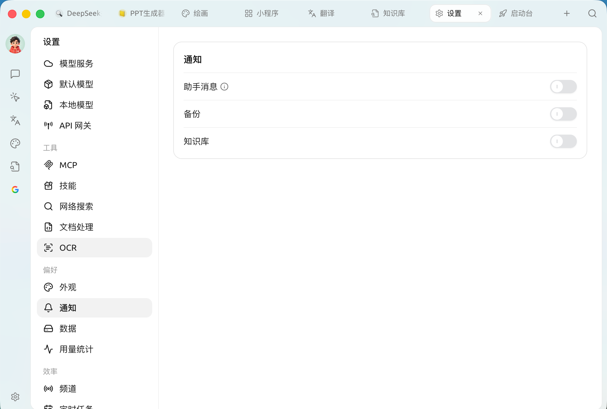

# Notificaciones

La configuración de notificaciones controla **cómo te avisa el software cuando se ejecuta en segundo plano**. Cuando cambias a otra ventana para trabajar, Cherry Studio puede mostrar notificaciones del sistema al completar eventos clave, evitando que esperes en vano o te pierdas los resultados.

Abre `Configuración → Notificaciones`, donde hay tres interruptores independientes:

<figure><figcaption>
Panel de configuración de notificaciones
</figcaption></figure>

| Interruptor | Cuándo te avisa | Recomendación |
| --- | --- | --- |
| **Mensajes del asistente** | Solo avisa cuando la respuesta de la IA es **exitosa** y la generación **toma más de 30 segundos** (hay una explicación con ⓘ junto al interruptor) | **Activar**. Al usar modelos de razonamiento o generar textos largos, no es necesario estar mirando la pantalla esperando |
| **Copia de seguridad** | Al completar una copia de seguridad automática / manual | **Activar**. Para confirmar que los datos se han archivado de forma segura |
| **Base de conocimientos** | Aviso al completar tareas relacionadas con la base de conocimientos (como la construcción de índices) | **Activar**. La creación de la base suele ser un proceso que consume tiempo, y recibir un aviso al finalizar es más práctico |


Estas notificaciones se envían a través del centro de notificaciones del sistema operativo. Si no recibes ningún aviso, verifica si el sistema permite que Cherry Studio envíe notificaciones ("Notificaciones" en macOS, "Notificaciones y acciones" en Windows).


***

### Obtener ayuda y enviar comentarios

Si tienes cualquier duda, error o sugerencia de mejora de funciones durante la configuración o el uso, consulta los canales oficiales proporcionados en [Comentarios y sugerencias](../../question-contact/suggestions.md).
