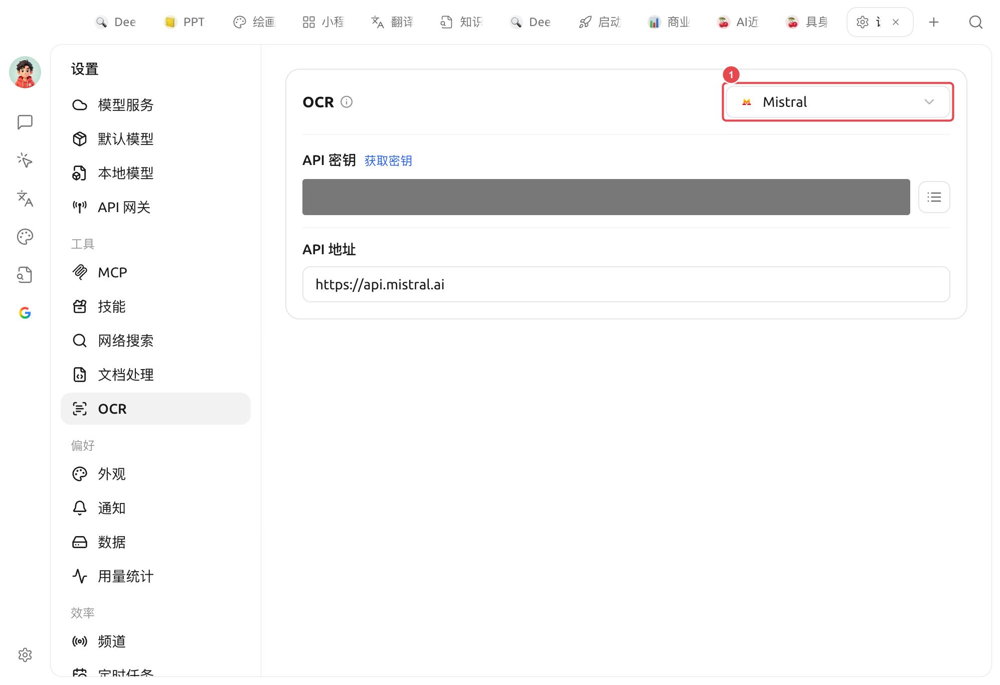

# OCR

OCR (Optical Character Recognition, reconocimiento óptico de caracteres) se encarga de **convertir el texto en imágenes en texto copiable y legible por la IA**. Las siguientes tareas dependen de él:

* Arrastrar una captura de pantalla / documento escaneado al cuadro de diálogo para que la IA lea el texto contenido en él
* Insertar facturas o documentos en formato de imagen en la [base de conocimientos](../../knowledge-base/knowledge-base.md) para poder buscarlos más adelante
* Que un [Agente](../../advanced-basic/agent.md) abra una imagen local para analizarla

OCR es una página de configuración independiente. Configura el motor de reconocimiento una vez en [Configuración] → [OCR] y todos los lugares donde se utilice el reconocimiento de texto en imágenes usarán la misma configuración.

<figure><figcaption>
Configuración de OCR: ① Selecciona el motor de reconocimiento mediante el menú desplegable en la esquina superior derecha (la imagen muestra Mistral), e ingresa la clave API y la dirección API del motor seleccionado en la parte inferior
</figcaption></figure>

### Selección del motor de reconocimiento

El menú desplegable en la esquina superior derecha del panel se utiliza para cambiar el motor de OCR; **el motor seleccionado se convierte en el predeterminado**. Motores integrados:

| Motor | Método de conexión / ejecución | A quién le conviene |
| --- | --- | --- |
| **System OCR** | Sin conexión, sin configuración | Utiliza el reconocimiento integrado del sistema (macOS Live Text / Windows OCR), listo para usar y con la velocidad más rápida |
| **PaddleOCR** | Ingresa la clave API ([Comunidad Paddle Star](https://aistudio.baidu.com/paddleocr/)); si se autoaloja, apunta la dirección API a tu servicio. Modelo de análisis opcional | Quien no quiera consumir recursos locales pero desee la calidad de reconocimiento de Paddle |
| **PaddleOCR local** | Sin conexión, requiere descargar previamente el modelo OCR local en [Configuración] → [Modelos locales] (aprox. 140MB) | Buen reconocimiento de chino y ejecución completamente local, priorizando la privacidad |
| **Tesseract OCR** | Sin conexión, integrado | OCR de código abierto clásico, multilingüe, útil como respaldo |
| **Mistral** | Clave API de Mistral | Reconocimiento mediante modelos de lenguaje multimodales, más inteligente para maquetaciones complejas / escritura a mano |
| **Intel OV OCR** | Ejecución local (Intel OpenVINO, aceleración NPU) | **Solo aparece en Windows + Intel Core Ultra (con NPU) y con el modelo OV desplegado**; no es visible en otros dispositivos |


¿No estás seguro de cuál elegir? Usa primero **System OCR**: la mayoría de las capturas de pantalla y escaneos claros se procesan directamente sin ninguna configuración. Si el resultado de reconocimiento no es satisfactorio, cambia a PaddleOCR local o Mistral.


Cuando se selecciona System OCR, el panel mostrará <mark style="color:green;">Motor macOS Live Text / Windows OCR detectado y disponible</mark> (si el sistema no lo admite, esta opción no aparecerá en el menú desplegable).


* Antes de seleccionar «PaddleOCR local», descarga el «Modelo OCR local» en [Configuración] → [Modelos locales], de lo contrario no se podrá invocar.
* **Tesseract** (y System OCR en Windows) permite seleccionar los idiomas a reconocer mediante el menú desplegable «Idioma» del panel.


### Diferencia con el procesamiento de documentos

Muchas personas confunden OCR con el [procesamiento de documentos](doc-process.md); la distinción en una frase:

* **OCR**: Se encarga del reconocimiento de texto en **imágenes / escaneos** (imagen → texto).
* **Procesamiento de documentos**: Se encarga del análisis estructurado de **PDF / documentos con maquetación compleja** (PDF con tablas, múltiples columnas → texto ordenado).

Ambos son independientes y se configuran por separado. Los párrafos de texto en PDF de solo texto, `.md`/`.txt`/`.docx` no pasan por ninguno de los dos; se leen directamente.

***

### Obtener ayuda y enviar comentarios

Si tienes cualquier duda, error o sugerencia de mejora de funciones durante la configuración o el uso, consulta los canales oficiales proporcionados en [Comentarios y sugerencias](../../question-contact/suggestions.md).
