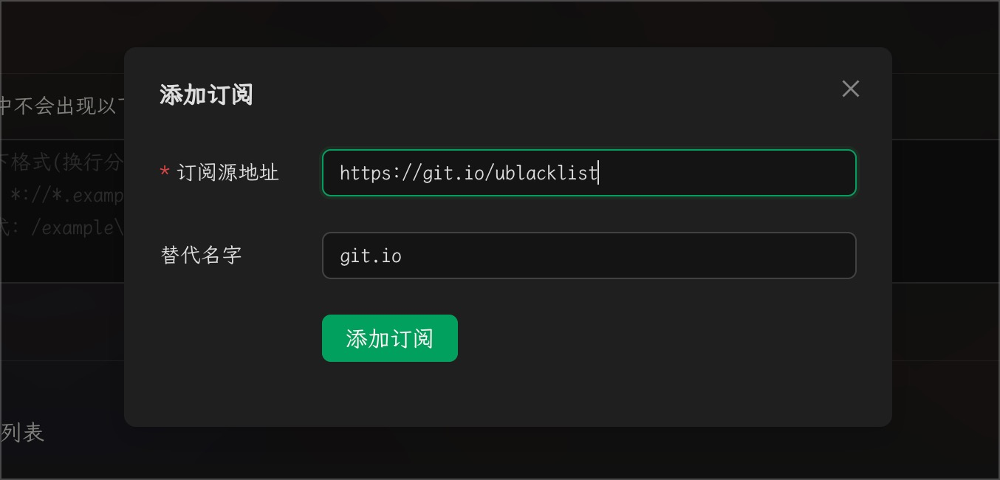

# Configuración de Lista Negra para Búsquedas Web


Este documento ha sido traducido del chino por IA y aún no ha sido revisado.


Cherry Studio admite dos métodos para configurar listas negras: manualmente y mediante fuentes de suscripción. Las reglas de configuración hacen referencia a [ublacklist](https://github.com/iorate/ublacklist).

## Configuración Manual

Puedes agregar reglas para los resultados de búsqueda o hacer clic en el icono de la barra de herramientas para bloquear sitios web específicos. Las reglas se pueden especificar mediante [patrones de coincidencia](https://developer.mozilla.org/zh-CN/docs/mozilla/add-ons/webextensions/match_patterns) (ejemplo: `*://*.example.com/*`) o usando [expresiones regulares](https://developer.mozilla.org/zh-CN/docs/web/javascript/guide/regular_expressions) (ejemplo: `/example\.(net|org)/`).

## Configuración de Fuentes de Suscripción

También puedes suscribirte a conjuntos de reglas públicos. Este sitio web enumera algunas suscripciones:\
https://iorate.github.io/ublacklist/subscriptions

Aquí hay algunos enlaces de suscripción recomendados:

| Nombre                                                                                                    | Enlace                                                                                                   | Tipo         |
| --------------------------------------------------------------------------------------------------------- | -------------------------------------------------------------------------------------------------------- | ------------ |
| [uBlacklist subscription compilation](https://github.com/eallion/uBlacklist-subscription-compilation)     | https://git.io/ublacklist                                                                                | Chino        |
| [uBlockOrigin-HUGE-AI-Blocklist](https://github.com/laylavish/uBlockOrigin-HUGE-AI-Blocklist)             | https://raw.githubusercontent.com/laylavish/uBlockOrigin-HUGE-AI-Blocklist/main/list_uBlacklist.txt      | Generado por IA |

<figure><figcaption>
Configuración de Fuentes de Suscripción
</figcaption></figure>