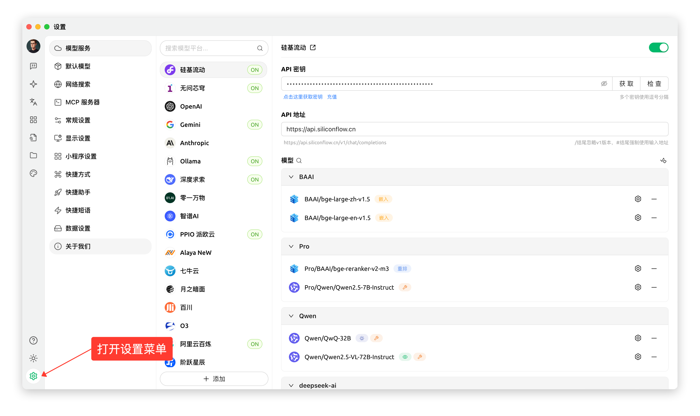
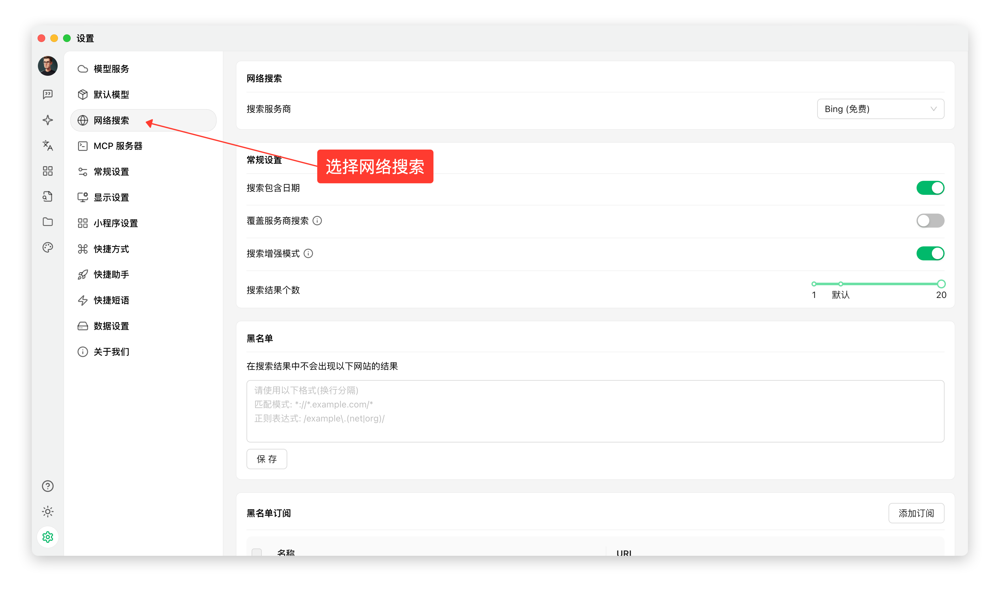
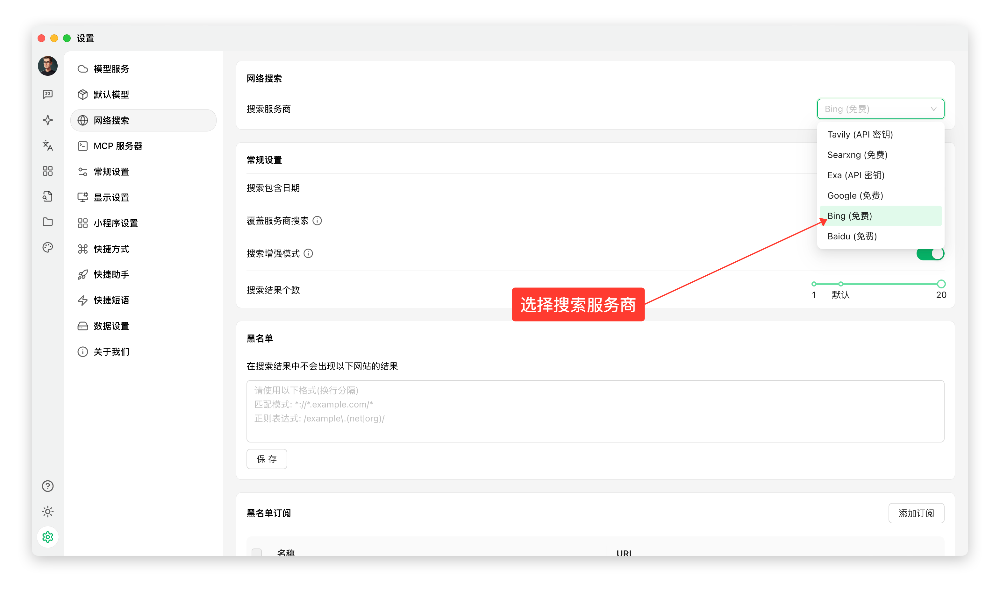
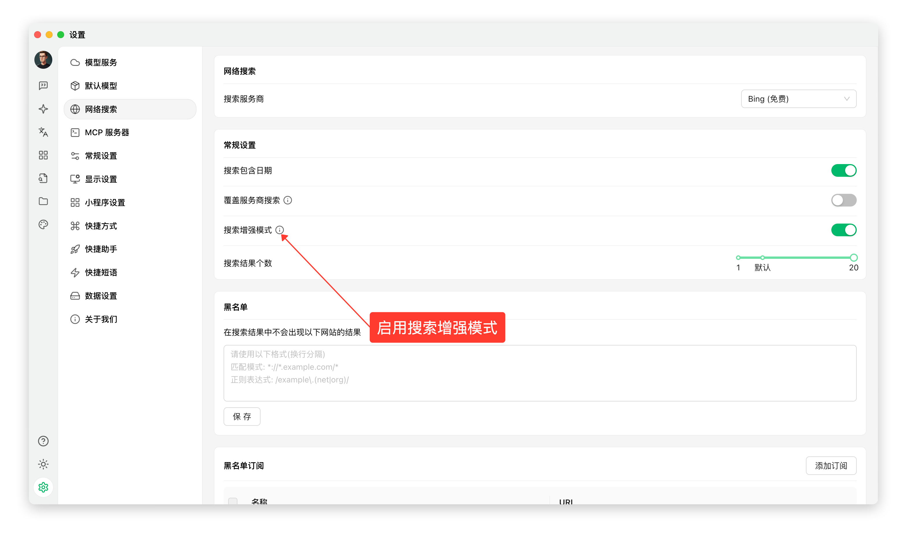
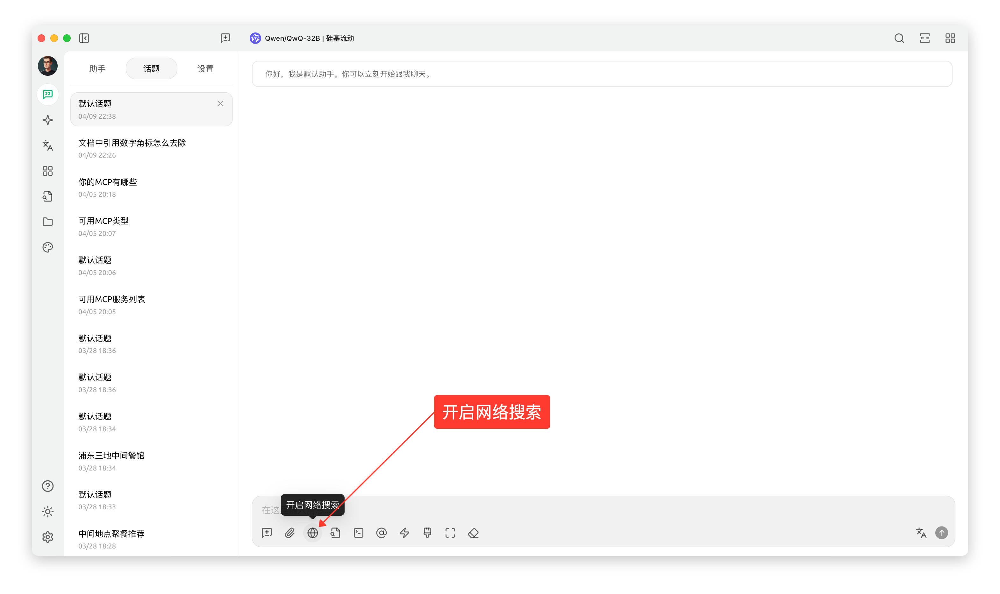
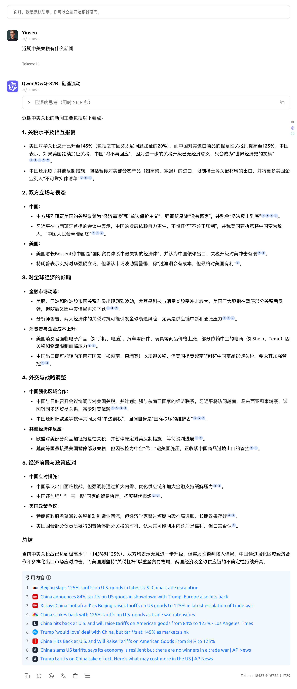
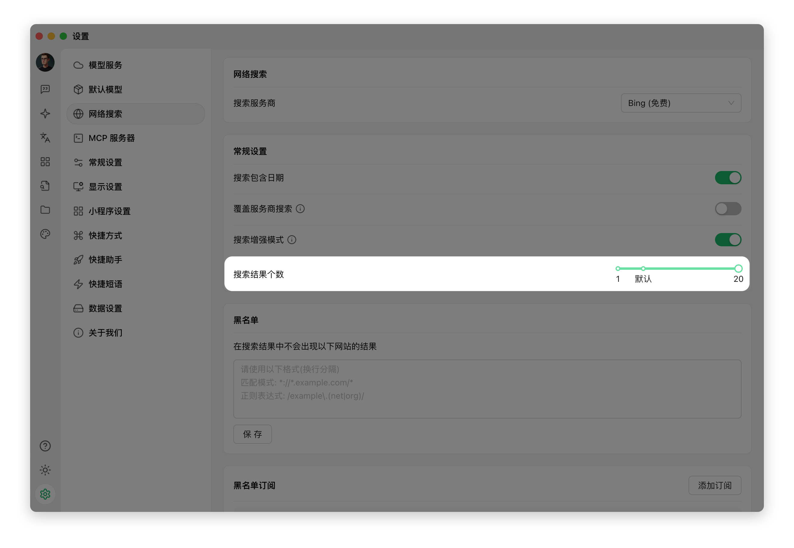

# Modo de Conexión Gratuita a Internet


Este documento ha sido traducido del chino por IA y aún no ha sido revisado.


Cherry Studio incluye una potente función de búsqueda web que te permite obtener información actualizada en tiempo real durante las conversaciones. Sigue estos pasos para activar y utilizar fácilmente esta funcionalidad:

***

### Pasos de Activación

1. **Abrir el menú de configuración**
   * Inicia la aplicación Cherry Studio.
   * En la pantalla principal, localiza y haz clic en el icono o opción de menú **Configuración (Settings)**; ubicado en la esquina inferior izquierda.\
     <figure><figcaption></figcaption></figure>
2. **Acceder a la configuración de búsqueda web**
   * En el menú de configuración, busca y selecciona los ajustes de **Búsqueda web**.\
     <figure><figcaption></figcaption></figure>
3. **Seleccionar tu motor de búsqueda**
   * En la página de ajustes de "Búsqueda web", localiza la opción **Proveedor de búsqueda**.
   * Haz clic y elige tu motor preferido de la lista desplegable:
     * **Bing**: Motor de Microsoft con buen acceso global.
     * **Baidu**: Popular en China, amplia cobertura en territorio continental.
     * **Google**: Motor líder mundial con información internacional.
   *   **⚠️ Importante**: Si eliges **Google**, asegúrate de tener **acceso sin restricciones** a sus servicios. Ante problemas de conexión, cambia de proveedor o verifica tu proxy.\
       <figure><figcaption></figcaption></figure>
4. **Confirmar el modo de búsqueda mejorada**
   * Busca la opción **Modo de búsqueda mejorada**.
   *   Asegúrate de que el interruptor (Toggle) o casilla (Checkbox) esté **activado**. Este modo optimiza las consultas para resultados más relevantes.\
       <figure><figcaption></figcaption></figure>
5. **Activar la búsqueda web en el chat**
   * Regresa a la **interfaz de chat** principal.
   * En la **barra de herramientas** del cuadro de mensaje.
   * Busca el icono **Búsqueda web** 🌐.
   *   **Haz clic en el icono** para activar. Se **resaltará** indicando que tu mensaje desencadenará una búsqueda.\
       <figure><figcaption></figcaption></figure>
6. **¡Comienza a buscar!**
   * Con el icono **activado**, escribe tus **palabras clave, preguntas o instrucciones**.
   *   Envía el mensaje normalmente. Cherry Studio usará tu motor seleccionado e integrará los resultados en su respuesta.\
       <figure><figcaption></figcaption></figure>

***

### ✨ Consideraciones Clave y Consejos

* **Cantidad de resultados**:
  * Por defecto, Cherry Studio muestra **~6 resúmenes** de resultados para equilibrio velocidad-información.
  *   Si está disponible, **aumenta la cantidad** para cobertura más completa.\
      <figure><figcaption></figcaption></figure>
* **Rendimiento y límites**:
  * Solicitar más resultados **aumenta el tiempo de procesamiento** y **ralentiza las respuestas**.
  * El exceso de contenido puede **exceder el límite de contexto del modelo**, causando **pérdida de información o errores**.
* **Recomendaciones**:
  * Mantén la configuración predeterminada inicialmente.
  * Ajusta gradualmente según necesidades y tolerancia a esperas.
  * **Desactiva el icono 🌐** después de usar para evitar búsquedas innecesarias.

***

¡Ahora dominas la búsqueda web en Cherry Studio! Utilízala para explorar información actualizada, verificar datos o descubrir nuevos temas.