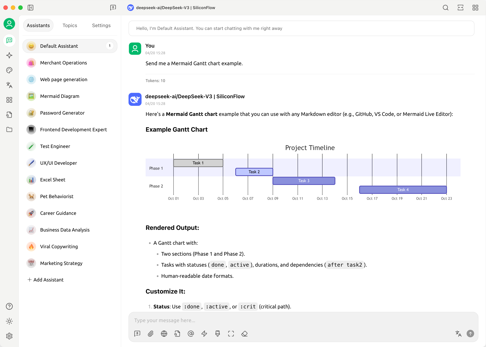
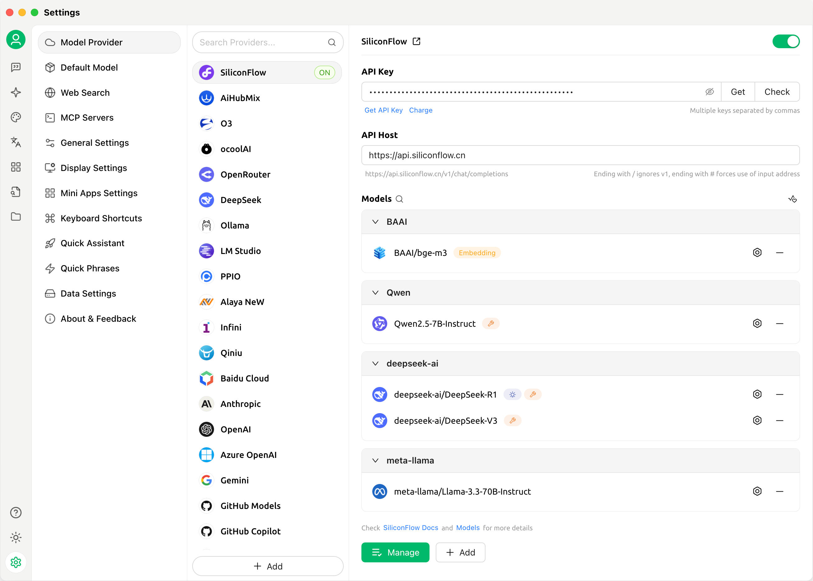

# 專案簡介


此文件由 AI 從中文翻譯而來，尚未經過審閱。


<figure><figcaption></figcaption></figure>

關注我們的社交賬號：[推特(X)](https://x.com/CherryStudioHQ)、[小紅書](https://www.xiaohongshu.com/user/profile/662b6853000000000b031d9a)、[微博](https://weibo.com/u/7975656228)、[嗶哩嗶哩](https://space.bilibili.com/3546657515898892)、[抖音](https://www.douyin.com/user/MS4wLjABAAAAmw9A54m5J0hHVMQY5eGrVJ-EHDoOS0hgJ6M1F9MN2Tn2V163A0xrC4_KVzfmQSxC)

加入我們的社群：[QQ群(575014769)](https://qm.qq.com/q/lo0D4qVZKi)、[Telegram](https://t.me/CherryStudioAI)、[Discord](https://discord.gg/wez8HtpxqQ)、[微信群（點擊查看）](https://www.cherry-ai.com/#Community)

***

Cherry Studio 是一款集多模型對話、知識庫管理、AI 繪畫、翻譯等功能於一體的全能 AI 助手平台。  
Cherry Studio 高度自訂的設計、強大的擴展能力和友好的使用者體驗，使其成為專業使用者和 AI 愛好者的理想選擇。無論是零基礎使用者還是開發者，都能在 Cherry Studio 中找到適合自己的 AI 功能，提升工作效率和創造力。

<figure><figcaption></figcaption></figure>

<figure><figcaption></figcaption></figure>

***

### **核心功能與特色**

#### **1. 基礎對話功能**

* **一問多答**：支援同一問題透過多個模型同時生成回覆，方便使用者對比不同模型的表現，詳見 [對話界面](cherrystudio/preview/chat.md)。
* **自動分組**：每個助手的對話記錄會自動分組管理，便於使用者快速查找歷史對話。
* **對話匯出**：支援將完整對話或部分對話匯出為多種格式（如 Markdown、Word 等），方便儲存與分享。
* **高度自訂參數**：除了基礎參數調整外，還支援使用者填寫自訂參數，滿足個性化需求。
* **助手市場**：內建千餘個行業專用助手，涵蓋翻譯、編程、寫作等領域，同時支援使用者自訂助手。
* **多種格式渲染**：支援 Markdown 渲染、公式渲染、HTML 即時預覽等功能，提升內容展示效果。

#### **2. 多種特色功能整合**

* **AI 繪畫**：提供專用繪畫面板，使用者可透過自然語言描述生成高品質影像。
* **AI 小程式**：整合多種免費 Web 端 AI 工具，無需切換瀏覽器即可直接使用。
* **翻譯功能**：支援專用翻譯面板、對話翻譯、提示詞翻譯等多種翻譯場景。
* **檔案管理**：對話、繪畫和知識庫中的檔案統一分類管理，避免繁瑣查找。
* **全域搜尋**：支援快速定位歷史記錄和知識庫內容，提升工作效率。

#### **3. 多服務商統一管理機制**

* **服務商模型聚合**：支援 OpenAI、Gemini、Anthropic、Azure 等主流服務商的模型統一呼叫。
* **模型自動獲取**：一鍵取得完整模型列表，無需手動配置。
* **多秘鑰輪詢**：支援多個 API 秘鑰輪換使用，避免速率限制問題。
* **精準頭像匹配**：為每個模型自動匹配專屬頭像，提升辨識度。
* **自訂服務商**：支援符合 OpenAI、Gemini、Anthropic 等規範的第三方服務商接入，相容性強。

#### **4. 高度自訂介面和佈局**

* **自訂 CSS**：支援全域樣式自訂，打造專屬介面風格。
* **自訂對話佈局**：支援列表或氣泡樣式佈局，並可自訂訊息樣式（如程式碼片段樣式）。
* **自訂頭像**：支援為軟體和助手設定個性化頭像。
* **自訂側邊欄選單**：使用者可根據需求隱藏或排序側邊欄功能，優化使用體驗。

#### **5. 本機知識庫系統**

* **多種格式支援**：支援 PDF、DOCX、PPTX、XLSX、TXT、MD 等多種檔案格式匯入。
* **多種資料來源支援**：支援本機檔案、網址、站點地圖甚至手動輸入內容作為知識庫來源。
* **知識庫匯出**：支援將處理好的知識庫匯出並分享給他人使用。
* **支援搜尋檢查**：知識庫匯入後，使用者可即時檢索測試，查看處理結果和分段效果。

#### **6. 特色聚焦功能**

* **快捷問答**：在任何場景（如微信、瀏覽器）中呼出快捷助手，快速取得答案。
* **快捷翻譯**：支援快速翻譯其他場景中的詞彙或文字。
* **內容總結**：對長文字內容進行快速總結，提升資訊提取效率。
* **解釋說明**：無需複雜提示詞，一鍵解釋說明不懂的問題。

#### **7. 資料保障**

* **多種備份方案**：支援本機備份、WebDAV 備份和定時備份，確保資料安全。
* **資料安全**：支援全本機場景使用，結合本機大模型，避免資料洩漏風險。

***

### **專案優勢**

1. **新手友好**：Cherry Studio 致力於降低技術門檻，零基礎使用者也能快速上手，讓使用者專注於工作、學習或創作。
2. **文件完善**：提供詳細的使用文件和常見問題處理手冊，幫助使用者快速解決問題。
3. **持續迭代**：專案團隊積極響應使用者回饋，持續最佳化功能，確保專案健康發展。
4. **開源與擴展性**：支援使用者透過開源程式碼進行客製化和擴展，滿足個性化需求。

***

### **適用場景**

* **知識管理與查詢**：透過本機知識庫功能，快速建置和查詢專屬知識庫，適用於研究、教育等領域。
* **多模型對話與創作**：支援多模型同時對話，幫助使用者快速取得資訊或生成內容。
* **翻譯與辦公自動化**：內建翻譯助手和檔案處理功能，適合需要跨語言交流或文件處理的使用者。
* **AI 繪畫與設計**：透過自然語言描述生成影像，滿足創意設計需求。

### Star History

## 關注我們的社交賬號

<table data-view="cards"><thead><tr><th></th><th data-hidden data-card-cover data-type="files"></th><th data-hidden data-card-target data-type="content-ref"></th></tr></thead><tbody><tr><td><a href="https://www.xiaohongshu.com/user/profile/662b6853000000000b031d9a?xsec_token=YB_1nKvlH4r5hPYVVbbsNHF8Y6n6AKlm5-DaggPCtd2DQ%3D&#x26;xsec_source=app_share&#x26;xhsshare=CopyLink&#x26;appuid=662b6853000000000b031d9a&#x26;apptime=1738627324&#x26;share_id=ace5db41b5954fab8d98a2a7865a62bc&#x26;share_channel=copy_link">小紅書</a></td><td><a href=".gitbook/assets/1.webp">1.png</a></td><td><a href="https://www.xiaohongshu.com/user/profile/662b6853000000000b031d9a?xsec_token=YB_1nKvlH4r5hPYVVbbsNHF8Y6n6AKlm5-DaggPCtd2DQ%3D&#x26;xsec_source=app_share&#x26;xhsshare=CopyLink&#x26;appuid=662b6853000000000b031d9a&#x26;apptime=1738627324&#x26;share_id=ace5db41b5954fab8d98a2a7865a62bc&#x26;share_channel=copy_link">https://www.xiaohongshu.com/user/profile/662b6853000000000b031d9a?xsec_token=YB_1nKvlH4r5hPYVVbbsNHF8Y6n6AKlm5-DaggPCtd2DQ%3D&#x26;xsec_source=app_share&#x26;xhsshare=CopyLink&#x26;appuid=662b6853000000000b031d9a&#x26;apptime=1738627324&#x26;share_id=ace5db41b5954fab8d98a2a7865a62bc&#x26;share_channel=copy_link</a></td></tr><tr><td><a href="https://b23.tv/hIfGgDW">嗶哩嗶哩</a></td><td><a href=".gitbook/assets/3.webp">3.png</a></td><td><a href="https://b23.tv/hIfGgDW">https://b23.tv/hIfGgDW</a></td></tr><tr><td><a href="https://weibo.com/u/7975656228">微博</a></td><td><a href=".gitbook/assets/2.webp">2.png</a></td><td><a href="https://weibo.com/u/7975656228">https://weibo.com/u/7975656228</a></td></tr><tr><td><a href="https://v.douyin.com/ifTpX4X7">抖音</a></td><td><a href=".gitbook/assets/4.webp">4.png</a></td><td><a href="https://v.douyin.com/ifTpX4X7">https://v.douyin.com/ifTpX4X7</a></td></tr><tr><td><a href="https://x.com/CherryStudioHQ?t=DYR0ulaLur-bO4Us3bG79A&#x26;s=05">推特(X)</a></td><td><a href=".gitbook/assets/5.webp">5.png</a></td><td><a href="https://x.com/CherryStudioHQ?t=DYR0ulaLur-bO4Us3bG79A&#x26;s=05">https://x.com/CherryStudioHQ?t=DYR0ulaLur-bO4Us3bG79A&#x26;s=05</a></td></tr></tbody></table>