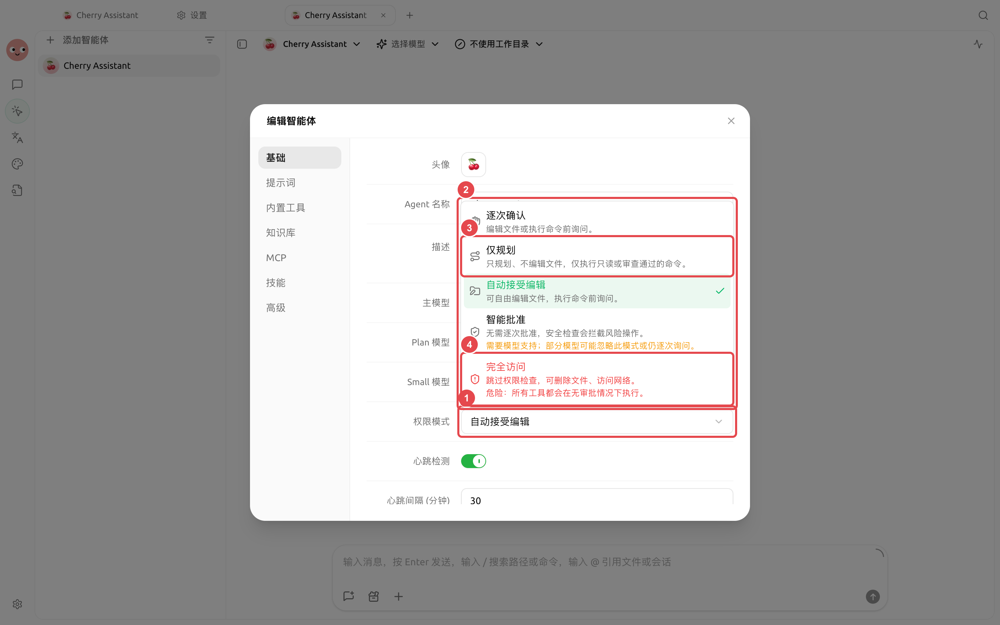

# 權限、記憶與背景任務

Agent 能執行檔案、終端機與網路操作，也能呼叫子智能體與背景任務。權限決定「是否要先問」，記憶決定「下次是否還知道」，右側狀態面板則告訴你「現在正在做什麼」。

<figure><figcaption><p>日常使用從預設權限開始；僅規劃適合先看方案，完全存取只用於邊界清楚且可恢復的任務。</p></figcaption></figure>

### 權限模式

| 模式 | 行為 | 適用情境 | 注意事項 |
| -------- | ------------- | ------------- | ---------------- |
| 【逐次確認】 | 編輯檔案或執行指令前詢問 | 預設起點、真實專案目錄 | 操作多時會頻繁確認，但最容易控制 |
| 【自動接受編輯】 | 可編輯檔案，執行指令前詢問 | 文件整理、可恢復的程式碼修改 | 先確認工作目錄和版本控制狀態 |
| 【智能核准】 | 由安全檢查決定是否放行 | 模型支援且任務邊界清晰 | 部分模型可能仍會逐次詢問 |
| 【僅規劃】 | 只規劃、不編輯檔案 | 方案評審、上線前審查 | 適合先看計畫再執行 |
| 【完全存取】 | 跳過權限檢查 | 隔離、可信、可恢復的環境 | 可能刪除檔案或存取網路，風險最高 |

不同執行模式提供的權限範圍並不完全相同：Pi 不提供【僅規劃】，新建 Pi Agent 時預設使用【智能核准】；DeepSeek Harness 不提供【智能核准】；【增強：Claude Agent】提供完整的五種模式。

設定路徑：左側導覽【工作】→ Agent 選單→【編輯】→【基礎】→【權限模式】。


頻道可以單獨覆蓋 Agent 的權限模式。外部聊天入口更容易收到意外指令，通常應選擇【繼承智能體設定】或比 Agent 更嚴格的模式，不要為了少點幾次確認而開放完全存取。


### Agent 記憶

Agent 的記憶跟隨 Agent，而不是跟隨某個任務或工作目錄。它適合保存長期有效的偏好、專案事實、技術決策和經驗；一次性進度則記錄為帶時間的日誌，供後續任務檢索。

直接在【工作】中告訴 Agent：

```
記住：所有對外發布的中文文案都使用全形標點，不使用誇張標題。之後的相關任務都依照這項規則執行。
```

需要糾正時明確指出舊資訊已經失效，並要求更新記憶。不要把密碼、API Key、私密身分資訊或短期無關內容寫入長期記憶。

### 子智能體、工作流和背景指令

複雜任務中，Agent 可以把研究、整理和驗證分配給子智能體，或透過工作流編排多個步驟。耗時指令可以在背景執行，不必阻塞整個對話。Agent 也可以在你確認後新建另一個會話，或向已有會話發送任務；請求會立即返回，完成結果隨後回到發起會話，並保留來源和交付狀態。

右側【狀態】可以查看：

* 正在進行和已完成的任務；
* 子智能體與工作流；
* 背景指令及停止入口；
* 工具呼叫的成功、失敗和數量；
* 上下文用量和已聲明產物。

開啟【設定】→【通知】→【對話完成通知】後，切換到其他分頁或視窗工作時，助手回覆完成、Agent 任務完成或等待核准都會透過系統通知提醒；點擊通知會回到對應對話。

<figure><figcaption><p>長任務可在【狀態】中查看產物、子任務、背景指令和上下文用量。</p></figcaption></figure>

### 使用者案例：持續維護專案規範

團隊把穩定的程式碼約定寫入 Agent 記憶，把詳細審查步驟做成技能。每次審查新分支時開一個任務，讓 Agent 用子智能體分別檢查介面、資資遷移和測試，再由主 Agent 匯總結論。規則發生變化時更新記憶，不需要改動每個任務的歷史記錄。

<details>

<summary>記憶能代替知識庫嗎？</summary>

不能。記憶適合少量、穩定、會跨任務使用的事實和經驗；知識庫適合成體系的文件，並能控制 Agent 的檢索範圍。

</details>

<details>

<summary>任務看起來卡住了，先看哪裡？</summary>

先開啟右側【狀態】，檢查是否在等待權限、背景指令仍在執行、子任務失敗或服務商正在重試。需要更深的請求細節時再開啟開發者模式查看呼叫鏈。

</details>

<details>

<summary>任務看起來卡住了，先看哪裡？</summary>

先開啟右側【狀態】，檢查是否在等待權限、背景指令仍在執行、子任務失敗或服務商正在重試。需要更深的請求細節時再開啟開發者模式查看呼叫鏈。

</details>
