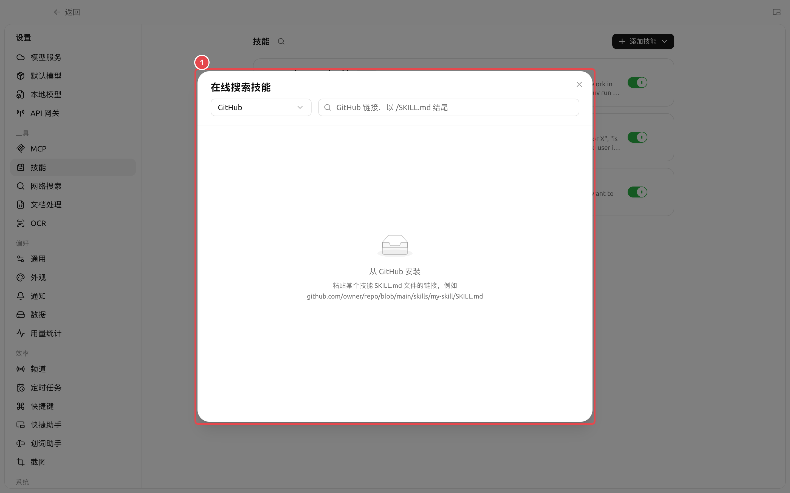
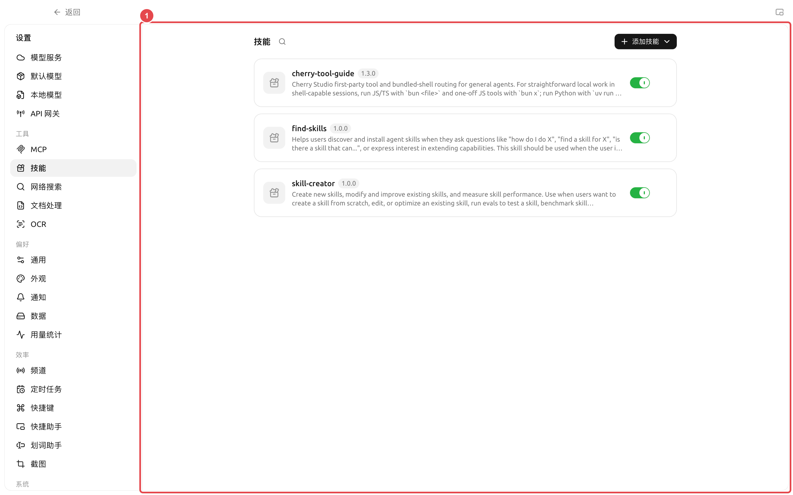

# 技能與能力庫

技能是一套可重用的工作說明與配套資源。它不負責連接外部系統，而是告訴 Agent 應該按照什麼流程、標準和格式來完成任務。


當需要某種工作方法時，先在【工作】中告訴 Agent 你的目標，並讓它幫你查找或安裝合適的技能。只有在需要檢查來源、批量管理或從本地導入時，再開啟【設定】→【技能】。


<figure><figcaption>
重複使用的方法適合沉澱為技能；資資、內建操作和外部系統則分別使用對應的入口。
</figcaption></figure>

### 安裝技能

手動路徑：【設定】→【技能】。

頁面支援四種來源：

* 線上搜尋技能註冊表；
* 在線上搜尋中選擇【GitHub】，貼上某個技能 `SKILL.md` 檔案的連結；
* 從本地 ZIP 檔案安裝；
* 從包含 `SKILL.md` 的資資夾安裝。

<figure><figcaption>
① 選擇【GitHub】後貼上目標技能的 `SKILL.md` 檔案連結；頁面會先解析具體技能，再提供安裝。
</figcaption></figure>



#### 1. 先確認用途

用一句話說明你希望技能解決的問題，例如「把會議記錄整理成決策、負責人與截止時間」。名稱相似不代表流程相同，請先查看說明再安裝。



#### 2. 檢查來源與內容

開啟技能詳情，確認它會要求 Agent 執行什麼操作、是否包含腳本、是否需要額外工具或外部帳號。來源不明的技能不要直接用於敏感目錄。



#### 3. 綁定到 Agent

先在【設定】→【技能】確認該技能的全域開關處於啟用狀態，再開啟【工作】→ Agent 選單→【編輯】→【技能】，為這個 Agent 啟用。技能切換會隨 Agent 設定自動儲存，並從下一則訊息開始生效。



#### 4. 用真實任務驗證

給 Agent 一份小樣本，檢查步驟、輸出格式和邊界是否符合預期，再用於批量任務或排程任務。



### 全域啟用與 Agent 啟用

<figure><figcaption>
① 卡片右側開關控制技能是否對所有 Agent 可選；關閉後，Agent 編輯視窗將不再顯示該技能。
</figcaption></figure>

| 狀態 | 作用 | 什麼時候使用 |
| -------- | ------------------------ | ------------------------- |
| 全域啟用 | 讓技能出現在 Agent 的可選技能目錄中 | 技能來源可信，仍可能被一個或多個 Agent 使用 |
| 全域關閉 | 暫停所有 Agent 使用該技能，但保留安裝內容 | 臨時停用、除錯或等待安全檢查 |
| Agent 啟用 | 只讓當前 Agent 載入該技能 | 流程與當前 Agent 的長期職責相符 |

<figure><figcaption></figcaption></figure>

關閉全域開關不會卸載技能；重新開啟後，仍要檢查各 Agent 的啟用狀態。卸載則會刪除技能內容並清理關聯。

### 技能、提示詞和 MCP 怎麼選

| 需要 | 應選擇 | 原因 |
| -------------- | ----------- | ------------- |
| 一句臨時要求 | 當前任務提示詞 | 不必增加長期設定 |
| 多次重用同一流程 | 技能 | 能同時儲存說明、範本和資源 |
| 設定 Agent 的長期角色 | Agent 系統提示詞 | 每個任務都需要遵守 |
| 存取資資庫或外部服務 | MCP | 技能本身不提供連接能力 |

### 使用者案例：團隊週報技能

團隊把週報欄目、語氣、資資檢查和禁用表述寫成技能，綁定到「週報整理」Agent。每週只需要提供本週資資，Agent 按技能輸出固定結構；當資資來自外部系統時，再組合 MCP，而不是把帳號和介面細節寫進技能正文。


卸載技能會從全域能力庫中移除它，並清理 Agent 工作區中的關聯。執行前請確認沒有正在使用該技能的任務；團隊自訂技能應保留可恢復的原始檔案。


安裝後為什麼 Agent 沒有使用技能？

先確認技能沒有被全域關閉，再到 Agent 編輯視窗的【技能】中啟用，或讓 Agent 幫你完成綁定。隨後新發一則訊息測試。

技能可以包含程式嗎？

技能包可以包含說明、資源和腳本。是否能執行腳本，還取決於 Agent 的工具、工作目錄、環境相依性和權限模式。

技能可以包含程式嗎？

技能包可以包含說明、資源和腳本。是否能執行腳本，還取決於 Agent 的工具、工作目錄、環境相依性和權限模式。

