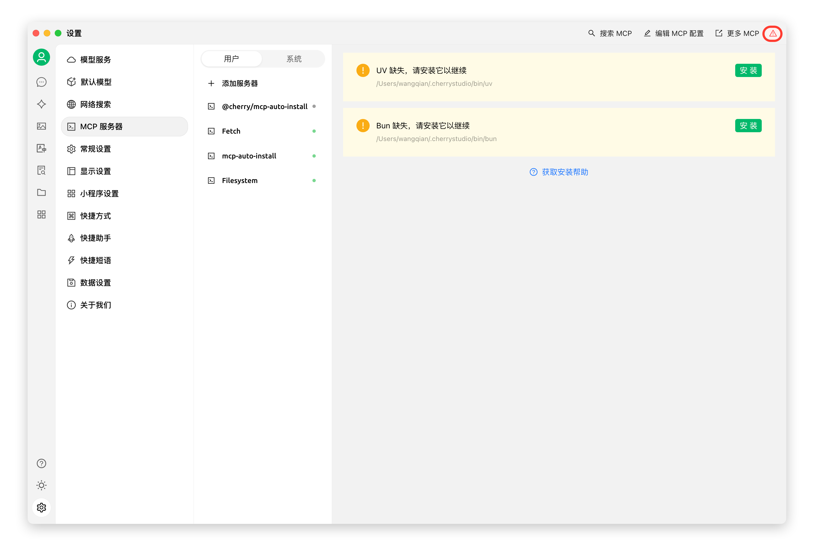

# MCP 環境安裝


此文件由 AI 從中文翻譯而來，尚未經過審閱。


**MCP(Model Context Protocol)** 是一種開源協定，旨在以標準化的方式向大型語言模型（LLM）提供上下文資訊。更多關於 MCP 的介紹請見 [#shen-me-shi-mcpmodel-context-protocol](../../question-contact/knowledge.md#shen-me-shi-mcpmodel-context-protocol "mention")

## 在 Cherry Studio 中使用 MCP

下面以 `fetch` 功能為例，演示如何在 Cherry Studio 中使用 MCP，可以在 [文件](https://github.com/modelcontextprotocol/servers/tree/main/src/fetch) 中查看詳情。

### **準備工作：安裝 uv、bun**


Cherry Studio 目前僅使用內建的 [uv](https://github.com/astral-sh/uv) 和 [bun](https://github.com/oven-sh/bun)，**不會複用**系統中已安裝的 uv 和 bun。


在 `設定 - MCP 伺服器` 中，點擊 `安裝` 按鈕，即可自動下載並安裝。由於是直接從 GitHub 下載，速度可能較慢，且失敗機率較高。安裝成功與否，以下文提到的資料夾內是否有檔案為準。

<figure><figcaption></figcaption></figure>

**可執行程序安裝目錄：**

Windows: `C:\Users\用戶名\.cherrystudio\bin`

macOS、Linux: `~/.cherrystudio/bin`

<figure><figcaption>
bin 目錄
</figcaption></figure>

**無法正常安裝的情況下：**

可將系統中的對應命令使用軟連結方式連結到此處，若無對應目錄需手動建立。也可手動下載可執行檔案放到此目錄下：

Bun: [https://github.com/oven-sh/bun/releases](https://github.com/oven-sh/bun/releases)\
UV: [https://github.com/astral-sh/uv/releases](https://github.com/astral-sh/uv/releases)