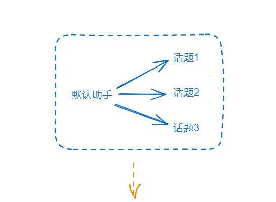
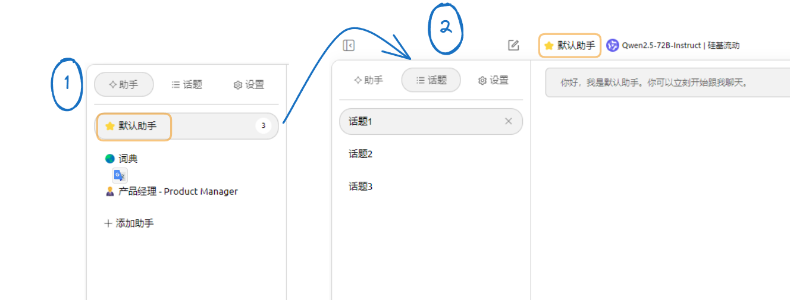
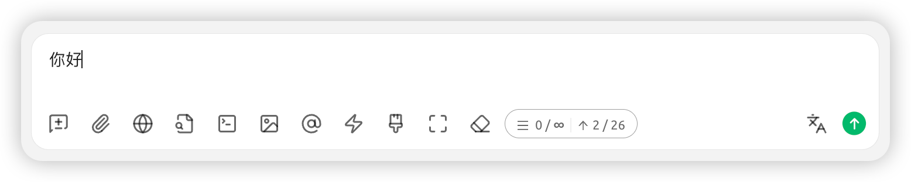
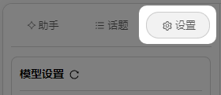
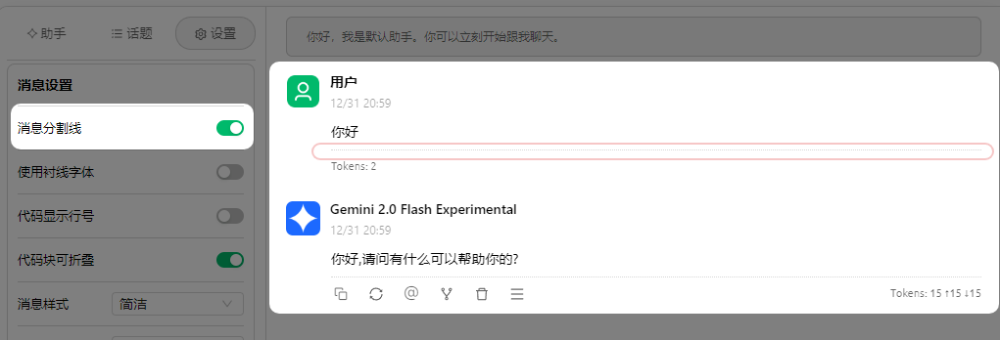
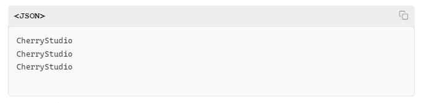
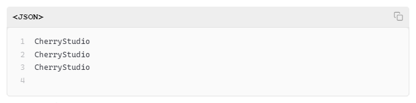
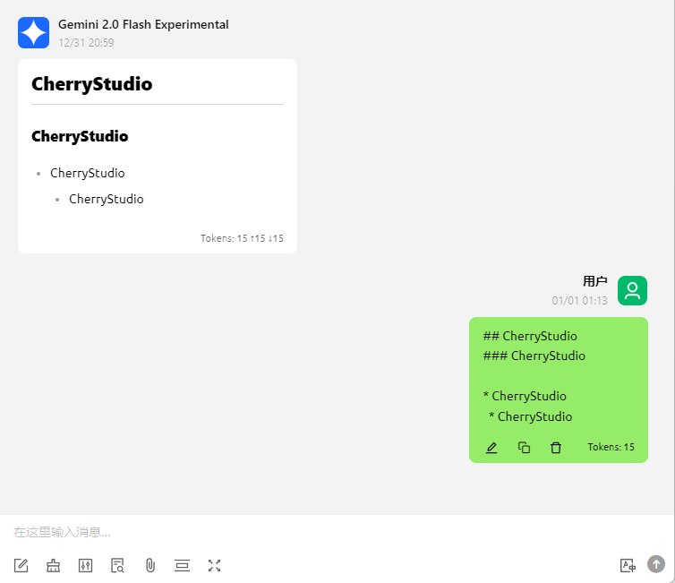
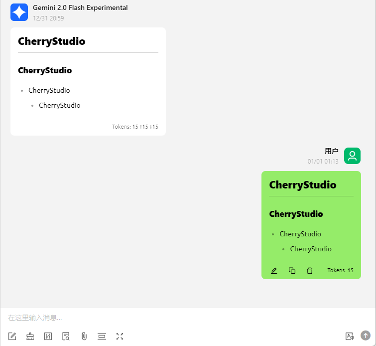
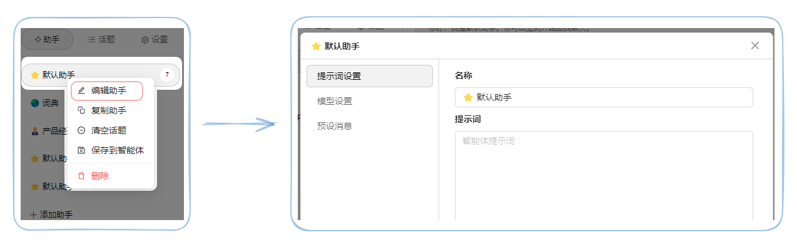

# 對話介面


此文件由 AI 從中文翻譯而來，尚未經過審閱。


## 助手和話題

### 助手

`助手` 是對所選模型做一些個性化的設置來使用模型，如提示詞預設和參數預設等，通過這些設置讓所選模型能更加符合你預期的工作。

`系統預設助手` 預設了一個比較通用的參數（無提示詞），您可以直接使用或者到 [智能體頁面](agents.md) 尋找你需要的預設來使用。

### 話題

`助手` 是 `話題` 的父集，單個助手下可以建立多個話題（即對話），所有 `話題` 共用 `助手` 的參數設置和預設詞（prompt）等模型設置。

<figure><figcaption></figcaption></figure>

<figure><figcaption></figcaption></figure>

## 對話框內按鈕

<figure><figcaption></figcaption></figure>

 `新話題` 在當前助手下建立一個新話題。

 `上傳圖片或文檔` 上傳圖片需要模型支援，上傳文檔會自動解析為文字作為上下文提供給模型。

 `網路搜尋` 須在設置中配置網路搜尋相關資訊，搜尋結果作為上下文返回給大模型，詳見 [聯網模式](../../websearch/)。

 `知識庫` 開啟知識庫，詳見 [知識庫教程](../../knowledge-base/knowledge-base.md)。

 `MCP 伺服器` 開啟 MCP 伺服器功能，詳見 [MCP 使用教程](../../advanced-basic/mcp/)。

 `生成圖片` 只有選擇的 **對話模型** 支援生圖時才會顯示。（非對話生圖模型請前往 [繪圖](./drawing.md)）

 `選擇模型` 對於接下來的對話，切換成指定的模型，保留上下文。

 `快捷短語` 需要先在設置中預設常用短語，在此處調用，直接輸入，支援變量。

 `清空消息` 刪除該話題下所有內容。

 `展開` 讓對話框變得更大，以便輸入長文。

 `清除上下文` 在不刪除內容的情況下，截斷模型能獲得的上下文，也就是說模型將「忘記」之前的對話內容。

 `預估 Token 數` 顯示預估 Token 數，四個數據分別為 `當前上下文數` 、 `最大上下文數` （ ∞ 表示無限上下文）、 `當前輸入框內消息字數` 、 `預估 Token 數` 。


此功能僅用於預估 Token 數，實際 Token 數每個模型都是不一樣的，請以模型提供商的數據為準。


 `翻譯` 將當前輸入框內內容翻譯成英文。

## 對話設置

<figure><figcaption></figcaption></figure>

### 模型設置

模型設置與助手設置當中的 `模型設置` 參數同步，詳見 [助手設置](chat.md#bian-ji-zhu-shou)。


在對話設置當中，僅該模型設置作用於當前助手，其餘設置作用於全域。如：設置消息樣式為氣泡後在任何助手的任何話題下都是氣泡樣式。


### 消息設置

#### <mark style="color:blue;">**`消息分割線`**</mark>:

使用分割線將消息正文與操作欄隔開。



<figure><figcaption></figcaption></figure>



<figure><figcaption></figcaption></figure>



#### <mark style="color:blue;">**`使用襯線字體`**</mark>：

字體樣式切換，現在我們也可以通過 [自訂css](../../personalization-settings/) 來更換字體。

#### <mark style="color:blue;">**`代碼顯示行號`**</mark>：

模型輸出代碼片段時顯示代碼塊行號。



<figure><figcaption></figcaption></figure>



<figure><figcaption></figcaption></figure>



#### <mark style="color:blue;">**`代碼塊可摺疊`**</mark>：

開啟後，當代碼片段中代碼較長時，將自動摺疊代碼塊。。

#### <mark style="color:blue;">**`代碼塊可換行`**</mark>：

開啟後，當代碼片段中但行代碼較長時（超出窗口），將自動換行。

#### <mark style="color:blue;">**`思考內容自動摺疊`**</mark>：

開啟後，支援思考的模型在思考完成後會自動摺疊思考過程。

#### <mark style="color:blue;">**`消息樣式`**</mark>：

可切對話介面換為氣泡樣式或列表樣式。

#### <mark style="color:blue;">**`代碼風格`**</mark>：

可切換代碼片段的顯示風格。

#### <mark style="color:blue;">**`數學公式引擎`**</mark>：

* KaTeX 渲染速度更快，因為它是專門為性能優化設計的；
* MathJax 渲染較慢，但功能更全面，支援更多的數學符號和命令。

#### <mark style="color:blue;">**`消息字體大小`**</mark>：

調整對話介面字體的大小。

### 輸入設置

#### <mark style="color:blue;">**`顯示預估 Token 數`**</mark>：

在輸入框顯示輸入文本預估消耗的Token數（非實際上下文消耗的Token，僅供參考）。

#### <mark style="color:blue;">**`長文本貼上為文件`**</mark>：

當從其他地方複製長段文本貼上到輸入框時會自動顯示為文件的樣式，減少後續輸入內容時的干擾。

#### <mark style="color:blue;">**`Markdown 渲染輸入消息`**</mark>：

關閉時只渲染模型回復的消息，不渲染發送的消息。



<figure><figcaption></figcaption></figure>



<figure><figcaption></figcaption></figure>



#### <mark style="color:blue;">**`快速敲擊3次空白翻譯`**</mark>：

在對話介面輸入框輸入消息後，連敲三次空白可翻譯輸入的內容為英文。


注意：該操作會覆蓋原文。


#### <mark style="color:blue;">**`目標語言`**</mark>：

設置輸入框翻譯按鈕以及快速敲擊3次空白翻譯的目標語言。

## 助手設置

在助手介面選擇需要設置的<mark style="background-color:yellow;">助手名稱</mark>→在<mark style="background-color:yellow;">右鍵選單中</mark>選對應設置

### 編輯助手


助手設置作用於該助手下的所有話題。


<figure><figcaption></figcaption></figure>

#### 提示詞設置

#### <mark style="color:blue;">**`名稱`**</mark>：

可自訂方便辨識的助手名稱。

#### <mark style="color:blue;">**`提示詞`**</mark>：

即 prompt ，可以參照智能體頁面的提示詞寫法來編輯內容。

#### 模型設置

#### <mark style="color:blue;">**`預設模型`**</mark>：

可以為該助手固定一個預設模型，從智能體頁面添加時或複製助手時初始模型為該模型。不設置該項初始模型則為全域初始模型(即 [預設助手模型](settings/default-models.md#mo-ren-zhu-shou-mo-xing) )。


助手的預設模型有兩種，一為 [全域預設對話模型](settings/default-models.md#mo-ren-zhu-shou-mo-xing) ，另一為助手預設模型；助手的預設模型優先級高於全域預設對話模型。當不設置助手預設模型時，助手預設模型=全域預設對話模型。


#### <mark style="color:blue;">**`自動重置模型`**</mark>：

開啟時 - 當在該話題下使用過程中切換其他模型使用時，再次建立新話題會將新話題的重置為助手的預設模型。當該項關閉時建立新話題的模型會跟隨上一話題所使用的模型。

> 如助手的預設模型為gpt-3.5-turbo，我在該助手下建立話題1，在話題1的對話過程中切換了gpt-4o使用，此時：
>
> 如果開啟了自動重置：建立新話題2時，話題2預設選擇的模型為gpt-3.5-turbo;
>
> 如果未開啟自動重置：建立新話題2時，話題2預設選擇的模型為gpt-4o。

#### <mark style="color:blue;">**`溫度 (Temperature)`**</mark> ：

溫度參數控制模型生成文本的隨機性和創造性程度（預設值為0.7）。具體表現為：

* 低溫度值(0-0.3)：
  * 輸出更確定、更專注
  * 適合代碼生成、數據分析等需要準確性的場景
  * 傾向於選擇最可能的詞彙輸出
* 中等溫度值(0.4-0.7)：
  * 平衡了創造性和連貫性
  * 適合日常對話、一般性寫作
  * 推薦用於聊天機器人對話(0.5左右)
* 高溫度值(0.8-1.0)：
  * 產生更具創造性和多樣性的輸出
  * 適合創意寫作、頭腦風暴等場景
  * 但可能降低文本的連貫性

#### <mark style="color:blue;">**`Top P (核採樣)`**</mark>：

預設值為 1，值越小，AI 生成的內容越單調，也越容易理解；值越大，AI 回覆的詞彙範圍越大，越多元化。

核採樣通過控制詞彙選擇的概率閾值來影響輸出：

* 較小值(0.1-0.3)：
  * 僅考慮最高概率的詞彙
  * 輸出更保守、更可控
  * 適合代碼註釋、技術文檔等場景
* 中等值(0.4-0.6)：
  * 平衡詞彙多樣性和準確性
  * 適合一般對話和寫作任務
* 較大值(0.7-1.0)：
  * 考慮更廣泛的詞彙選擇
  * 產生更豐富多樣的內容
  * 適合創意寫作等需要多元化表達的場景


- 這兩個參數可以獨立使用或組合使用
- 根據具體任務類型選擇合適的參數值
- 建議通過實驗找到最適合特定應用場景的參數組合
- 以上內容僅供參考和了解概念，所給參數範圍不一定適合所有模型，具體可參考模型相關文檔給出的參數建議。


#### <mark style="color:blue;">**`上下文數量 (Context Window)`**</mark>

要保留在上下文中的消息數量，數值越大，上下文越長，消耗的 token 越多：

* 5-10：適合普通對話
* \>10：需要更長記憶的複雜任務（例如：按照寫作大綱分步生成長文的任務，需要確保生成的上下文邏輯連貫）
* > 注意：消息數越多，token 消耗越大

#### <mark style="color:blue;">**`開啟消息長度限制 (MaxToken)`**</mark>

單次回答最大 [Token](https://docs.cherry-ai.com/question-contact/knowledge#shen-me-shi-tokens) 數，在大語言模型中，max token（最大令牌數）是一個關鍵參數，它直接影響模型生成回答的品質和長度。

> 如:在CherryStudio當中填寫好key後測試模型是否連通時，只需要知道模型是否有正確回覆消息而不需特定內容,這種情況下設置MaxToken為1即可。

多數模型的MaxToken上限為32k Tokens，當然也有64k，甚至更多的，具體需要到對應介紹頁面查看。

具體設置多少取決於自己的需要，當然也可以參考以下建議。


建議：

* 普通聊天：500-800
* 短文生成：800-2000
* 代碼生成：2000-3600
* 長文生成：4000及以上 (需要模型本身支援)



一般情況下模型生成的回答將被限制在 MaxToken 的範圍內，當然也有可能會出現被截斷（如寫長代碼時）或表達不完整等情況出現，特殊情況也需要根據實際情況來靈活調整。


#### <mark style="color:blue;">**`串流輸出（Stream）`**</mark>

串流輸出是一種數據處理方式，它允許數據以連續的流形式進行傳輸和處理，而不是一次性發送所有數據。這種方式使得數據可以在生成後立即被處理和輸出，極大地提高了實時性和效率。

在 CherryStudio 用戶端等類似環境下簡單來說就是打字機效果。

關閉後(非流)：模型生成完資訊後整段一次性輸出（想像一下微信收到消息的感覺）；

開啟時：逐字輸出，可以理解為大模型每生成一個字就馬上傳送給你，直到全部傳送完。


如果某些特殊模型不支援串流輸出需要將該開關關閉，比如**剛開始**只支援非流的o1-mini等。


#### <mark style="color:blue;">**`自訂參數`**</mark>

在請求體（body）中加入額外請求參數，如 `presence_penalty` 等字段，一般人一般情況下用不到。

> 上述top-p、maxtokens、stream等參數就是這些參數之一。

填法：參數名稱—參數類型（文本、數字等）—值，參考文檔：[點擊前往](https://openai.apifox.cn/doc-3222739)


各個模型提供商都或多或少有自己的獨有參數，需要到提供商的文檔中尋找使用方法



* 自訂參數優先級高於內建參數。即自訂參數如果與內建參數重複，則自訂參數會覆蓋內建參數。

> 如：自訂參數中設置 `model` 為 `gpt-4o` 後，在對話中無論選擇哪個模型都使用的是 `gpt-4o` 模型。

* 使用 <kbd>參數名稱:undefined</kbd> 的設置可排除參數。
