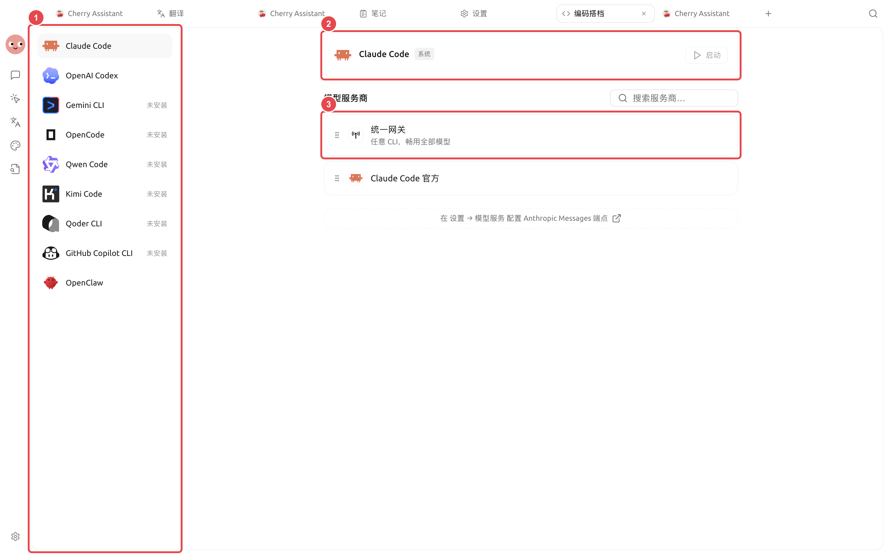

# 編碼搭檔

【編碼搭檔】用於安裝、設定和啟動常見程式設計命令列工具。Cherry Studio 會識別自己的託管安裝，也會偵測系統登入環境中已經可用的 CLI；系統工具仍由原來的套件管理員維護。

<figure><figcaption>
先確認工具已經安裝且版本可用，再設定模型連線和專案目錄。
</figcaption></figure>

## 頁面能做什麼

* 檢查工具是否安裝以及是否有可用更新；
* 安裝或更新 Cherry Studio 託管的工具副本；
* 偵測系統 PATH 中已有的工具；
* 為需要模型服務的 CLI 選擇服務商和模型；
* 為使用自身帳號登入的 CLI 保留原生登入方式；
* 選擇工作目錄和系統偵測到的終端後啟動。

頁面目前包含 Claude Code、OpenAI Codex、Gemini CLI、OpenCode、Qwen Code、Kimi Code、Qoder CLI 和 GitHub Copilot CLI 等工具。實際可見項會隨產品更新變化，以頁面清單為準。

## 使用流程



### 1. 開啟左側導覽【編碼搭檔】

選擇需要的工具，先看狀態是未安裝、由 Cherry Studio 託管，還是來自系統。



### 2. 完成安裝或登入

未安裝時點擊【安裝】。由工具自身提供帳號登入的 CLI，按照頁面提示完成原生登入，不需要從 Cherry Studio 選擇服務商。



### 3. 設定模型連線

需要 Cherry Studio 模型服務的工具，選擇相容的服務商和模型。頁面會按 CLI 所需的介面類型篩選，不相容的服務商不會列出。



### 4. 選擇目錄和終端

工作目錄決定 CLI 啟動位置。終端只能從系統偵測到的清單中選擇；自訂終端可執行檔路徑不再提供。



### 5. 啟動並驗證

點擊【啟動】，在終端中執行一個唯讀檢查。確認帳號、模型和目錄正確後再執行檔案修改或命令。



## Claude Code 的模型模式

設定 Claude Code 時，【模型】提供兩種模式：

* 【通用】：所有請求使用同一個模型，設定簡單；
* 【詳細】：在【模型角色對應】中分別設定 Fable、Opus、Sonnet、Haiku 和 Subagent。表格裡的【實際請求模型】就是每個角色最終使用的模型；需要時還可為對應角色開啟【1M】上下文。

只有確實需要為背景子任務、壓縮或標題等角色指定不同模型時，才使用【詳細】。留空的會跟隨主模型。修改後先用一個小任務確認每個角色都能正常請求。

## 使用情境：在專案目錄啟動編碼工具

| 選擇 | 建議起點 | 適用情境 | 注意事項 |
| ----- | ----------------------------- | ------------ | ---------------- |
| 安裝來源 | 已有系統版本就先使用系統版本 | 團隊已經統一管理 CLI | 更新和解除安裝仍由原套件管理員負責 |
| 模型連線 | 先選一個已經在 Cherry Studio 驗證可用的連線 | 需要模型服務的 CLI | 自帶帳號登入的工具按原生流程登入 |
| 工作目錄 | 只選擇目前專案目錄 | 修改程式碼、執行檢查 | 啟動後先確認終端所在路徑 |
| 第一次命令 | 唯讀檢視專案狀態 | 驗證帳號、模型和目錄 | 確認無誤後再允許寫入檔案 |

### 完成標準

頁面能識別安裝來源；終端在正確目錄開啟；最小唯讀命令成功；工具顯示的帳號或模型與預期一致。

## 安裝來源要分清

| 來源 | Cherry Studio 會做什麼 | 你應該如何維護 |
| ---------------- | ------------------ | ------------------ |
| Cherry Studio 託管 | 安裝、更新和解除安裝對應託管副本 | 在【編碼搭檔】或【環境相依】中管理 |
| 系統 PATH | 偵測並直接使用，不覆蓋 | 用原套件管理員更新或解除安裝 |
| 應用程式內建 | 直接使用，不提供系統層級解除安裝 | 隨 Cherry Studio 更新 |


解除安裝 Cherry Studio 託管副本後，如果系統中還有同名可執行檔，頁面會自動回退到系統版本。版本或行為變化時，先確認目前使用的是哪一種來源。


為什麼找不到已經安裝的終端或 CLI？

Cherry Studio 從登入環境和標準位置偵測工具。確認命令在登入終端中可執行，然後重新啟動應用程式刷新環境。便攜式或非標準路徑目前需要從該終端手動啟動。

