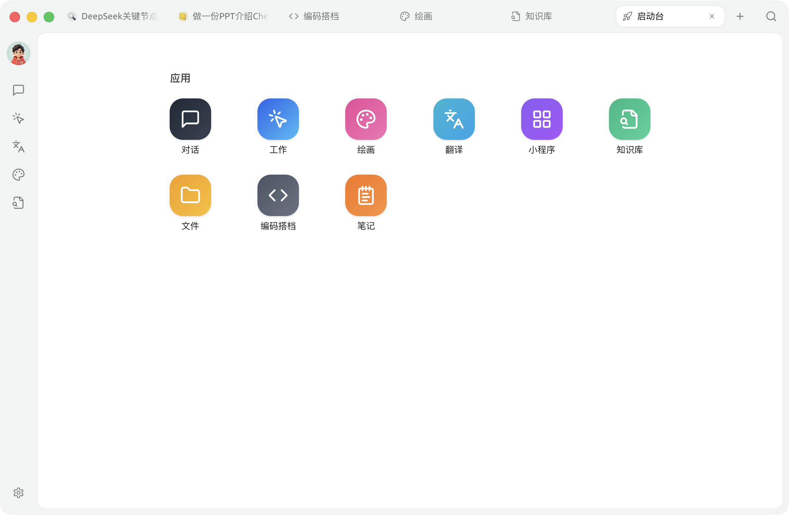

# 啟動台

啟動台集中展示 Cherry Studio 的常用功能入口。點擊頂部標籤列右側的 **+**，即可開啟新的啟動台分頁；關閉最後一個分頁時，也會自動回到啟動台。

## 預設應用程式

目前啟動台包含 9 個內建應用程式：

| 應用程式 | 用途 |
| --------------------------------------- | ----------------------- |
| [對話](chat.md) | 與模型對話，管理助手與對話清單 |
| [工作](../../advanced-basic/agent.md) | 讓智能體呼叫工具並完成多步驟任務 |
| [繪圖](drawing.md) | 使用圖像模型生成和管理圖片 |
| [翻譯](translation.md) | 翻譯文字並對照查看原文和譯文 |
| [小程式](../../../../cherry-studio/preview/app) | 在 Cherry Studio 中使用網頁應用程式 |
| [知識庫](knowledge-base.md) | 匯入資資並進行檢索和問答 |
| [檔案](files.md) | 查看和管理應用程式內使用的檔案 |
| [編碼夥伴](code-cli.md) | 安裝、設定和啟動 AI 編程 CLI 工具 |
| [筆記](notes.md) | 建立和整理 Markdown 筆記 |

## 調整應用程式順序

按住應用程式圖示並拖曳到目標位置，即可調整內建應用程式的排列順序。Cherry Studio 會自動儲存新的順序。

啟動台和側邊欄分別儲存各自的應用程式順序。在啟動台中排序不會改變側邊欄的排列。

## 固定到側邊欄

經常使用的應用程式可以固定到側邊欄：

1. 在啟動台中右鍵點擊應用程式。
2. 選擇 **新增至側邊欄**。
3. 如需取消固定，再次右鍵點擊並選擇 **從側邊欄移除**。

> **提示：** **對話** 是側邊欄的必需入口，不能移除。其他應用程式即使沒有固定到側邊欄，仍可從啟動台開啟。

## 管理小程式

在 [小程式](../../../../cherry-studio/preview/app) 頁面將網頁應用程式新增到啟動台後，它會顯示在內建應用程式下方的「小程式」區域。

* 拖曳小程式圖示可以調整顯示順序。
* 右鍵點擊小程式，可以將其新增到側邊欄或從啟動台移除。
* 從啟動台移除只會取消快捷入口，不會刪除小程式本身。

***

### 取得協助與提交回饋

如果在使用過程中遇到問題，或有功能改進建議，請透過 [回饋與建議](../../question-contact/suggestions.md) 頁面提供的官方管道聯繫我們。
