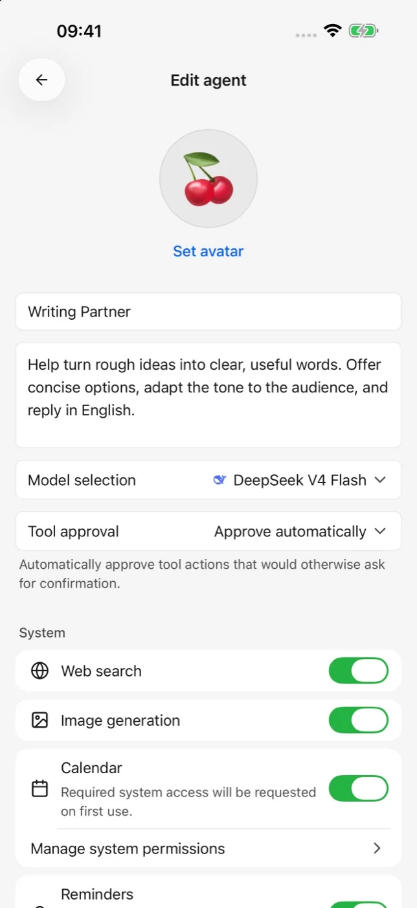
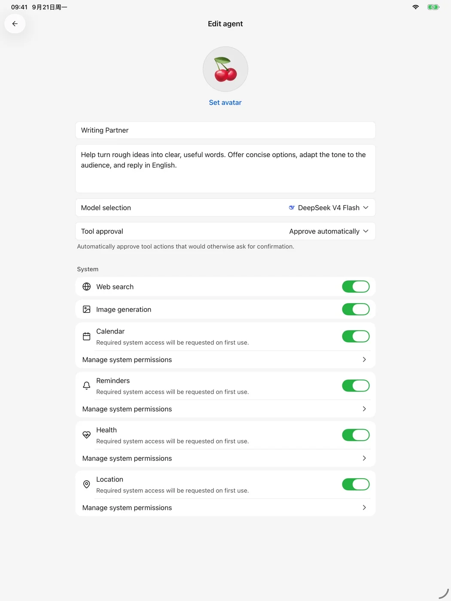

# 智能體與工具

智能體（Agent，即儲存了角色說明、模型與可用工具的工作設定）適合重複使用的任務，例如寫作輔助、資訊整理或行程相關操作。

<figure data-mobile-shot="phone"><figcaption>
<strong>iPhone</strong> · 設定頭像、指令、模型與工具
</figcaption></figure>
<figure data-mobile-shot="tablet"><figcaption>
<strong>iPad</strong> · 在更大的空間中檢查工具與系統權限
</figcaption></figure>

## 建立智能體

1. 新建智能體並設定名稱、頭像與任務說明。
2. 選擇適合該任務的模型。
3. 視需要啟用網路搜尋、圖片生成或系統工具。
4. 檢查工具審核方式後儲存。

任務說明應寫清楚目標、輸出格式與限制條件。不要把 API Key、密碼或其他長期憑證寫進智能體說明。

## 工具與系統權限

行事曆、提醒事項等系統工具會在首次使用時要求作業系統權限。只為確實需要的能力授權；之後可以在系統設定中檢視或撤銷權限。

工具可能讀取內容或執行外部操作。對於重要行程、檔案或對外傳送的內容，建議保留人工確認，並在執行後檢查結果。
