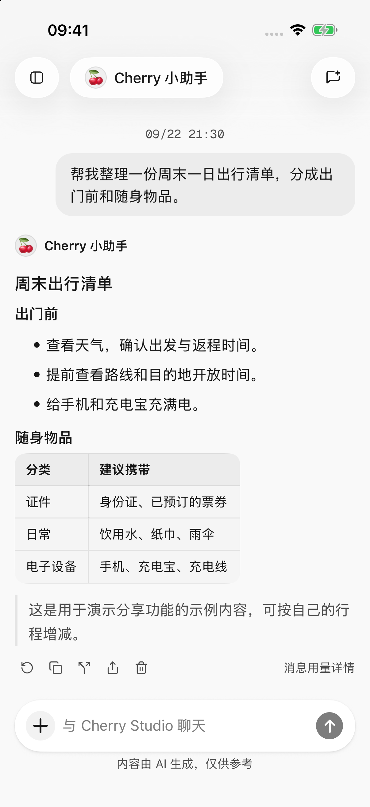
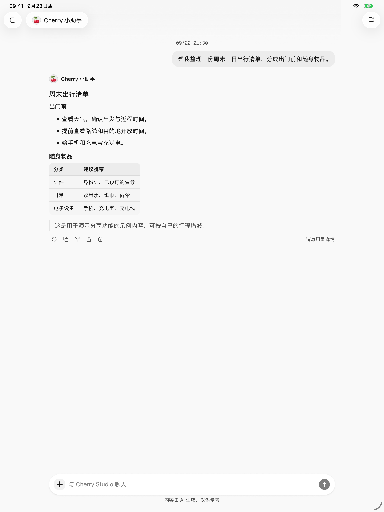

# 對話與檔案

一段對話用於持續討論一個主題；智能體決定使用哪個模型，以及回答時應遵循什麼要求。不同主題可以使用同一個智能體分別新建對話，避免把無關材料混在一起。

<figure data-mobile-shot="phone"><figcaption>
<strong>iPhone · 簡體中文介面</strong> · 訊息、模型資訊與回答操作集中在單列介面
</figcaption></figure>
<figure data-mobile-shot="tablet"><figcaption>
<strong>iPad · 簡體中文介面</strong> · 更寬的閱讀區域適合長回答與檔案內容
</figcaption></figure>

## 開始對話與切換模型

從側邊欄選擇 **新對話**，在對話頁選擇智能體和模型後傳送訊息。新對話先作為草稿開啟，傳送第一條訊息後才會形成對話記錄。

可以在對話中切換模型，不需要先離開頁面。這個選擇會更新當前智能體的模型，下一次傳送時使用新選擇；已經生成的回答不會因此重寫。

如果只想改變長期回答風格，例如“先給結論，再列步驟”，把要求寫進[智能體說明](agents-and-tools.md)。只對這次問題生效的要求直接寫進訊息即可。

## 找回以前的對話

* 側邊欄的最近對話可按時間瀏覽，也可以透過最近列表的選單切換為按智能體分組。點選智能體名稱展開或收起，重開應用會保留已選的瀏覽方式。
* 點選側邊欄標題旁的搜尋按鈕，可同時搜尋**對話標題和訊息內容**；尚未輸入關鍵詞時先顯示最近對話。
* 點選訊息搜尋結果，會開啟該訊息所在位置。可以繼續向前後閱讀，或點選 **返回最新訊息** 回到對話末尾。
* 在側邊欄長按對話，可以重新命名或刪除。刪除前需要的內容可先[匯出](sharing-and-export.md)。

搜尋定位的是整條訊息，不會把正文裡的每個關鍵詞都高亮；當前搜尋範圍是對話，不是手機裡的所有檔案。

## 新增圖片

點選輸入框旁的 **＋**，選擇照片、拍照，或透過檔案入口新增圖片。需要模型支援圖片理解，可在模型選擇器中使用“視覺”篩選。

例如傳送一張照片並問：“幫我把圖裡的清單整理成表格。”文字裡寫清楚要看圖片的哪一部分，會比只發圖片更容易得到需要的回答。

當前支援傳送 JPEG、PNG、GIF、WebP 圖片，一次最多 9 張，單張不超過 10 MB，合計不超過 20 MB；具體模型可能有更低限制。不相容的格式可以先轉為 JPEG 或 PNG。

應用可能為過大的圖片請求壓縮圖片後再嘗試，但壓縮不能解決不支援圖片的模型、數量超限或所有網路錯誤。

## 新增文件與已有檔案

1. 點選 **＋ → 檔案**。
2. 從已有檔案中選擇，或點選上傳，從系統檔案選擇器匯入。
3. 寫出具體任務，例如“總結第二部分的結論，並列出待辦事項”。

普通文字檔案單個不超過 1 MB，文件單個不超過 20 MB。文字過長或超出模型能處理的範圍時，應用可能只提供部分內容並顯示提示，不能假設全文都已讀入。PDF 文字提取最多處理前 100 頁。

### 文件解析器選哪個？

在 **設定 → 文件解析器** 選擇，選擇後立即儲存，之後處理文件時使用，不會改寫之前的回答：

| 選項 | 適合什麼情況 | 注意事項 |
| --- | --- | --- |
| 內建 | 以文字為主的摘要和問答 | 支援 PDF、DOCX、XLSX、PPTX 的文字提取，較節省模型用量 |
| AnyDoc（保留文件結構的解析方式） | 需要理解標題、表格等結構的複雜文件 | 非 PDF 文件可保留更多結構，但消耗的模型用量通常更多 |

PDF 仍使用系統文字提取，切換解析器不會自動讓純掃描圖片變成可讀文字。提示“未提取到文字”時，可以提供含可選中文字的版本，或把相關頁面作為圖片交給視覺模型。

**能預覽檔案不等於模型能理解檔案。** 文件傳送給模型的是應用解析得到的內容；音訊、影片、壓縮包等檔案也不能僅靠修改模型能力標記就變成可用附件。

希望把回答儲存為清單、表格或網頁，或繼續修改已有檔案，見[生成與修改檔案](file-generation.md)。已儲存的 HTML 還可以[轉為圖片或 PPT](html-export.md)。

## 複製、重新回答、分支與刪除

| 操作 | 使用場景 | 結果 |
| --- | --- | --- |
| 選擇文字或複製 | 只要回答中的一部分或全文 | 使用文字選擇或回答操作區的複製入口 |
| 重新回答 | 最新回答不滿意、失敗或中斷 | 用原問題重新處理，並在原位置替換最新回答 |
| 在新聊天中建立分支對話 | 想從某個位置嘗試不同方向 | 在新對話中繼續，原對話保留 |
| 刪除這輪對話 | 不想保留某次問答 | 刪除這一輪問題、回答和中間工具記錄 |

**重新回答**只提供給最新且已停止生成的回答，不會保留可切換的多個回答版本。較早的回答需要改換方向時，使用分支對話。

中斷前已經完成的工具結果可能被保留並用於繼續處理。重新回答或刪除記錄都**不會撤銷已經建立的日程、修改過的檔案或發出的內容**；重新回答還可能產生新的模型費用。需要保留舊答案時先複製、分享或建立分支。

刪除一輪問答會永久移除這輪記錄；不會退回已經發生的費用。正在生成或處理操作時，先等它結束或停止，再執行刪除。

## 思考深度與長對話

支援的模型會在輸入區提供 **思考深度** 調整。檔位由模型決定，不同模型不一定都有“關閉”或相同數量的選項。簡單問答可以使用預設或較快檔位，複雜分析再嘗試更高檔位；更深的思考可能更慢、消耗更多用量。

長對話或連續工具操作中出現 **正在壓縮上下文 / 已壓縮上下文**，表示應用正在把較早的資訊整理為摘要，騰出繼續回答的空間。聊天記錄仍在，但模型後續看到的摘要可能沒有所有原文細節；關鍵限制、數字或原文引用可以在下一條訊息裡重新提供。

壓縮也不能容納任意大的單份材料。仍然提示內容過多時，減少附件或在新對話中處理。

切換後臺後任務中斷或沒有通知，見[後臺回覆與通知](settings-and-usage.md)。想分享多條問答，見[分享與匯出](sharing-and-export.md)。
