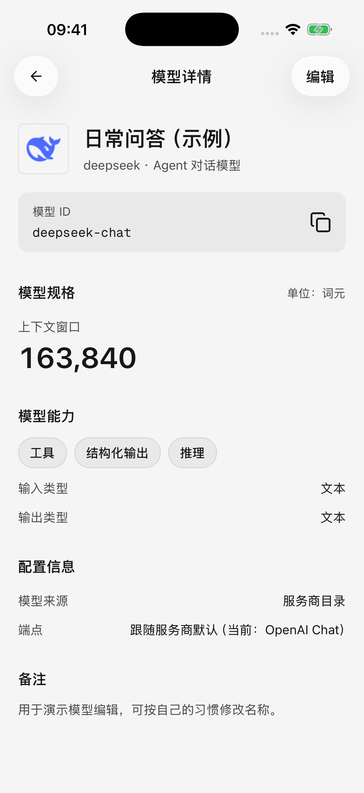
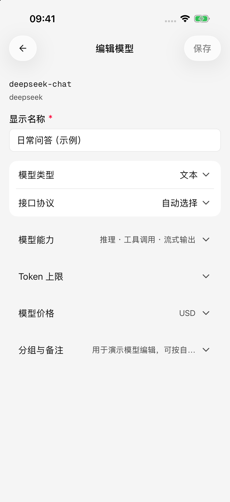
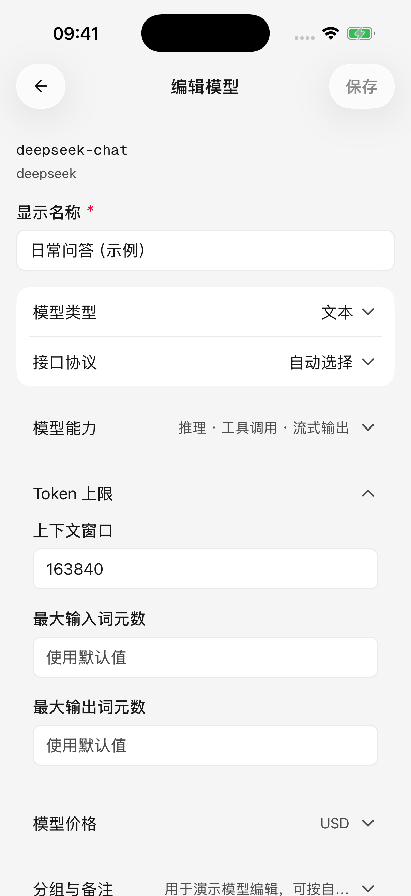
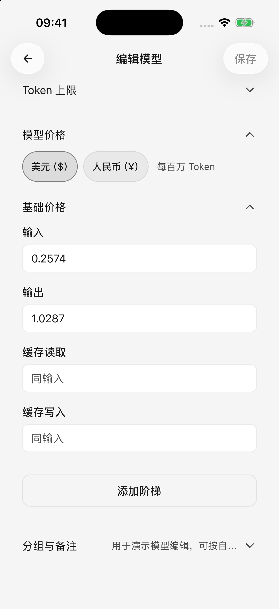

# 新增、編輯與管理模型

通常從服務商同步列表、選擇常用模型即可。只有模型缺失、名稱難辨認，或平台的實際能力與頁面資訊不一致時，才需要手動新增或編輯。

入口：**設定 → 模型服務 → 選擇服務商 → 模型**。

## 手動新增一個模型

1. 在模型頁點選新增按鈕，進入手動新增頁面。
2. 填寫 **模型 ID（平台用來識別模型的準確名稱）**，從平台文件或模型列表複製，不要自行翻譯。
3. 填寫顯示名稱，例如“日常問答”或“海報配圖”。顯示名稱方便自己辨認，不會改變實際呼叫的模型。
4. 核對模型類型和介面；其他設定不確定時保留預設值。
5. 點選 **新增**。若是首次配置服務商，完成設定後回到模型服務列表，確認該服務商的開關已開啟。

一次手動新增一個模型；需要批次新增時使用[模型同步](model-updates.md)。同一服務商下不能重複新增相同模型 ID。

## 檢視與編輯

點選模型檢視詳情，可檢視或複製模型 ID，並閱讀能力、長度限制和價格等資訊。點選詳情頁右上角的 **編輯** 進入設定；也可以長按列表中的模型，開啟詳情、編輯、選擇或刪除選單。

模型編輯頁採用**手動儲存**：展開需要修改的設定，完成後點選 **儲存**。如果儲存失敗，先處理提示中的欄位，再重試；不要把退出頁面當作儲存。

現有模型的 **模型 ID 不能在編輯頁修改**。填錯時，按正確 ID 新增新模型，把智能體或預設模型切換到新條目後，再刪除舊條目。

<figure data-mobile-shot="phone"><figcaption>
<strong>iPhone · 簡體中文介面</strong> · 檢視模型 ID、資料與來源，從右上角進入編輯
</figcaption></figure>
<figure data-mobile-shot="phone"><figcaption>
<strong>iPhone · 簡體中文介面</strong> · 展開需要修改的專案，完成後手動儲存
</figcaption></figure>

## 各項設定應該怎麼理解？

| 設定 | 對使用有什麼影響 | 不確定時怎麼辦 |
| --- | --- | --- |
| 顯示名稱、分組、備註 | 方便區分用途、整理列表 | 按自己的習慣填寫 |
| 模型 ID | 決定平台實際呼叫哪個模型 | 使用平台提供的原值 |
| 模型類型 | 區分文字對話、影象生成等用途 | 按平台說明選擇 |
| 介面 | 決定用哪種方式連線模型 | 保留自動或預設選擇 |
| 推理 | 標記模型是否支援思考相關能力 | 使用模型預設資訊 |
| 工具呼叫 | 標記模型能否呼叫搜尋、日曆或外掛等工具 | 根據模型實際能力填寫 |
| 支援的輸入 | 標記圖片、音訊、影片等輸入能力 | 不支援的能力不要勾選 |
| 流式輸出 | 記錄模型是否支援逐步返回回答 | 保留預設值；這個標記不會強制改變回答方式 |

**修改能力標記不會給模型增加新功能。** 例如，給純文字模型勾選“圖片”，並不能讓它看懂照片；標記支援音訊、影片，也不表示行動版已經可以傳送所有這類附件。

“嵌入”“重排”是檢索類模型的分類，可以儲存和管理其資訊，當前不能用它們進行普通聊天。只想問答時選擇文字模型；想畫圖時選擇影象生成模型。

## 上下文和輸入、輸出上限

**Token（模型計算內容長度的單位，不等於字數）**用於衡量文字、歷史訊息和其他材料佔用的空間。

* **上下文視窗**：模型一次處理的內容總空間，歷史對話、工具結果和新回答都可能佔用它。
* **最大輸入**：一次請求允許帶入多少內容。
* **最大輸出**：一次回答最多可以生成多少內容。

把數值調大不會突破服務商限制，反而可能讓請求被拒絕。只有平台明確給出不同限制時再修改。填寫正整數，並處理頁面提示的限制衝突。

想恢復自動取值時，清空自己填寫的長度上限並儲存，即可重新採用模型目錄或應用預設值。若長對話仍提示內容過多，可減少附件、縮短材料，或開啟新對話。

## 模型價格與費用顯示

價格設定用於用量和費用估算，**不會修改服務商帳單**。

* 可選擇美元或人民幣，輸入、輸出價格的單位是 **每百萬 Token**。
* 快取讀取、快取寫入是平台對重複內容採用的計價方式；按平台價格表填寫，留空時按輸入價格處理。
* 未知價格和免費不同。`0` 表示明確的零價格，不要為了消除空白把未知價格填成零。
* 某些平台對長輸入使用階梯價格。每檔的起始輸入量需要依次增大；達到某一檔時，整次請求採用該檔價格，並非只對超出部分加價。

沒有可靠價格資訊時保留預設值。用量頁面的估算、缺失價格和服務商實際計費可能不同，詳見[設定與用量](settings-and-usage.md)。

<figure data-mobile-shot="phone"><figcaption>
<strong>iPhone · 簡體中文介面</strong> · 長度上限可以跟隨預設值，不確定時不要隨意調大
</figcaption></figure>
<figure data-mobile-shot="phone"><figcaption>
<strong>iPhone · 簡體中文介面</strong> · 價格按每百萬 Token 填寫；圖中數值僅展示欄位，以服務商價格為準
</figcaption></figure>

## 切換介面是否需要儲存？

在模型管理列表中直接切換介面會立即儲存；在模型**編輯頁**選擇介面只是修改草稿，需要點選儲存。

“跟隨預設”表示使用服務商當前的預設介面。如果服務商更改了預設介面，該模型也可能隨之改變連線方式。遇到不可用提示時，檢查服務商是否配置了對應介面，而不是反覆修改模型名稱。

## 刪除與批次整理

長按模型進入選擇模式，可選擇當前篩選範圍內的多個模型並刪除。刪除失敗時選擇會保留，可修正問題後再試。

* 被設為全域預設模型的條目不能直接刪除，先到 **設定 → 預設模型** 更換或清除對應選擇。
* 刪除智能體正在使用的模型後，需要為相關智能體重新選擇模型。
* 刪除的是應用中的模型配置，不會關閉服務商帳戶，也不會取消已經發生的呼叫費用。

如果只是暫時不用某個平台，可以停用服務商，避免刪除後重新配置。

模型資訊如何跟隨遠端更新，見[模型資訊與列表更新](model-updates.md)。
