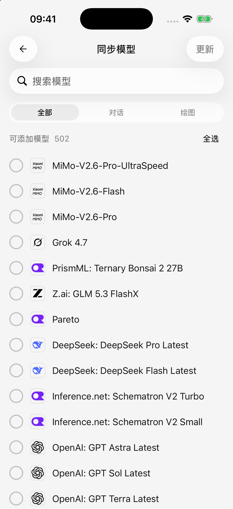

# 模型資訊與清單更新

行動版裡的“更新”有幾種不同含義。看到模型資訊更新，並不意味著應用自動換了模型、替你開通了權限，或把新模型都加入了常用列表。

| 想做什麼 | 應該怎麼操作 | 會改變什麼 |
| --- | --- | --- |
| 獲取新的模型名稱、能力、長度或價格資訊 | 開啟任意服務商的 **模型** 頁 | 重新整理應用使用的模型資料 |
| 檢視某個平台當前返回哪些模型 | 在該服務商的模型頁點選 **同步** | 預覽可新增模型與遠端未返回的模型，由你選擇應用哪些改動 |
| 使用電腦上已配置的服務商 | 選擇 **從桌面端同步** | 匯入所選服務商配置及缺少的已啟用模型 |
| 獲取新的應用功能與修復 | 透過官方安裝渠道更新 App | 更新應用本身 |

## 模型資訊什麼時候自動更新？

首次使用時，應用會在後臺下載模型資料。沒有下載完成時，模型選擇、新增或編輯頁面可能顯示載入或重試提示；先等待下載完成，失敗後檢查網路並重試。

下載成功後，模型資料會儲存在裝置上。以後啟動應用先使用已儲存的資料，不需要每次啟動都重新下載。**再次開啟服務商的模型頁時**，應用會在後臺嘗試獲取更新。

只有成功應用了更新，而且你仍停留在模型頁，才會出現 **模型資訊已更新** 提示。沒有新版本、後臺重新整理失敗，或者已經離開頁面，都可能不顯示提示；沒有提示不一定表示出錯。

## 沒聯網會怎樣？

已有模型資料時，重新整理失敗會繼續使用原資料，不會因一次下載失敗清空模型配置。首次安裝、還沒有資料時，需要聯網完成第一次下載。

可以離線檢視已儲存的模型資料，不代表可以離線呼叫雲端模型；傳送訊息仍需連線所選服務商。

## 我自己編輯的模型資訊會被覆蓋嗎？

遠端資料更新不會重寫你手動儲存的模型改動或自訂模型。沒有單獨覆蓋、仍跟隨預設值的欄位，才會採用新資料，因此你可能看到預設名稱、能力或價格發生變化。

遠端模型資料不會修改你的 **API Key、服務商地址或認證配置**，也不會替你啟用服務商。若自己改過的長度限制不再合適，可在模型編輯頁清空該項並儲存，恢復預設取值。

## 如何同步服務商返回的模型列表？

1. 開啟 **設定 → 模型服務 → 目標服務商 → 模型**。
2. 先儲存剛修改的服務商配置，再點選 **同步**。
3. 等待列表載入，檢視 **可新增模型** 和 **遠端未返回** 兩類變化。
4. 勾選本次要處理的條目，然後點選 **更新**。初始沒有替你選好改動。
5. 如包含移除操作，閱讀確認提示後再決定是否繼續。

同步列表不會自動替你啟用服務商。同步失敗、沒有返回模型時，原有模型會保留，可以檢查配置後重試，也可以改用[手動新增](model-management.md)。

<figure data-mobile-shot="phone"><figcaption>
<strong>iPhone · 簡體中文介面</strong> · 同步先展示可新增模型，勾選後才會應用；列表會隨平台變化
</figcaption></figure>

## “遠端未返回”是不是模型已經下線了？

不一定。不同金鑰、帳號權限、服務商列表介面和臨時故障，都可能影響返回結果。

應用不會因為一次列表結果就自動刪除這些模型。只有你選中移除項並確認後才會從應用中移除；聊天記錄仍保留，受保護的模型會跳過，具體見[模型刪除規則](model-management.md)。不要僅憑“遠端未返回”就批次刪除正在使用的模型。

## 為什麼同步失敗，但手動新增後能聊天？

獲取模型列表和傳送對話使用不同的請求地址。部分平台支援對話，卻沒有提供模型列表介面，因此同步失敗不等於服務不可用。

自訂服務商配置頁會單獨顯示 **模型列表請求地址**。如果平台不支援該地址，可以從平台複製準確的模型 ID，手動新增後檢查連線。

## 平台釋出了新模型，為什麼我還是看不到？

依次確認：

1. 已開啟模型頁，讓模型資料有機會更新。
2. 已向目標服務商同步列表，或手動新增了模型。
3. 當前帳號和金鑰有該模型的使用權限。
4. 服務商已啟用，模型沒有停用，選擇器篩選已切回“全部”。

模型資料、平台權限和本機已新增的模型是三件不同的事。新模型是否支援當前應用的連線方式，也需要以平台和應用版本為準。
