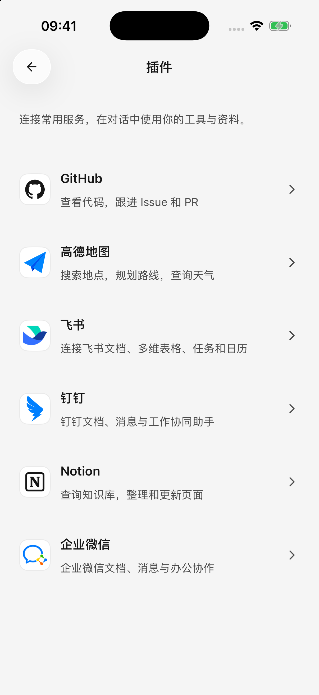
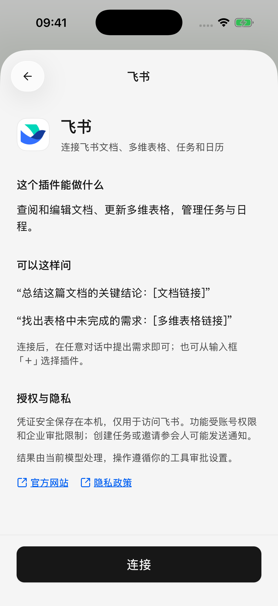

# 外掛與外部工具

外掛讓智能體在你的授權範圍內讀取或處理其他服務中的資料。例如查閱飛書文件、整理 Notion 頁面，或透過高德查詢路線。

模型負責理解需求，外掛負責訪問對應服務。要使用外掛，請先選擇支援工具呼叫的文字模型。

## 連線並使用一個外掛

1. 從側邊欄開啟 **外掛**，選擇目標服務。
2. 閱讀“這個外掛能做什麼”、示例和權限說明，點選 **連線**。
3. 按頁面要求登入授權，或填寫對應服務的金鑰。
4. 外部頁面授權完成後返回 Cherry Studio；需要確認帳號或工作區時，繼續點選確認，直到顯示 **已連線**。
5. 回到對話提出明確需求。也可以點選 **＋ → 外掛**，插入目標外掛，再補充問題。

例如：“用飛書總結這篇文件的三個結論：[文件連結]。”外掛名稱會顯示在輸入框和已傳送訊息中，方便辨認。

已連線外掛可供不同智能體使用，不必給每個智能體重複授權；輸入框裡的選擇用於明確本次需求。沒有已連線外掛時，輸入框不會顯示外掛入口。

<figure data-mobile-shot="phone"><figcaption>
<strong>iPhone · 簡體中文介面</strong> · 從外掛列表選擇需要連線的服務
</figcaption></figure>
<figure data-mobile-shot="phone"><figcaption>
<strong>iPhone · 簡體中文介面</strong> · 連線前先閱讀用途、示例與授權說明
</figcaption></figure>

## 常見外掛怎樣連線？

| 外掛 | 適合的任務 | 連線時注意 |
| --- | --- | --- |
| 飛書 | 文件、多維表格、任務與日曆 | 按頁面準備應用並授權個人帳號；企業可能需要管理員審批，當前這裡使用飛書帳號，不支援國際版 Lark 帳號 |
| Notion | 搜尋、閱讀和編輯頁面，維護資料庫記錄 | 授權工作區後返回確認帳號；可訪問內容受工作區權限限制 |
| GitHub | 閱讀倉庫和討論，管理問題與合併請求 | 可使用應用授權或個人訪問令牌；組織倉庫可能需要額外批准 |
| 高德地圖 | 查地點、周邊、天氣和路線 | 使用高德開放平台的 **Web 服務 Key**；查詢路線不會自動讀取手機定位 |
| 釘釘 | 文件、日程、待辦及其他辦公操作 | 在釘釘授權帳號和組織，部分行為還需要單獨確認權限 |
| 企業微信 | 在授權範圍內處理文件、表格、日程等辦公資料 | 把生成的授權連結貼上到企業微信檔案傳輸助手中開啟，完成後返回 Cherry Studio |

功能列表不是帳號權限承諾。某個外掛支援日曆，不代表你的企業一定已開放日曆權限；帳號套餐、管理員設定和服務配額也可能限制可用能力。

### 飛書應用是什麼，怎麼準備？

這裡的“應用”是飛書側用於管理授權的配置，不是要再安裝一個手機 App。按連線頁的 **前往飛書配置應用** 或配置指南連結操作；使用已有應用時，填寫 App ID（應用標識）和 App Secret（應用金鑰），開通所需的文件、任務或日曆權限，再授權個人帳號。

### 飛書只有部分功能可用

部分授權成功也可以連線，不必等全部權限都齊全。需要新增能力時，在飛書應用中開通相關權限、完成企業審批，再更新個人授權。只反覆重連不會自動獲得缺少的權限。

### 釘釘要求額外確認

到釘釘完成該操作的行為授權後，返回對話**重新發起操作**。授權完成不會自動重新執行原來失敗的請求。

### 企業微信授權連結過期

連結有效期為 5 分鐘。過期時重新生成，並在企業微信內開啟；不要僅在普通瀏覽器裡開啟後等待。

## 連好以後，可以怎樣使用？

以下示例從讀取開始。把方括號中的內容換成自己的連結、名稱或日期，先檢查返回的來源與範圍。

| 外掛 | 可以直接改寫的提問 | 要核對什麼 |
| --- | --- | --- |
| 飛書 | “閱讀這篇文件：[連結]，列出結論、待辦、負責人和截止時間。缺少的資訊寫待確認，先不要建立任務。” | 文件中的負責人和日期是否明確；建立任務是後續的獨立操作 |
| Notion | “閱讀這個頁面：[連結]，整理最近的專案進展，並保留來源連結。” | 工作區權限；頁面或子內容是否讀取完整 |
| GitHub | “檢視 [倉庫地址] 中最近一週的問題討論，按主題整理，並保留對應連結。” | 倉庫可見性、時間範圍，以及討論結論是否已經得到確認 |
| 高德地圖 | “查 [城市與起點] 到 [終點] 的公共交通路線，比較步行距離、換乘次數和預計時間。” | 同名地點的城市與地址；預計時間不等於即時發車時間 |
| 釘釘 | “讀取這篇釘釘文件：[連結]，總結與 [主題] 有關的內容，先不要修改。” | 所選組織與文件權限；是否還需在釘釘完成行為授權 |
| 企業微信 | “讀取這份文件：[連結]，整理其中的三個關鍵結論並標明來源，先不要修改。” | 授權身份是否能訪問該文件，實際連線是否提供相應工具 |

### 從文件整理成真正的任務

例如使用飛書，可以分兩次請求：

1. “讀取會議紀要：[連結]，列出準備建立的任務、負責人、截止日期。先不要建立。”
2. 核對後再明確要求：“在飛書建立表格中第 1、2 項任務，按剛才確認的負責人和日期設定，其他項先不建立。返回建立結果與連結。”

需要文件讀取、人員查詢、任務建立等對應能力都可用。負責人同名或日期不明確時先補充資訊；不能把聊天裡顯示的待辦表格當作已儲存的任務。任務分配、邀請等操作也可能通知對方。

### 讀取和修改多維表格或資料庫

提供具體表格連結與檢視，再說明篩選條件，例如：“只讀取這個檢視中狀態為‘進行中’的記錄，列出名稱和截止日期，先不要修改。”不要只說“修改我的專案表”，因為可能存在同名表格或多個檢視。

需要改動時，先確認具體記錄和欄位，再要求修改。列表有分頁或返回上限時，讓智能體說明覆蓋範圍；一次查詢不能預設代表整個資料庫。Notion 當前連線不提供附件處理或呼叫 Notion 智能體的能力。

### 能同時用多個外掛嗎？

可以在同一任務中配合使用已連線且可用的工具。例如先讀取文件，再[儲存一份清單檔案](file-generation.md)。跨服務複製資料時，明確目的地與要複製的內容，並檢查各步驟的結果；一項成功不會使另一項失敗自動回滾。

工具確認、結果判斷和失敗後的處理，見[讓 AI 使用工具](using-tools.md)。

## 授權頁面關了，為什麼還沒連上？

關閉瀏覽器不等於取消授權，也不代表連線已完成。返回外掛連線頁檢視狀態，按需使用 **開啟授權頁面** 或 **已完成，再次檢查**，並完成帳號確認。

請求過期或被拒絕時重新發起授權。需要切換帳號時，按頁面提示先斷開當前連線，再授權新的帳號。

## 斷開與撤銷授權

在外掛詳情頁開啟連線管理或更多選單，選擇 **斷開連線**。本機斷開後，該外掛不再可用。

如果提示“遠端撤銷尚未確認”，可點選 **管理授權**，到服務商網站撤銷。刪除本機連線與撤銷服務商上的授權不是始終同時完成的。

授權憑據儲存在本機，不透過電腦配置同步帶到其他裝置；另一臺手機需要重新連線。外掛取回的內容可能交給模型處理，詳見[資料、隱私與權限](data-privacy.md)。

## 新增自訂 MCP 工具

**MCP（給智能體連線額外工具服務的方式）**適合已經拿到遠端工具伺服器地址的使用者。內建外掛能滿足需求時，可以直接使用外掛。

1. 開啟 **設定 → MCP → 新增伺服器**。
2. 填寫伺服器地址，優先使用服務提供方給出的 `https://` 地址。
3. 如果對方要求憑據，在 **請求頭（隨連線傳送的認證欄位）** 中按每行 `名稱=值` 填寫，例如 `Authorization=Bearer 你的令牌`。普通使用者不需要自行猜測欄位。
4. 儲存，等待連線並檢視 **工具** 列表；可以停用不需要的工具。
5. 開啟目標智能體的編輯頁，在工具區域開啟對應伺服器，再開始新的請求。若智能體尚未建立，先儲存，再重新開啟編輯頁配置工具。

伺服器已連線、全域工具已啟用，以及智能體已開啟對應伺服器，需要同時滿足。**自動批准**不能繞過任何一個條件。

這裡新增的是遠端服務地址，不是桌面端的本地啟動命令。不能直接把 `npx`、`uvx` 等電腦命令貼上為伺服器地址。iOS 還可能阻止明文 `http://` 連線，應優先使用服務方提供的安全地址。

## 外掛沒按要求操作，怎麼排查？

先看外掛是否顯示“已連線”，再看模型是否支援工具呼叫。給出目標連結、名稱、日期範圍等資訊；如果工具已返回權限錯誤，到服務商處理權限，而不是更改智能體說明。

對寫入任務，可先說“只讀取並列出準備修改的內容”，核對後再要求執行。具體是否出現確認提示由[工具審批方式](agents-and-tools.md)決定。
