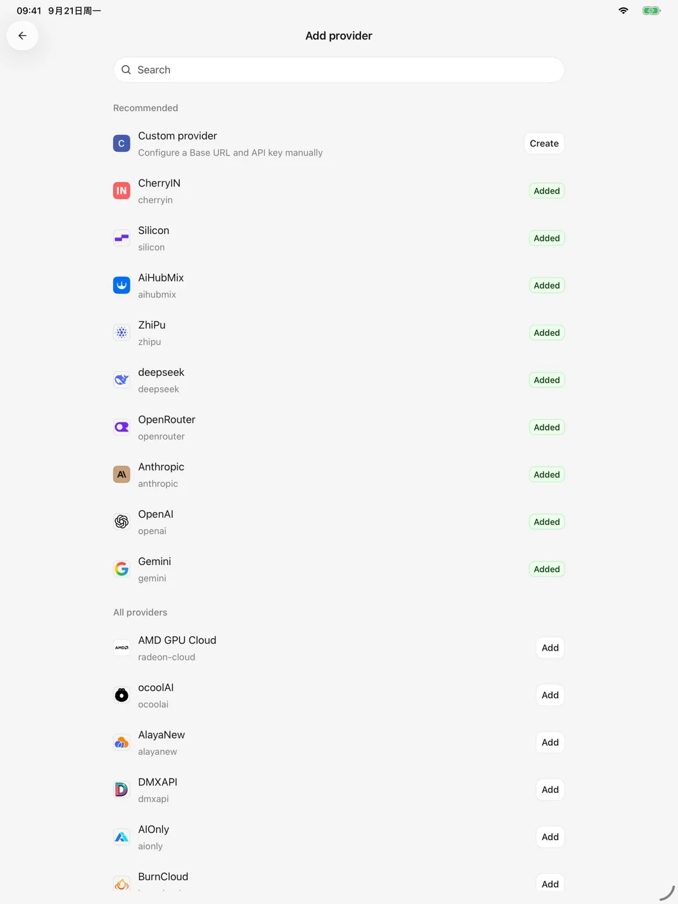
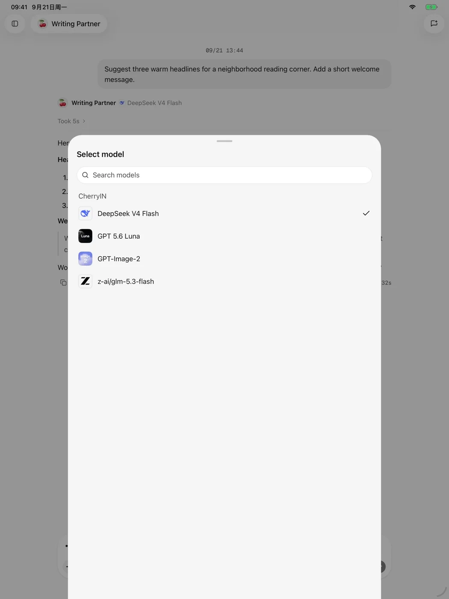

# 服務商與模型

行動版透過你設定的服務商呼叫模型。Cherry Studio 負責用戶端體驗，不代理模型額度，也不會改變服務商本身的計費與資料規則。

<figure data-mobile-shot="phone"><figcaption>
<strong>iPhone</strong> · 搜尋內建服務商或建立自訂服務商
</figcaption></figure>
<figure data-mobile-shot="tablet"><figcaption>
<strong>iPad</strong> · 同一服務商目錄的平板版面
</figcaption></figure>

## 新增內建服務商

1. 開啟模型服務設定並選擇 **新增服務商**。
2. 搜尋並選擇目標服務商。
3. 填寫 API Key；如果頁面提供額外欄位，再依服務商要求填寫。
4. 取得或新增模型，並啟用需要使用的模型。

## 使用自訂服務商

如果服務相容應用程式支援的介面規範，可以選擇 **自訂服務商**，填寫名稱、Base URL、API Key 和模型 ID。Base URL 應使用服務商文件提供的 API 位址，而不是主控台首頁位址。

## 選擇模型

在對話或智能體頁面開啟模型選擇器，即可在已啟用的模型之間切換。模型是否支援圖片理解、工具呼叫或圖片生成，取決於服務商與特定模型。

<figure data-mobile-shot="phone"><figcaption>
<strong>iPhone</strong> · 依服務商瀏覽已啟用的模型
</figcaption></figure>
<figure data-mobile-shot="tablet"><figcaption>
<strong>iPad</strong> · 在平板端檢視模型能力與上下文資訊
</figcaption></figure>

## 常見連線錯誤

* **401 / 未授權**：檢查 API Key 是否完整、是否過期，以及帳戶是否有權限。
* **404 / 模型不存在**：核對 Base URL 與模型 ID，避免把顯示名稱當成模型 ID。
* **429 / 請求過多**：等待流量限制恢復，或檢查服務商餘額與速率限制。
* **逾時或網路失敗**：確認目前網路可以連線到服務商，並檢查 Proxy 設定。
