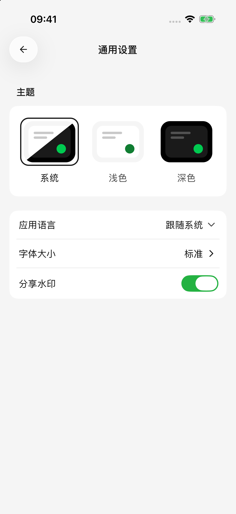
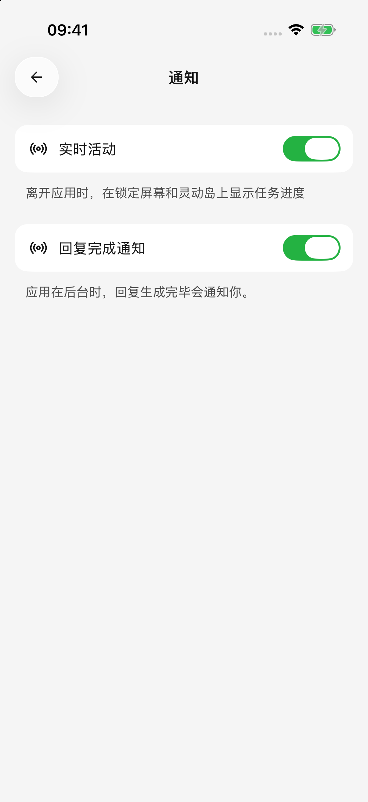

# 設定、用量與背景回覆

常用設定集中在側邊欄的設定入口。想改善閱讀體驗、選擇預設模型或處理後臺任務，可以從這裡調整。

## 主題、語言與字號

在 **設定 → 通用設定** 中：

* 選擇淺色、深色或跟隨系統的主題。
* 選擇應用語言；應用介面語言與正在閱讀的官網文件語言分別設定。
* 開啟字型大小，按預覽選擇適合閱讀的字號。
* 開啟或關閉分享水印，控制後續匯出的品牌頁尾。

這些選項更改後直接儲存。如果看到儲存失敗提示，重試後再離開。

<figure data-mobile-shot="phone"><figcaption>
<strong>iPhone · 簡體中文介面</strong> · 調整主題、語言、字號與分享水印
</figcaption></figure>

## 預設模型與繪圖模型

在 **設定 → 預設模型** 中選擇：

* **預設模型**：為新建智能體提供預設的文字模型選擇。
* **繪圖模型**：用於預設繪圖及文字智能體的圖片生成工具。

選擇或清除會立即儲存，不需要另找儲存按鈕。已有智能體仍保留自己的模型；切換某個智能體時，到它的編輯頁或對話模型選擇器修改。

模型列表為空時，先到模型服務中新增可用模型並啟用服務商。模型的編輯、能力標記和價格設定見[模型管理](model-management.md)。

## 檢視用了多少模型額度

從側邊欄進入首頁，檢視 **AI 用量**，點選檢視詳情可閱讀按日期、模型或服務商整理的記錄。

對話中也可以開啟回答的用量詳情，檢視該次回答的模型、輸入和輸出量、生成耗時及費用資訊。**Token（模型計算內容長度的單位）**不等於字數，歷史對話、思考和工具往返也可能計入消耗。

理解費用時留意：

* 服務商返回的計費金額與根據模型價格估算的金額，來源可能不同；檢視頁面標註。
* 缺少價格時，統計可能只有部分費用，不能把未顯示金額當作免費。
* 重新回答或多次呼叫工具可能產生額外請求。刪除對話不會退回已經使用的額度，也不會抹去已經發生的用量記錄。
* 此處反映本應用已記錄的使用情況，不是整個服務商帳戶的餘額或正式帳單。

實際帳單與剩餘額度請到服務商帳戶檢視。

## 離開應用後繼續生成

開啟 **設定 → 通知**：

| 選項 | 用途 |
| --- | --- |
| iPhone / iPad：即時活動 | 離開應用後，在支援的鎖定螢幕或靈動島上展示任務狀態 |
| Android：後臺回覆 | 嘗試繼續處理回覆，並透過通知顯示狀態 |
| 回覆完成通知 | 應用在後臺完成回覆時，嘗試傳送完成通知 |

進度展示和完成通知是不同選項。還需要系統允許 Cherry Studio 傳送通知；關閉系統權限後，僅在應用中開啟開關不能保證收到提醒。點選任務通知可回到相應內容。

當前頁面正顯示任務時，完成通常不會額外彈出通知。即時活動也主要在離開應用後出現，前臺看不到不一定是設定失效。

<figure data-mobile-shot="phone"><figcaption>
<strong>iPhone · 簡體中文介面</strong> · 任務進度與回覆完成通知可以分別控制
</figcaption></figure>

## 鎖屏後為什麼還是中斷？

後臺回覆不是持續執行保證。系統的省電策略、後臺限制、網路斷開或清理程序，仍可能讓任務停止。較長的生成任務儘量保持應用在前臺。

應用能處理的任務中斷會保留部分回答並提示中斷，不會自動重新傳送原請求。系統強制結束程序時，以已經儲存的內容為準，最後收到但尚未儲存的部分可能丟失。回到對應對話檢查結果，再決定是否重新回答；繪圖則檢查任務記錄後再生成。

等待工具批准時，任務也可能停在審批步驟。回到應用完成確認後才能繼續。通知未送達時，仍可在應用內檢視任務狀態。

## 隱私與系統權限

**設定 → 隱私設定** 中的共享匿名使用資料、匿名錯誤報告分別控制不同用途；**設定 → 系統權限** 控制相機、照片、日曆等系統能力。二者不互相代替。

完整說明見[資料、隱私與權限](data-privacy.md)。
