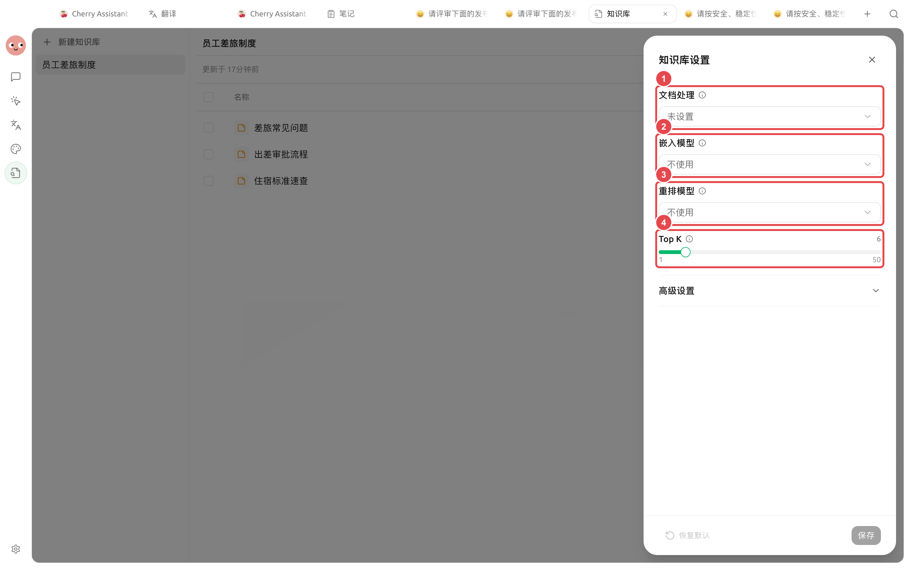

# 模型与检索设置

知识库会先把资料解析并切成片段，再从这些片段中找出最可能回答问题的内容。嵌入模型、重排模型和 Top K 决定“怎样找、怎样排、最后保留多少”；它们不能补救缺失的正文或错误的分段。


第一次调优时，先用当前设置完成一次召回测试。之后每轮只修改一个参数，并始终用同一组问题复测，才能判断是哪项设置带来了变化。


## 先理解检索链路

<figure><figcaption>
BM25 始终可以单独工作；配置嵌入模型后加入向量检索，重排是候选合并后的可选步骤。
</figcaption></figure>

图中每一层都会影响最终结果：资料内容决定“有没有答案”，解析与分段决定“答案是否完整”，检索和重排决定“正确片段能否排到前面”。

### 三种常见组合

| 组合 | 实际检索方式 | 适合什么资料 | 什么时候升级 |
| ----------- | -------------------- | --------------- | -------------------- |
| 不使用嵌入模型 | 仅 BM25 关键词检索 | 条款编号、产品名、专有名词较多 | 换一种说法就难以命中时，加入嵌入模型 |
| 嵌入模型 | BM25 与向量检索并行，再合并候选结果 | 用户问法与资料原文差异较大 | 正确片段能出现但排序不稳时，加入重排模型 |
| 嵌入模型 + 重排模型 | 混合检索后再次评分和排序 | 候选片段相似、需要稳定排序 | 先保持阈值为 0.0，再根据噪声逐步调整 |


不配置嵌入模型，知识库也能工作。只有选择重排模型后，设置面板才会显示【相似度阈值】。


## 打开设置并确认当前配置

打开左侧导航【知识库】→ 选择知识库 → 点击右上角【设置】。

默认区域包含【文档处理】、【嵌入模型】、【重排模型】和【Top K】。第一次测试建议先保留 Top K 为 6，并暂时不提高相似度阈值。

<figure><figcaption>
先确认模型和 Top K，再进入【高级设置】检查分块。
</figcaption></figure>

### 推荐起点

| 配置项 | 界面初始值 | 建议起点 | 作用与注意事项 |
| ----- | ------------ | ---------------- | ------------------------------------- |
| 嵌入模型 | 不使用 | 关键词能稳定命中时先不使用 | 加入后会同时进行关键词与向量检索；云端模型的计费和数据处理方式取决于服务商 |
| 重排模型 | 不使用 | 正确片段能召回但排序不稳时再启用 | 会增加一次模型评分和等待时间 |
| Top K | 6，可选 1～50 | 先保留 6 | 太小可能漏掉答案，太大会带来更多噪声并占用对话上下文 |
| 相似度阈值 | 0.0，仅配置重排后显示 | 从 0.0 开始 | 只过滤重排后的低分结果；设得过高可能把正确片段一起移除 |

## 用固定问题建立基线

开始前，准备 3～5 个答案明确的真实问题。问题应覆盖资料中的专有名词、口语问法和需要上下文才能回答的情况。



### 1. 先查看资料正文和 Chunks

确认答案确实存在于资料中，并且条件、结论没有被错误拆开。如果这一层有问题，先处理解析或分块，不要急着调整模型。



### 2. 完成第一次召回测试

打开【召回测试】，逐个输入准备好的问题，记录命中来源、片段内容、顺序和耗时。

<figure><figcaption>
不要只看“有没有结果”，还要确认来源正确、片段完整且排序合理。
</figcaption></figure>



### 3. 找到问题所在的层级

* 完全没有正确片段：先查资料内容、解析和分块。
* 关键词能找到，换种说法找不到：尝试嵌入模型。
* 正确片段能出现，但经常排在后面：尝试重排模型。
* 正确片段被过滤：降低相似度阈值。
* 前几条都是相关内容但答案仍不完整：再小幅提高 Top K。



### 4. 每轮只修改一项

例如先调整 Top K 并保存，不要同时更换嵌入模型和分段大小。涉及旧资料分块或已有向量时，按下文说明重新索引或重建。



### 5. 使用同一组问题复测

比较调整前后的来源、片段完整度、排序和耗时。没有改善时恢复原设置，再测试下一项。



## 分块不完整时怎么调

展开【高级设置】，可以看到【智能分段】、【分隔符】、【分段大小】和【重叠大小】。

<figure><figcaption>
通用资料可从智能分段开启、分段大小 1024、重叠大小 200 开始。
</figcaption></figure>

| 配置项 | 界面初始值 | 什么时候调整 | 常见副作用 |
| ---- | ----------- | -------------------------- | ------------------ |
| 智能分段 | 开启 | 资料有清晰标题和段落结构时保持开启 | 关闭后仅按分隔符切分 |
| 分隔符 | `\n\n` | 资料有稳定的自定义段落边界时调整 | 关闭智能分段时，分隔符不能为空 |
| 分段大小 | 1024 tokens | 一个片段混入多个主题时减小；条件与结论总被拆开时增大 | 太大增加噪声，太小丢失上下文 |
| 重叠大小 | 200 tokens | 关键信息经常跨片段边界时小幅增加 | 必须小于分段大小，过大会产生重复内容 |


分块设置只影响之后新添加的内容。要让已有资料使用新设置，请在资料行菜单中执行【重新索引】，再用同一组问题复测。


## 更换模型与重建知识库

从仅使用 BM25 的知识库启用嵌入模型时，可以直接完成向量索引。已有向量的知识库更换嵌入模型时，界面会进入【重建知识库】流程，因为不同嵌入模型生成的向量不能混用。


开始重建前先确认新嵌入模型可以正常调用。重建后要重新完成召回基线；不要在同一轮又更换模型、又修改分块，否则无法判断结果变化来自哪里。


需要在本机完成嵌入时，可打开【设置】→【本地模型】，在【嵌入模型】区域下载可用模型，然后回到知识库设置中选择它。

<figure><figcaption>
先完成本地模型下载，再回到知识库选择并建立索引。
</figcaption></figure>

## 调优闭环

<figure><figcaption>
固定问题 → 检查结果 → 定位层级 → 单项调整 → 必要时重新索引 → 复测。
</figcaption></figure>

每次只保留能稳定改善固定测试问题的修改。如果结果没有改善，就恢复上一组设置，而不是继续叠加更多改动。

## 一个完整例子

小林维护一套员工差旅制度。资料里写的是“住宿费标准”，员工却常问“住酒店最多能报多少”。

1. 他先用默认设置测试，发现使用原文关键词能命中，但口语问法不稳定。
2. 他配置嵌入模型并完成索引，用相同问题复测。
3. 正确片段能稳定出现，但偶尔排在后面，于是再配置重排模型。
4. 他保留 Top K 为 6、阈值为 0.0，只在确认无关结果明显时逐步提高阈值。

完成标准是：三种不同问法都能在前几条结果中找到同一条住宿标准，并且片段同时包含适用条件和报销上限。

## 常见问题

不使用嵌入模型，知识库还能搜索吗？

可以。知识库会使用 BM25 关键词检索，适合条款编号、专有名词和接近原文的问法。

为什么看不到【相似度阈值】？

只有选择重排模型后，设置面板才会显示【相似度阈值】。

修改分段大小后，旧资料为什么没有变化？

分块设置只影响之后新添加的内容。请对已有资料执行【重新索引】，然后再用相同问题复测。

正确片段完全没有出现，应该先调大 Top K 吗？

先检查资料正文和 Chunks。解析或切分错误时，调大 Top K 只会返回更多不正确或不完整的片段。

## 继续阅读

<table data-view="cards"><thead><tr><th></th><th></th><th data-hidden data-card-target data-type="content-ref"></th></tr></thead><tbody><tr><td><strong>知识库入门</strong></td><td>先建立知识库工作的整体认识。</td><td><a href="knowledge-base.md">knowledge-base.md</a></td></tr><tr><td><strong>文档解析与 OCR</strong></td><td>正文缺失或识别错误时，从资料处理层排查。</td><td><a href="document-preprocessing.md">document-preprocessing.md</a></td></tr><tr><td><strong>添加与整理资料</strong></td><td>了解重新索引、资料状态和内容维护。</td><td><a href="sources.md">sources.md</a></td></tr><tr><td><strong>检查资料与召回</strong></td><td>继续练习召回测试和结果判断。</td><td><a href="recall-test.md">recall-test.md</a></td></tr></tbody></table>
