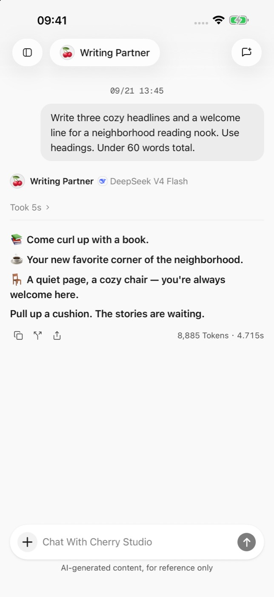
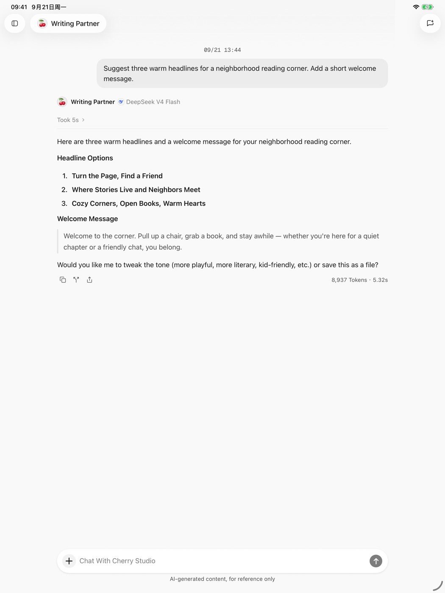

# Cherry Studio 移动版

Cherry Studio 移动版是为 Android、iPhone 与 iPad 设计的 AI 客户端。你可以连接自己的模型服务，在移动设备上进行对话、配置智能体并生成图片。

<figure data-mobile-shot="phone"><figcaption>
<strong>iPhone</strong> · 完整对话与消息操作，点击查看原图
</figcaption></figure>
<figure data-mobile-shot="tablet"><figcaption>
<strong>iPad</strong> · 针对平板空间展开的对话界面，点击查看原图
</figcaption></figure>

## 当前状态

移动版目前处于 **Beta** 阶段：

* Android 通过官方 APK 提供。
* iPhone 与 iPad 通过 Apple TestFlight 提供。
* 界面与功能可能随版本快速调整，具体以你安装的版本为准。

前往[下载页的移动端选项](https://cherryai.com.cn/download?platform=mobile)，或先阅读[安装指南](installation.md)。

## 可以做什么

* 添加内置或自定义模型服务商，管理常用模型。
* 在助手中切换模型，发送文字、图片或文件。
* 创建智能体，配置提示词、模型与支持的系统工具。
* 使用已配置的图像模型生成并预览图片。
* 在 iPhone、iPad 与 Android 设备上使用针对触屏设计的界面。

## 阅读路线

1. [下载与安装](installation.md)
2. [快速开始](quick-start.md)
3. [服务商与模型](providers-and-models.md)
4. [对话与文件](chat-and-files.md)
5. [智能体与工具](agents-and-tools.md)
6. [图片生成](image-generation.md)
7. [数据、隐私与权限](data-privacy.md)
8. [常见问题](troubleshooting.md)

> Cherry Studio 是客户端，不附带模型额度。调用费用、可用地区与服务条款由你选择的模型服务商决定。
