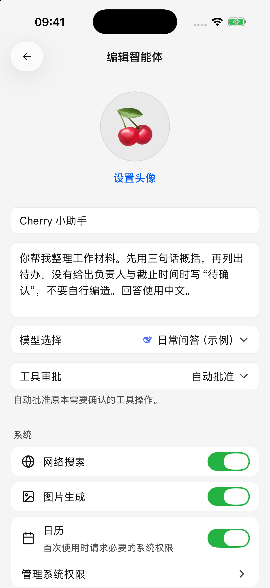
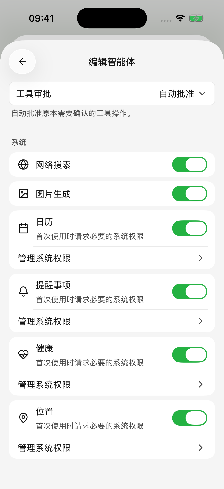

# 智能体与工具

智能体是一套保存下来的工作设置：名称、头像、任务说明、默认模型和工具审批方式。你可以为写作、学习、工作资料整理分别创建智能体，再为每个话题开启独立对话。

<figure data-mobile-shot="phone"><figcaption>
<strong>iPhone</strong> · 保存常用说明，选择模型与审批方式；图中为演示智能体
</figcaption></figure>

## 创建一个常用智能体

1. 打开智能体列表，点击添加；也可以从对话顶部的智能体选择器新建。
2. 填写名称，选择头像，写清希望它如何工作。
3. 选择默认模型。需要搜索、调用插件或操作日历时，选择支持工具调用的文字模型。
4. 选择工具审批方式，在“系统”区域按需开启网络搜索、图片生成或设备能力。自定义工具可在保存后添加。
5. 点击 **保存**。从对话选择器创建后会进入这个智能体的新对话；从管理列表创建后返回列表。

可以从这个简单的说明开始：

> 你帮我整理工作材料。先用三句话概括，再列出待办。没有给出负责人与截止时间时写“待确认”，不要自行编造。回答使用中文。

把常用规则写进说明，把本次要处理的文件和问题放进对话。不要把 API Key 或账号密码当作任务说明保存。

## 修改后需要点保存吗？

**新建智能体需要保存，编辑已有智能体会自动保存。**

名称和说明在短暂停止输入后保存，头像、模型和审批方式等选择会立即保存。如果出现保存失败提示，当前编辑页会保留草稿并提供重试，请处理后再离开。

未选择模型的智能体可以保存，但不能开始对话。为它选择可用模型后再发送。

## “需要时确认”和“自动批准”有什么区别？

| 模式 | 实际行为 |
| --- | --- |
| 需要时确认 | 只有工具规则要求确认时才询问，部分读取操作仍可直接进行 |
| 自动批准 | 自动通过符合条件的工具审批，仍受系统权限、工具启用状态和可访问资料范围限制 |

当前新建智能体，包括初始 Cherry 智能体，默认使用 **自动批准**；已有智能体保留原设置。希望修改日历、删除提醒或调用外部工具前先确认，可以改为 **需要时确认**。

工具审批只决定是否询问，不能让没有权限的工具变得可用。通过文字模型调用的**图片生成工具每次仍需确认**，因为会使用模型服务额度；这与直接选择图片模型并主动点击生成不同。

出现待审批提示时，阅读将进行的操作，然后允许或拒绝。拒绝后工具不会执行，智能体可能改用已有信息回答。批准以后若还出现系统权限弹窗，需要另外完成系统授权。

## 手机能提供哪些系统工具？

在智能体编辑页的 **系统** 区域，选择这个智能体可以使用哪些能力。开关包括网络搜索、图片生成、日历、提醒事项、健康和位置；只显示当前平台与设备支持的项目。

* 从编辑页新建智能体时，日历、提醒事项、健康和位置默认关闭，按需开启；已有智能体保留自己的设置。
* 这里的开关只控制当前智能体。关闭网络搜索后，它不会调用内置搜索或网页阅读工具；关闭图片生成后，它不会通过文字对话调用内置绘图工具。插件与自定义 MCP 工具需在各自配置中单独管理。
* 开启开关不会直接授予系统权限。实际操作时按提示授权，也可以点击 **管理系统权限**，或进入 **设置 → 系统权限** 查看。
* 开关更改会随已有智能体自动保存，之后的新请求使用新的设置；正在进行的操作不会因此自动撤销。

| 能力 | 可以怎样提问 | 可用范围 |
| --- | --- | --- |
| 日历 | “列出我明天的日程”；“明天下午三点建一个 30 分钟会议” | iOS、Android，受日历读写权限和系统支持限制 |
| 提醒事项 | “明天上午九点提醒我寄快递” | iOS 的提醒事项权限；Android 当前不提供此系统工具 |
| 健康记录 | “汇总本周已记录的步数和运动” | iOS，按系统实际授权的数据类型读取；Android 当前不提供 |
| 当前位置 | “获取我现在的位置，再帮我规划路线” | iOS、Android，需要定位权限 |
| 应用内文件 | “把刚才的内容整理成一个文件” | 处理本次对话可访问的附件或生成文件 |

Android 某些日历写入操作会打开系统日历表单，需要在系统页面完成；仅打开表单不表示日程已经保存。健康数据为空也不一定是应用出错，可能没有记录或未授权该数据类型。

系统工具不能随意访问手机中所有文件、接管其他 App，或远程操作你的电脑。可用能力以实际工具和授权为准。

<figure data-mobile-shot="phone"><figcaption>
<strong>iPhone</strong> · 分别控制智能体能力，需要时再管理系统权限
</figcaption></figure>

## 联网、插件和自定义工具从哪里配置？

* **联网搜索**：在设置中配置搜索与网页阅读服务，然后在消息里提出搜索需求，详见[联网搜索与网页阅读](web-search.md)。
* **插件**：从侧边栏连接飞书、Notion 等账号，连接后可在对话中直接使用，也可通过 **＋ → 插件** 指定。详见[插件与外部工具](plugins.md)。
* **自定义 MCP（给智能体连接额外工具服务的方式）**：先在设置中添加服务器，再在已保存智能体的编辑页中开启对应服务器。详见[自定义工具步骤](plugins.md)。
* **绘图工具**：在 **设置 → 默认模型** 选择绘图模型，并开启当前智能体的 **图片生成** 后，支持工具调用的文字模型才有可用的绘图工具。也可以直接选择图片模型进入图像对话。

## 为什么已经授权，智能体仍然不会使用工具？

先确认选中的模型支持工具调用，再检查当前智能体的能力开关、工具连接、服务器和具体工具是否启用，以及系统权限。插件账号还可能受企业管理员或目标文档权限限制。

提问时给出明确目标，例如文档链接、日期范围或日历名称；仅说“帮我处理一下”通常不足以确定对象。可以先让它读取并列出内容，确认对象后再要求修改。

想按步骤实际使用，继续阅读[让 AI 使用工具](using-tools.md)、[日历与提醒事项](calendar-and-reminders.md)、[位置与健康记录](location-and-health.md)和[生成与修改文件](file-generation.md)。
