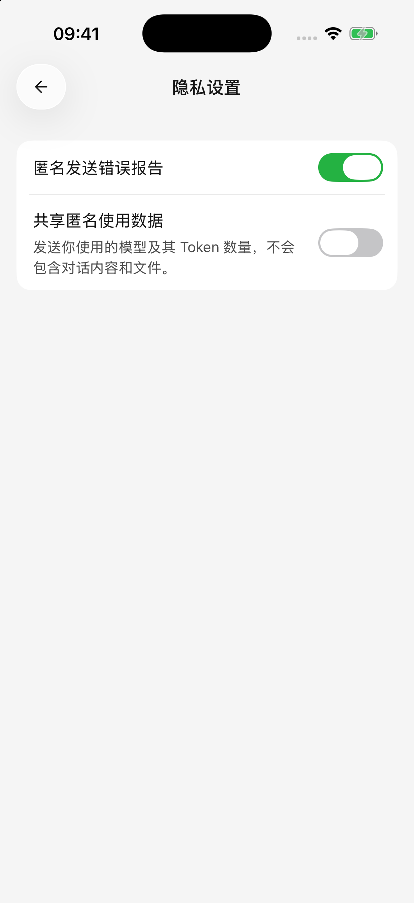

# 数据、隐私与权限

移动版把对话和配置保存在当前设备，但使用云端模型或联网工具时，完成任务所需的内容仍会发送到对应服务。下面按用途说明。

## 不同数据去哪里？

| 使用方式 | 需要处理的数据 |
| --- | --- |
| 云端对话或图片生成 | 所选模型服务商接收消息、参与本次请求的历史，以及相关图片、解析后的文档内容或绘图描述 |
| 联网搜索与网页阅读 | 搜索或阅读服务接收关键词、网页链接；返回的资料再参与模型回答 |
| 插件或自定义工具 | 对应外部服务按授权处理请求；取回的资料可能提供给模型 |
| 日历、提醒、位置等系统工具 | 在系统授权范围内获取或修改资料，相关结果可能用于模型回答 |
| 从电脑导入配置 | 通过局域网读取选中服务商的地址、密钥和支持的模型配置 |

这些服务如何保留数据，以各自的账号设置和隐私政策为准。“数据保存在本机”不表示模型回答全程离线。

## 匿名使用数据与错误报告

首次使用或隐私政策更新后，应用会说明匿名数据用途，让你选择 **同意并继续** 或 **不同意**。以后可在 **设置 → 隐私设置** 修改选择。

* **共享匿名使用数据**：用于了解应用使用情况，包含安装标识、应用与系统版本、所用模型及 Token 数量等，不包含对话正文、文件或 API Key。
* **匿名发送错误报告**：用于排查崩溃和异常，与使用数据是独立开关。

关闭匿名使用数据不等于阻止你主动向模型服务商发送消息，也不等于撤销插件账号授权。需要停止某个连接时，到对应服务商或插件设置处理。

<figure data-mobile-shot="phone"><figcaption>
<strong>iPhone</strong> · 匿名错误报告与匿名使用数据是两个独立选项
</figcaption></figure>

## 保管密钥与插件授权

API Key 是调用模型服务的密钥，不要写进智能体说明、公开截图或问题反馈。怀疑泄露时，到服务商撤销旧密钥，再回到应用填写新密钥。

内置插件的授权凭据存放在设备的系统安全存储中，不通过电脑配置导入同步到其他设备。自定义 MCP 的静态认证字段随服务器配置保存在本机，请同样妥善保管。

## 系统权限怎么管理？

打开 **设置 → 系统权限**，查看相机、照片、日历、定位等状态。首次用到某项能力时可能先出现应用内工具确认，再出现系统授权；需要分别处理。

| 现象 | 可以怎么做 |
| --- | --- |
| 只能看到部分照片 | 系统可能只授权了选中的照片，重新选择或调整照片访问权限 |
| 拒绝后没有再次弹窗 | 前往手机系统设置修改 Cherry Studio 的权限 |
| 可以看日历但不能修改 | 检查读、写权限是否分别满足 |
| 健康数据为空 | 确认设备中有相应记录，且该数据类型已授权 |
| 扫码能配对却读不到电脑配置 | 检查局域网权限与网络，见[电脑导入教程](desktop-sync.md) |

智能体编辑页的能力开关决定这个智能体是否使用相关内置工具，系统权限决定应用是否有权访问对应资料。插件与自定义 MCP 工具需单独管理。关闭智能体开关不会撤销系统授权；需要撤销时到系统设置处理。自动批准工具不会越过系统权限。Android 当前不提供 iOS 提醒事项、健康记录这两类系统工具。

## 换设备、卸载和清理数据前

不要把电脑配对当作完整备份或自动同步。当前设备互联主要导入服务商配置及模型，聊天记录不在导入范围。

卸载、清除应用数据或更换设备前，先把重要问答和文件[分享或导出](sharing-and-export.md)，保存到应用之外的位置或其他设备，并确认可以打开。只保存在 Cherry Studio 文件库里仍可能随应用数据一起被删除。导出的图片、HTML 或 Markdown 用于保存成果，并不是可恢复所有应用设置的备份文件。

## 删除记录能撤销已经执行的操作吗？

不能。删除一轮对话或重新回答，不会撤销已经修改的日程、外部文档或发出的消息，也不会退回模型费用。需要撤销外部操作时，到相关服务查看并处理实际结果。

## 反馈时提供什么？

提供应用版本、设备与系统版本、操作步骤、预期和实际结果，以及错误提示即可。截图或错误详情中如果有真实密钥、带凭据的地址、私人对话或文件内容，先遮盖再发送。
