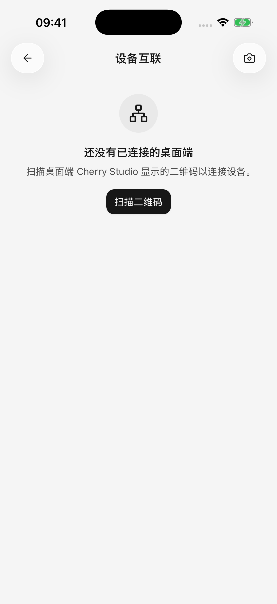

# 从电脑导入配置

如果电脑上的 Cherry Studio 已经配置好模型服务，可以把支持的服务商配置和模型导入手机，减少重复填写地址和密钥。

**当前导入范围是模型服务商配置和已启用模型，不包含聊天记录，也不是远程控制电脑。** 配对成功后不会持续自动同步；需要更新配置时再主动同步。

## 连接电脑

1. 让手机或平板与电脑连接同一局域网，例如同一家庭 Wi-Fi，并保持桌面端 Cherry Studio 运行。
2. 在桌面端打开 **设备互联**，显示配对二维码。
3. 移动端打开 **设置 → 设备互联 → 扫描二维码**；首次使用允许相机和系统请求的局域网访问权限。
4. 扫描后按页面继续选择要同步的服务商。首次使用向导中的“从桌面端同步”也会进入这套流程。

不能使用相机时，可以使用页面提供的手动输入方式，粘贴桌面端的配对二维码内容。这里需要的是配对内容，不是普通网页链接。

<figure data-mobile-shot="phone"><figcaption>
<strong>iPhone</strong> · 打开设备互联，扫描电脑端的配对二维码
</figcaption></figure>

## 选择并导入服务商

已配对设备可以从设备详情中的 **从桌面端同步模型服务商** 进入；也可以从模型服务列表的更多菜单选择 **从桌面端同步**，再选择来源电脑。

1. 等待读取电脑上已启用的服务商。
2. 勾选本次需要导入的服务商。
3. 阅读“将覆盖所选服务商的地址和密钥，已有模型保留”的提示。
4. 点击同步，查看新增、更新与跳过的数量。
5. 返回对话选择导入的模型；首次使用向导会继续让你选择聊天模型。

## 已在手机上配置过，会发生什么？

| 项目 | 再次同步后的行为 |
| --- | --- |
| 选中的服务商 | 更新为电脑上的配置和密钥，并在手机启用 |
| 电脑已启用、手机缺少的模型 | 添加到手机 |
| 手机上已经存在的同一模型 | 保留手机现有设置，不重复添加 |
| 手机独有的服务商或模型 | 保留 |
| 电脑上已停用的服务商或模型 | 不在本次导入范围内 |
| 聊天记录、插件账号授权 | 不通过此功能导入 |

手机与电脑使用不同密钥时，尤其要注意第一项。即使没有新模型，选择已有服务商同步仍可能替换其地址和密钥。

## 为什么有些服务商不能选？

查看条目上的原因：

* **认证方式不支持**：例如电脑端登录的账号没有可导出的、移动端可用的密钥，需要在手机使用支持的方式单独配置。
* **未配置可用密钥**：先在电脑确认至少有一个有效且启用的 API Key。
* **当前版本无法识别配置**：更新移动版，或先跳过该条目，导入其他可用服务商。

电脑上的本地模型服务，例如 Ollama、LM Studio，不属于当前导入范围。手机不能因为配对成功就把电脑里的本地模型当作手机上的服务运行。

## 扫码成功，但同步失败

配对保存的是连接凭据，后续读取配置仍需要连得上电脑。确认桌面端运行、两台设备在同一局域网，且路由器的访客网络隔离、电脑防火墙或代理没有阻断连接。

iPhone 或 iPad 拒绝过局域网权限时，请到系统设置为 Cherry Studio 开启。页面显示“需要重新配对”时，重新扫描电脑端生成的二维码。

## 移除设备会撤销两边的授权吗？

移动端的 **移除设备** 只移除这台手机保存的连接凭据。需要撤销桌面端授权时，还应在电脑的 **设备互联** 中移除这台移动设备。

导入配置不是完整备份。重要对话和文件请另外[分享或导出](sharing-and-export.md)。
