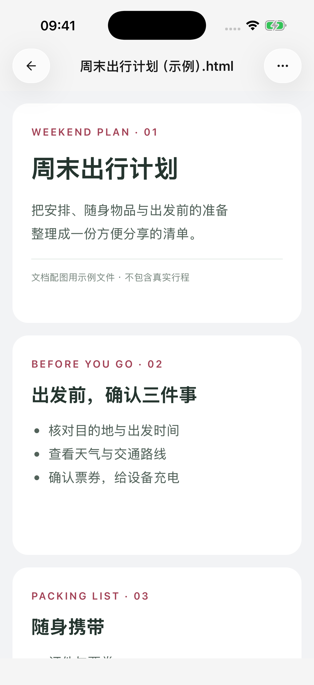
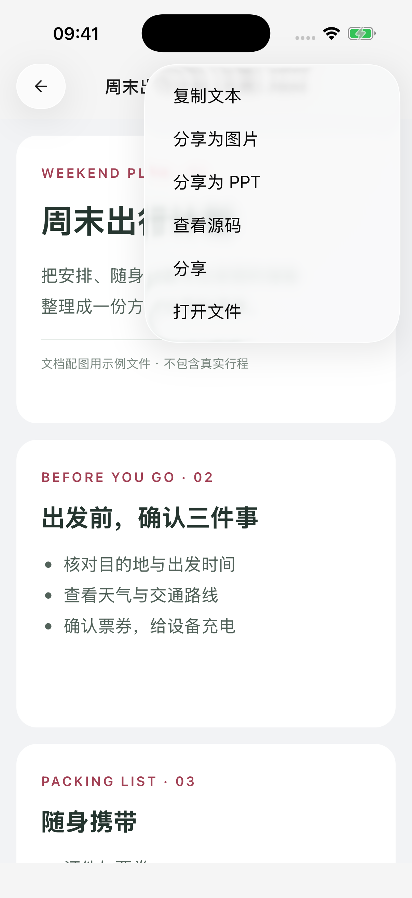

# HTML 转图片与 PPT

HTML 是可以带有排版、颜色和图片的网页文件。在 Cherry Studio 中保存并打开 HTML 后，可以把它分享成长图或 PPT，适合展示方案、学习卡片或简短演示稿。

## 先准备一个 HTML 文件

可以上传已有文件，也可以让支持工具调用的模型制作：

> 把刚才的项目介绍制作成一个可独立打开的 HTML 演示稿，三页，分别介绍目标、计划和下一步。每页使用 16:9 比例，字号便于阅读，不依赖网络图片或字体，保存为“项目介绍.html”。请为每页使用 class="slide" 的独立页面容器。

最后一句是告诉模型如何标记页面，你可以直接复制，不需要自己编写代码。只要求一张信息卡时，不必分页。

等待文件保存完成，再点击文件卡片，或从侧边栏 **文件** 中打开。只有聊天中的 HTML 代码块时，需要先让模型将其[保存成文件](file-generation.md)。

## 分享成长图或 PPT

1. 打开完整的 HTML 文件，检查文字、图片和页面布局。
2. 点击右上角 **更多**。
3. 选择 **分享为图片** 或 **分享为 PPT**。
4. 等待准备、页面捕获和文件写入完成；需要停止时点击进度区域的 **取消**。
5. 在系统分享面板中选择保存或接收应用。

生成的 PNG 或 PPTX 也会保留在 **文件** 中，之后可以再次打开或分享。关闭系统分享面板不代表已经保存到你选择的其他位置。

<figure data-mobile-shot="phone"><figcaption>
<strong>iPhone</strong> · 打开已保存的 HTML；图中为专门准备的演示文件
</figcaption></figure>
<figure data-mobile-shot="phone"><figcaption>
<strong>iPhone</strong> · 从文件菜单选择分享为图片或 PPT
</figcaption></figure>

## 两种格式有什么区别？

| 格式 | 适合什么 | 输出特点 |
| --- | --- | --- |
| 图片（PNG） | 发给别人直接查看，分享信息卡 | 整份 HTML 合为一张图片；多页内容纵向排列 |
| PPT（PPTX） | 按页展示或播放 | 每页是一张画面，放入 16:9 幻灯片中 |

**PPT 中的文字和图表属于页面图片，不能逐项编辑。** 需要修改内容时，先让模型修改 HTML，再重新转换。需要原始可编辑内容时，可以同时分享 HTML 文件。

带有明确页面标记的 HTML 会按页面转换。普通长网页则按高度切成 16:9 页面，可能截断段落或表格，并不会自动重新设计成演示稿。出现这种情况，可以让模型重新整理为每页独立、内容较少的演示稿。

页面比例不一致时，PPT 会保留比例并留白，不会强行拉伸。转换使用较宽的页面布局，排版可能与手机上看到的窄屏预览不同。

## 水印和文件里的交互会保留吗？

转换跟随 **设置 → 通用 → 分享水印**：开启时，图片底部或 PPT 最后一页会加入水印。设置影响新生成的文件；已经保存的转换结果不会随之后的开关变化而重做。

转换重新打开已保存的 HTML，不会复制你刚才在预览里点击按钮、展开折叠区或填写表单后的状态。动画与视频也不会变成可播放的 PPT 内容。需要展示某种状态时，让模型把它直接保存为页面的静态内容。

## 为什么看不到转换入口，或转换失败？

* **文件不是 HTML**：Markdown、普通文字或聊天代码块不会显示这两个转换入口。
* **文件过长，只加载了部分内容**：无法转换不完整的 HTML；请精简或拆分。空内容也不能转换。
* **图片或字体加载失败**：依赖网络的资源需要可访问；可以让模型改为不依赖外部资源的版本。
* **内容太长或页面太多**：PPT 最多 64 页，长图也有尺寸限制。减少内容、分成多个文件，或把长图改为分页演示稿。
* **布局不断变化或切到后台**：复杂动态页面可能失败，转换时保持 App 在前台；必要时使用静态排版。

失败或取消后，原 HTML 文件仍可继续编辑。重新尝试前按提示处理原因；重要文件分享出去后，再用接收应用确认页数和内容。
