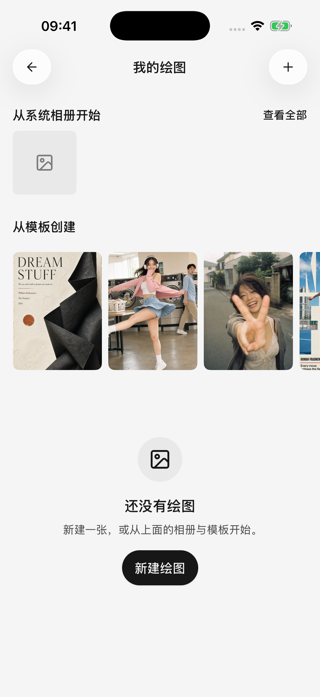
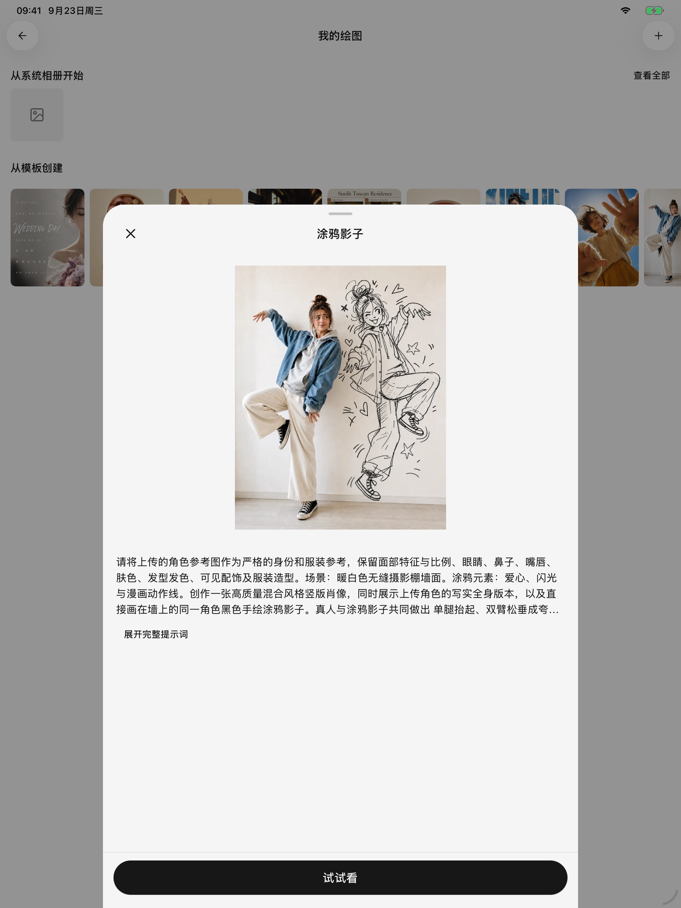

# 图片生成

移动版支持从文字描述或参考图开始创作，也可以从模板选择喜欢的效果。先配置一个可用的图像生成模型；“能看图片”的文字模型不一定能生成图片。

<figure data-mobile-shot="phone"><figcaption>
<strong>绘画入口</strong> · 从照片或模板开始创作
</figcaption></figure>
<figure data-mobile-shot="tablet"><figcaption>
<strong>模板预览</strong> · 查看示例效果和提示词，再决定是否使用
</figcaption></figure>

## 三种使用方式

| 方式 | 怎么开始 | 结果在哪里 |
| --- | --- | --- |
| 独立绘图 | 从侧边栏打开 **绘画**，点击右上角添加按钮，选择模型并输入描述 | 绘图历史 |
| 在对话中直接使用图片模型 | 为智能体选择图像生成模型 | 当前对话里的图片附件 |
| 让文字智能体调用绘图工具 | 在 **设置 → 默认模型** 配置绘图模型，开启智能体的 **图片生成**，再向支持工具调用的文字模型提出绘图需求 | 当前对话里的工具过程和生成图片 |

第三种方式会在调用绘图工具前要求确认，即使智能体使用自动批准也一样。独立绘图和直接选择图片模型，则由你主动点击发送或生成来提交。

## 从一段描述开始

1. 选择图像生成模型。
2. 描述主体、用途、风格和构图。
3. 打开参数面板，调整该模型提供的尺寸、画幅、数量或其他选项。
4. 提交后等待结果，点击图片放大预览。

可以试试：

> 为读书笔记生成一张横向封面。木桌上放着一本打开的书和一杯茶，清晨自然光，暖白与浅木色，画面左侧留白，不要文字。

不同模型的参数不完全相同，只会显示当前模型支持的选项。更大的图片或更多张数可能增加等待时间和费用。

## 用模板快速开始

从绘图模板中选择效果，先查看预览，再把模板中的主体、用途和其他可填内容改成自己的需求。模板提供的是创作起点，最终效果仍取决于所选模型和输入内容。

生成后可回到绘图历史查看结果和 **生成详情**，再次使用有效描述，不必每次从头写。

## 用参考图继续修改

以下输入保留和自动参考规则适用于**独立绘图**以及**对话中直接选择图片模型**的输入界面。文字智能体调用绘图工具时，则由它根据对话与工具请求选择材料，不等同于这些输入框规则。

对于支持参考图或图片编辑的模型，可以添加图片并描述要改什么，例如“保留构图，把背景改成傍晚，其他部分不变”。

* 支持连续编辑时，上一轮成功生成的单张图片可自动成为下一轮参考；生成了多张时，需要选择要继续使用的图片。
* 如果生成期间已经修改下一条输入，应用会保留你的输入，不会直接用结果覆盖它。
* 手动添加的参考图会替代自动参考；提交前检查实际附带的图片。
* 切换到只支持文字生成图片的模型时，自动参考会暂停。显式附带了不兼容图片时，应用会提示处理，应移除图片或换回支持编辑的模型。
* 要求输入图片的模型必须先加参考图。部分模式可不写文字，是否允许以页面提示为准。

在图片预览里选择编辑或调整尺寸，会带着选中的图片进入创作。能否执行仍取决于目标模型支持什么，不是所有图片模型都支持任意修改。

## 失败、取消和重复提交

失败或取消后的续画会尽量保留输入与参考图意图；独立绘图会保留之前成功的结果，便于调整后再试。取消并不表示服务商没有处理过请求，也不保证退回费用。

先查看错误提示：模型不支持、参考图要求不符、余额不足、限流和网络超时需要分别处理。不要只反复点击生成；确认前一次任务状态后再提交。

## 保存与分享

打开图片预览，可使用保存到相册、系统分享或用其他应用打开等入口。保存到相册需要系统授权。

在 **设置 → 通用设置 → 分享水印** 中可以调整后续导出的水印。对话里的图片可以随选中的问答一起导出；独立绘图结果从绘图历史打开。详见[分享与导出](sharing-and-export.md)。
