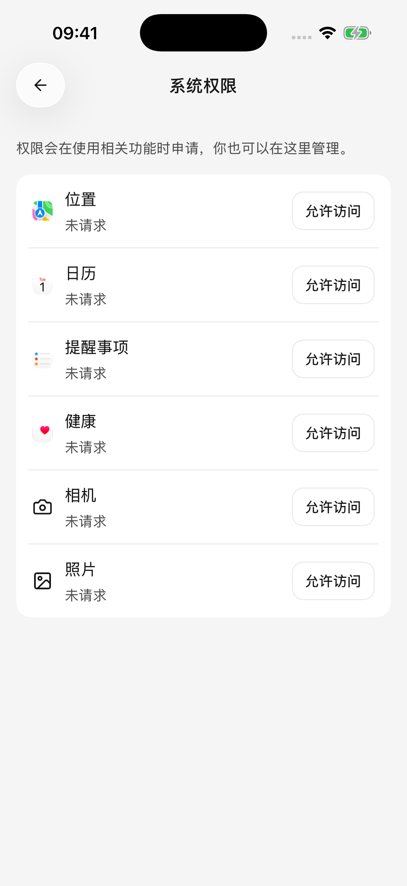

# 位置与健康记录

位置工具可以读取手机当前的位置；健康工具可以汇总 iOS 健康中已有的记录。它们各自需要智能体能力开关与系统授权，不会因为开启“自动批准”就获得权限。

## 查看和管理权限

在智能体编辑页的 **系统** 区域开启本次需要的 **位置** 或 **健康**，再按提示授权。也可以打开 **设置 → 系统权限**，查看支持的项目与当前状态。

<figure data-mobile-shot="phone"><figcaption>
<strong>iPhone</strong> · 系统权限独立管理；开启智能体能力后仍需授权
</figcaption></figure>

只想暂停某个智能体使用这些能力，可以关闭它的能力开关；要撤销 App 的系统权限，需按权限页面指引到系统设置中处理。

## 获取位置，再查询周边

先做一个简单查询：

> 获取我现在的位置，告诉我大致在哪个区域，以及这次定位的时间。

需要周边或路线信息时，可以结合已连接的高德插件：

> 获取我当前的位置，再用高德查询附近的地铁站，列出名称和地址。

两步需要各自的条件：读取手机位置需要系统定位权限，查询地图需要连接高德插件。仅连接高德不会自动读取手机定位。

### 不想授权位置，也能查路线吗？

可以直接给出起点和终点：

> 用高德查询从上海人民广场到虹桥站的公共交通路线，比较换乘次数和预计时间，不需要读取手机位置。

内置位置工具进行的是一次当前位置读取，不提供持续跟踪、后台定位或逐段导航。路线说明来自地图服务，不能把一次定位当成实时导航。

### 定位失败，或只有坐标没有地址

* 先确认系统定位服务和 Cherry Studio 的定位权限已开启，并让 App 保持在前台。
* 室内信号、设备和系统提供的位置精度会影响结果；定位超时不一定是权限被拒绝。
* 坐标转成文字地址可能单独失败。拿到坐标但没有地址，不表示整次定位都失败。
* 处理提示中的原因后再主动重试；也可以直接提供城市、地标或出发地址。

## 汇总健康记录（仅 iOS）

当前支持读取这些已记录的数据：

| 类别 | 可以得到的内容 |
| --- | --- |
| 日常活动 | 步数、活动能量、步行与跑步距离 |
| 心率 | 心率、静息心率、心率变异性 |
| 睡眠 | 已记录的睡眠时长 |
| 体能训练 | 指定日期范围内的运动记录 |

你可以只授权需要的数据类型。例如只整理步数时，不必同时开放心率和睡眠。当前工具用于读取，不能向系统健康写入或删除记录；Android 当前不提供这些健康工具。

可以这样提问：

> 读取最近七天已记录的步数和步行跑步距离，按天列出。没有数据的日期标为“无可用记录”，不要填成零。

> 汇总上周的睡眠时长，并说明哪些日期缺少记录。

> 列出本月已记录的体能训练，说明本次返回了多少条；如果可能不完整，请说明。

单次查询时间跨度最多 90 天。未指定日期时，工具默认查询最近七天；运动列表默认取 20 条，单次最多 50 条。记录较多时按较短时间段分别查询。

## 为什么健康数据为空或只有部分指标？

可能是系统健康中没有对应记录、没有授权该类型、系统没有提供可读取的历史记录，或某一指标读取失败。**空结果不等于步数为零，也不等于没有运动。** iOS 不会完整披露用户是否拒绝了某类健康数据的读取，App 不能仅凭空结果区分这些情况。

先打开系统健康确认日期与记录，再检查对应类型的授权；也可以缩短日期范围，只查询一个指标。让智能体明确写出缺失项，避免把不完整的数据解释成完整趋势。

位置与健康结果可能随对话交给你选择的模型服务处理。了解授权和数据用途，见[数据、隐私与权限](data-privacy.md)。
