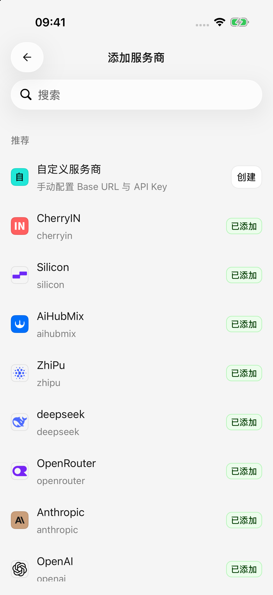
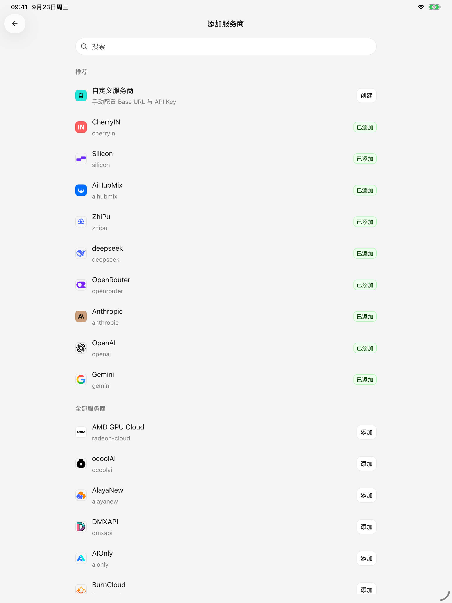
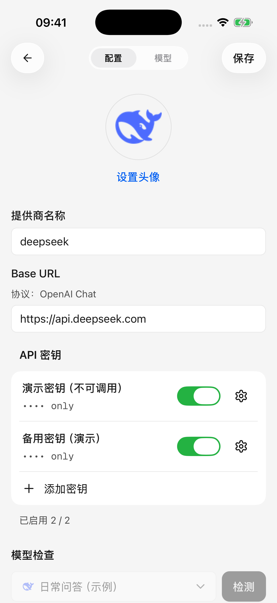
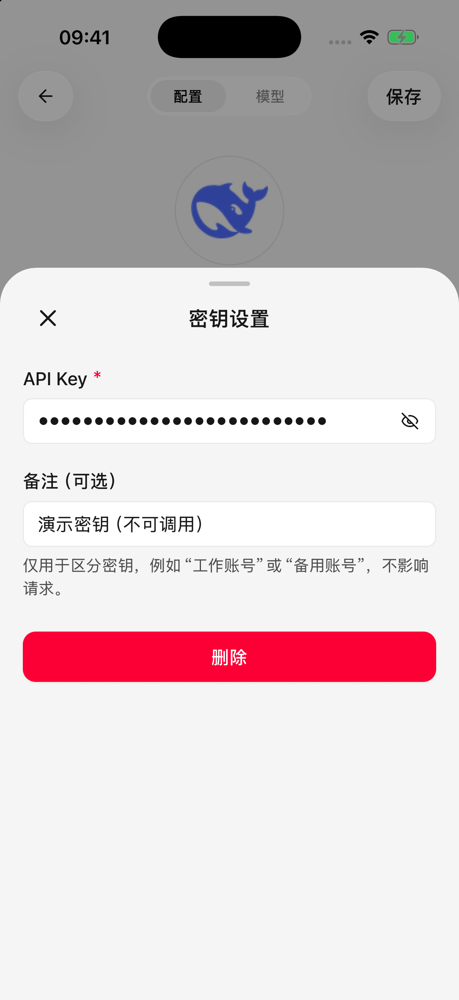

# 服务商与模型

服务商是提供 AI 服务的公司或平台，模型是你在这个平台上使用的具体 AI。同一个模型可能由不同平台提供，需要分别填写对应平台的账号凭据。

初次使用只需准备 **API Key（服务商发给你的调用密钥）**，添加一个模型并启用服务商。Cherry Studio 是客户端，不附带模型额度；能否调用及实际费用以服务商账户为准。

<figure data-mobile-shot="phone"><figcaption>
<strong>iPhone</strong> · 搜索内置服务商或创建自定义服务商
</figcaption></figure>
<figure data-mobile-shot="tablet"><figcaption>
<strong>iPad</strong> · 同一服务商目录的平板布局
</figcaption></figure>

## 添加内置服务商

1. 打开 **设置 → 模型服务**，点击添加按钮。
2. 搜索目标服务商，点击 **添加**。内置服务商已提供常用的连接配置。
3. 填写该平台的 API Key。除非平台另有说明，先保留预填地址和接口选项。
4. 保存配置，进入模型选择步骤。同步模型列表后，勾选需要添加的模型并确认；列表不可用时可以手动添加。
5. 完成配置后，回到模型服务列表查看该服务商的开关；若仍停用，打开开关，按提示补齐配置。出现在已启用分组后，再回到对话中选择模型。

已添加的服务商不必重复创建。点击原来的条目即可修改配置；暂时不使用时可以停用，之后再启用。

## 添加自定义服务商

适合使用列表中没有的平台，或平台给了你一个专用服务地址的情况。

1. 在添加服务商页面选择 **自定义服务商**，填写便于辨认的名称。
2. 按平台说明选择接口。OpenAI、Anthropic、Gemini 等选项表示连接方式，请选择平台声明支持的那一种。
3. 填写 **Base URL（应用连接该平台的基础地址）**和 API Key。
4. 查看页面显示的 **请求地址**，确认实际发往的平台正确，然后保存。
5. 同步模型，或填写平台提供的模型 ID 手动添加。回到模型服务列表，确认该服务商的开关已开启。

### Base URL 应该填什么？

填写服务商提供的基础地址，例如 `https://api.example.com/v1`，不要填写登录页或控制台首页，也不要直接粘贴以 `/chat/completions` 结尾的完整请求地址。应用会补上请求路径；重复填写会导致地址错误。页面识别出完整请求地址时，会提示改用基础地址。

少数平台要求地址后面**不再自动补版本号**。这种情况下可按平台的连接要求在基础地址末尾加 `#`，例如 `https://api.example.com#`，并核对页面的请求地址预览。不需要时不要添加。

如果平台支持多种接口，可以在配置中分别管理并选择默认接口。更改默认接口可能影响跟随它的已有模型，请留意页面提示；不清楚用途时保留原选项即可。

## 编辑服务商与管理多个密钥

打开服务商的 **配置** 页，可修改名称、地址和密钥。密钥可以添加备注，例如“个人账户”或“备用”；备注仅方便辨认，不影响服务商权限。

* 每个密钥单独添加，可分别启用、停用、修改或删除，不要把多个密钥粘贴进同一个输入框。
* 关闭某个密钥的编辑小窗后，改动仍在当前页面的草稿里。请点击页面的 **保存**，地址和密钥才会一起保存。
* 至少保留一个已启用且有效的密钥。全部停用时，服务商仍无法正常调用。
* 新增、替换或删除密钥后，如果离开页面时出现放弃修改提示，说明改动尚未保存。

支持密钥切换的对话请求，在尚未开始输出时遇到未授权或限流错误，可以尝试其他已启用密钥。这不代表所有错误、图片生成或模型列表请求都会自动重试，也不会增加账户本身的额度。

<figure data-mobile-shot="phone"><figcaption>
<strong>iPhone</strong> · 修改密钥状态后，点击页面右上角保存；图中为不可调用的演示密钥
</figcaption></figure>
<figure data-mobile-shot="phone"><figcaption>
<strong>iPhone</strong> · 密钥备注只用来区分用途，关闭小窗后仍需保存服务商配置
</figcaption></figure>

## 检查连接

先保存当前配置，再打开 **模型检查**，选择要检查的模型并执行检测。检查页面会显示请求地址和结果。

检查成功表示这次配置与所选模型可以连通，并不代表所有模型都能使用。检测也不会替你启用服务商；回到模型服务列表确认启用状态。

## 从哪里选择模型？

对话中的模型选择器用于切换当前智能体使用的模型。服务商需要启用，模型也需要处于可用状态。可搜索模型，并使用 **全部、免费、视觉** 筛选缩小范围。

“视觉”表示已记录支持图片输入，“免费”来自模型价格信息。实际能力、免费范围和额度仍以平台为准。列表突然变少时，先把筛选改回“全部”。

在 **设置 → 默认模型** 中可以设置默认模型和绘图模型，选择或清除后立即保存。已有智能体保留自己的模型选择；默认模型并不会一次改掉所有智能体。

## 接下来阅读

* [添加、编辑与管理模型](model-management.md)：名称、能力、上下文、价格和删除规则。
* [模型信息与列表更新](model-updates.md)：远端更新会改变什么，什么时候需要手动同步。
* [从电脑导入配置](desktop-sync.md)：已有桌面版配置时，免去重复填写。
* [常见问题](troubleshooting.md)：按错误提示排查连接。
