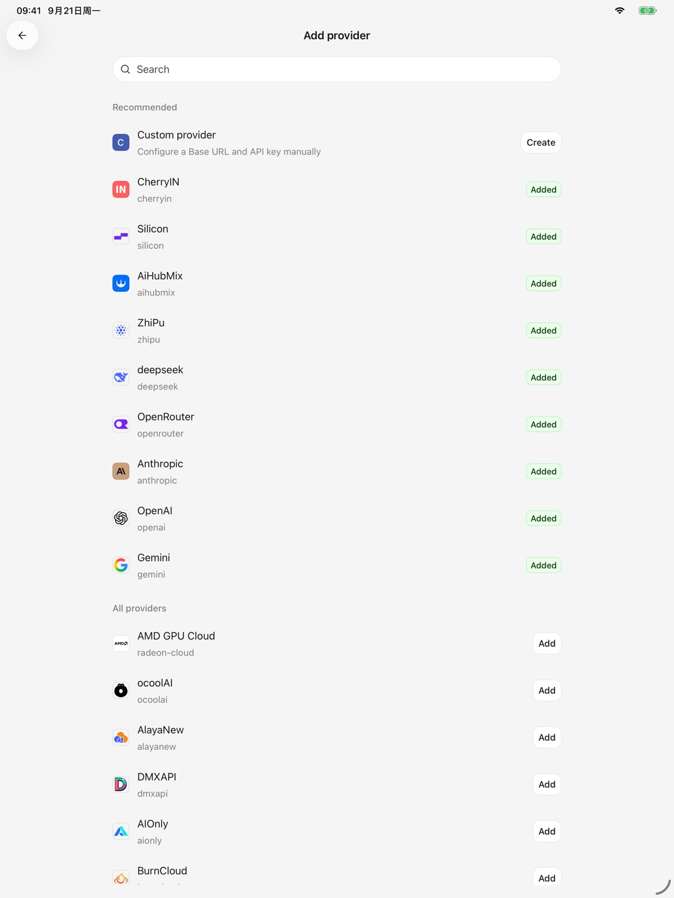
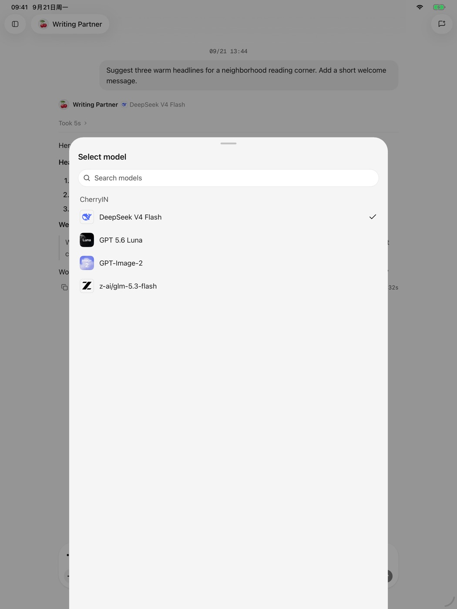

# 服务商与模型

移动版通过你配置的服务商调用模型。Cherry Studio 负责客户端体验，不代理模型额度，也不会改变服务商自己的计费与数据规则。

<figure data-mobile-shot="phone"><figcaption>
<strong>iPhone</strong> · 搜索内置服务商或创建自定义服务商
</figcaption></figure>
<figure data-mobile-shot="tablet"><figcaption>
<strong>iPad</strong> · 同一服务商目录的平板布局
</figcaption></figure>

## 添加内置服务商

1. 打开模型服务设置并选择 **添加服务商**。
2. 搜索并选择目标服务商。
3. 填写 API Key；如果页面提供额外字段，再按服务商要求填写。
4. 获取或添加模型，并启用需要使用的模型。

## 使用自定义服务商

如果服务兼容应用支持的接口规范，可以选择 **自定义服务商**，填写名称、Base URL、API Key 和模型 ID。Base URL 应使用服务商文档给出的 API 地址，而不是控制台首页地址。

## 选择模型

在对话或智能体页面打开模型选择器，即可从已启用的模型中切换。模型是否支持图片理解、工具调用或图片生成，取决于服务商和具体模型。

<figure data-mobile-shot="phone"><figcaption>
<strong>iPhone</strong> · 按服务商浏览已经启用的模型
</figcaption></figure>
<figure data-mobile-shot="tablet"><figcaption>
<strong>iPad</strong> · 在平板端查看模型能力与上下文信息
</figcaption></figure>

## 常见连接错误

* **401 / 未授权**：检查 API Key 是否完整、是否过期，以及账户是否有权限。
* **404 / 模型不存在**：核对 Base URL 与模型 ID，避免把展示名称当成模型 ID。
* **429 / 请求过多**：等待限流恢复，或检查服务商余额与速率限制。
* **超时或网络失败**：确认当前网络可以访问服务商，并检查代理设置。
