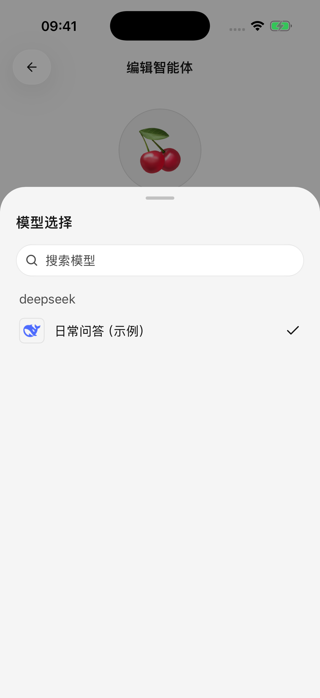

# 快速开始

先让一个模型成功回答一条消息，再按需要添加更多功能。

## 1. 选择配置方式

* **电脑已经配置好 Cherry Studio**：使用[从电脑导入配置](desktop-sync.md)，选择要带到手机的服务商和模型。导入成功后可直接跳到第 4 步。
* **直接在手机配置**：在首次使用向导中选择服务商，或打开 **设置 → 模型服务 → 添加服务商**，然后按第 2、3 步操作。

内置服务商提供常用的连接设置。列表里没有你的平台时，可以创建自定义服务商。

## 2. 填写并保存密钥

填写平台提供的 **API Key（调用模型服务的密钥）**。使用自定义服务商时，还需要按平台说明填写基础地址和选择连接方式。

点击保存或按向导继续。不要把平台登录密码当作 API Key；平台的普通聊天会员也不一定包含开放接口额度，请在对应平台确认。

## 3. 添加模型并启用服务商

同步模型列表，选一个常用文字模型并确认。列表获取失败时，可以复制平台提供的准确模型 ID 手动添加。

首次下载模型资料可能需要等待。完成后确认服务商已经启用，从对话顶部打开智能体编辑页，再选择已启用的模型。完整步骤见[服务商与模型](providers-and-models.md)。

<figure data-mobile-shot="phone"><figcaption>
<strong>步骤 1</strong> · 选择内置或自定义服务商，点击查看原图
</figcaption></figure>
<figure data-mobile-shot="phone"><figcaption>
<strong>步骤 3</strong> · 在智能体编辑页选择已启用模型，点击查看原图
</figcaption></figure>

## 4. 发送第一条消息

使用初始的 Cherry 智能体，选择刚配置的模型，发送“用三句话介绍你能帮我做什么”。收到回复就说明基础配置已完成。

智能体可以理解为一套可重复使用的“名称、任务说明和模型”设置；同一个智能体可以开启多段不同话题的对话。

若没有回复，先用不带附件的短消息重试，再按[常见问题](troubleshooting.md)检查密钥、模型和网络。

## 接下来可以试什么？

| 需求 | 从这里开始 |
| --- | --- |
| 让 AI 看照片、总结文件 | [对话与文件](chat-and-files.md) |
| 为写作、翻译等任务保存不同要求 | [智能体与工具](agents-and-tools.md) |
| 搜索网页并核对来源 | [联网搜索与网页阅读](web-search.md) |
| 使用飞书、Notion 等已有账号 | [插件与外部工具](plugins.md) |
| 生成图片、用参考图继续修改 | [图片生成](image-generation.md) |
| 把几条回答整理成图片或文件 | [分享与导出](sharing-and-export.md) |
