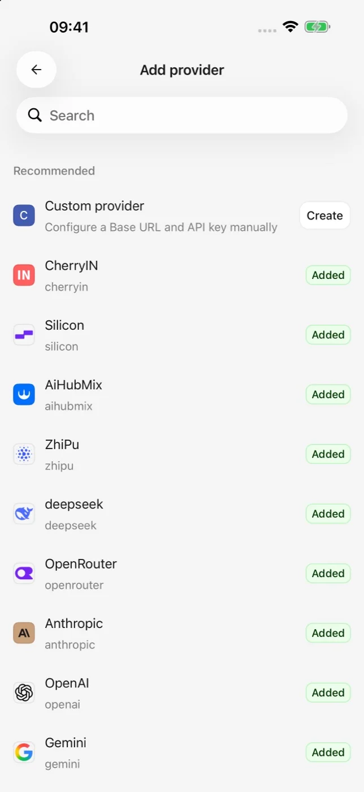
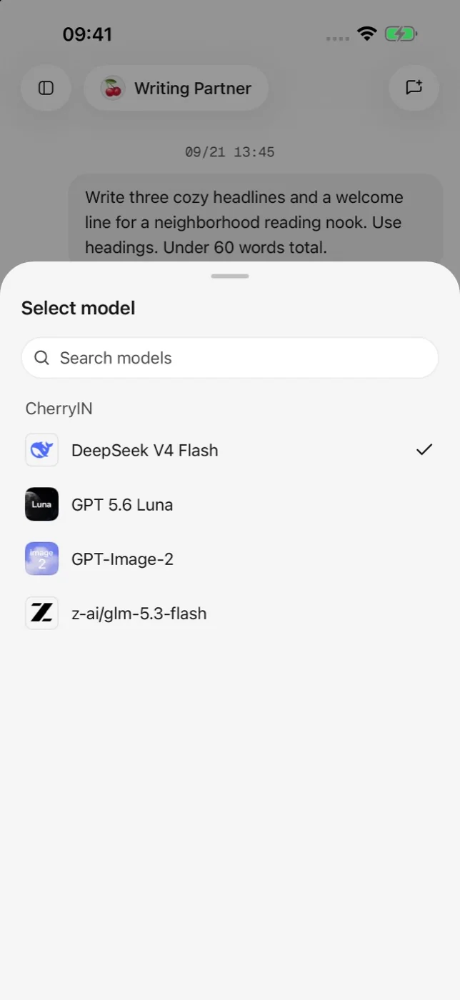

# 快速开始

完成下面四步，即可发送第一条消息。

## 1. 添加服务商

打开应用设置中的模型服务入口，选择一个内置服务商。使用兼容接口时，也可以创建自定义服务商并填写 Base URL。

## 2. 填写凭据

填写该服务商提供的 API Key，并按页面提示保存或测试连接。不要把 API Key 发送给他人，也不要粘贴到公开对话、截图或问题反馈中。

## 3. 添加模型

从服务商获取或手动添加模型，将至少一个可用模型启用。不同模型支持的对话、视觉、工具或图片生成能力可能不同。

<figure data-mobile-shot="phone"><figcaption>
<strong>步骤 1</strong> · 选择内置或自定义服务商，点击查看原图
</figcaption></figure>
<figure data-mobile-shot="phone"><figcaption>
<strong>步骤 3</strong> · 在对话中选择已启用模型，点击查看原图
</figcaption></figure>

## 4. 发送消息

返回对话页，打开默认助手或新建助手，选择模型并发送一条简短消息。能够正常收到回复，表示基础配置已经完成。

下一步可以阅读[服务商与模型](providers-and-models.md)，或了解[对话与文件](chat-and-files.md)。
