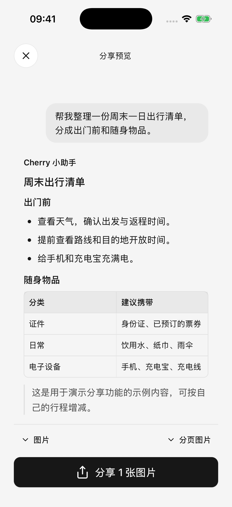
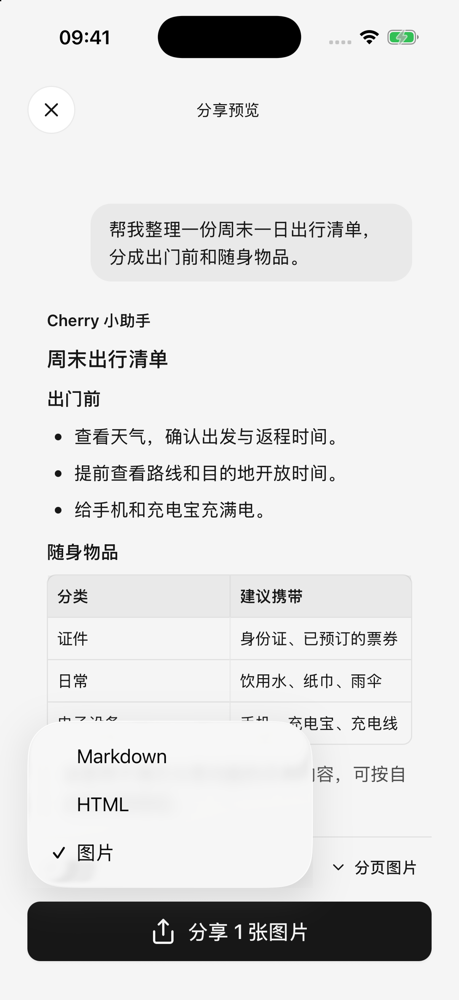

# 分享与导出

可以只分享一条回答，也可以把多轮问答整理成图片、网页文件或可继续编辑的文本文件。分享前先选择内容，再看预览，最后选择接收应用。

## 分享一条或多条消息

1. 使用回答操作区的分享按钮，或消息菜单中的分享入口。
2. 在消息选择页勾选要分享的内容，最初会选中刚才那条消息。
3. 点击确认，进入全屏预览。
4. 按需要调整格式、图片布局，以及是否包含思考内容。
5. 点击分享，在系统面板选择保存位置或接收应用。

只会导出**选中的消息**，不会自动附上未选择的问题。想让接收者理解上下文，请同时勾选相关问题和回答。选择顺序不影响输出，最终按对话时间排序。

一次最多选择 128 条消息，正在生成的消息不能选择。选择页里的文字只是简短摘要，实际导出使用所选消息的完整内容，并按格式处理代码、图片等部分。

<figure data-mobile-shot="phone"><figcaption>
<strong>iPhone</strong> · 所选问题与回答一起预览；这里使用演示对话
</figcaption></figure>
<figure data-mobile-shot="phone"><figcaption>
<strong>iPhone</strong> · 在预览中选择图片、HTML 或 Markdown
</figcaption></figure>

## 选哪种格式？

| 格式 | 适合用途 | 需要知道 |
| --- | --- | --- |
| 图片（PNG） | 发到聊天、便于直接阅读 | 默认分页输出；代码块只显示开头的有限区域，需要完整代码时选其他格式 |
| HTML（可在浏览器打开的网页文件） | 保留较丰富排版、完整代码和可展开内容 | 对方需要用浏览器或支持的应用打开 |
| Markdown（方便继续编辑的纯文本排版文件） | 保存原文、代码与表格，继续整理笔记 | 显示效果受接收软件支持程度影响 |

默认图片模式会把长内容分成按顺序排列的多张图片，也可以切换为单张长图。很长的单图对设备和接收应用要求更高，打不开时优先使用分页图片、HTML 或 Markdown。

图片和 HTML 中的来源会简化展示。需要仔细核对引用时，可以返回对话打开原始来源；不要把图片预览当作完整的资料包。

## 选择页与预览的格式提示不一致怎么办？

部分版本的消息选择页仍显示“多选仅支持 HTML 和 Markdown”的旧提示。当前预览也支持把多条消息生成图片，以进入预览后实际可选的格式为准；图片准备失败时，可使用 HTML 或 Markdown。

## 思考和工具过程会一起发出去吗？

默认不包含。开启 **包含思考内容** 后，会加入可见的思考、过程文字及可读的工具名称，不会把原始工具请求或诊断数据一并导出。

HTML 中相关内容可以展开阅读，图片会展开已选择包含的过程。分享给他人前，仍请在预览中检查是否包含不需要的中间内容。

## Markdown 里的图片能离线看吗？

本地和生成的 PNG、JPEG 图片会嵌入导出的 Markdown 文件，因此文件可能变大。有些 Markdown 阅读器会限制这类嵌入图片，导致看不到；可换用 HTML 或图片格式。

本地 GIF、WebP 等其他格式若无法嵌入，会显示图片不可用说明；普通附件也可能只保留文件名称或说明，不会把附件原文件全部打包进去。需要完整保留时，另外分享原文件。

原本来自外部网址的图片仍保留远程链接，不会因此全部变为离线附件。

## 图片导出失败怎么办？

应用会在图片转换失败时尝试准备 HTML；HTML 也无法预览时保留 Markdown，并提示实际可分享的格式。查看格式名称再分享，避免把不同格式的文件误当作图片。

退到后台或主动取消会中断转换，不会因此自动改换格式。长内容建议保持应用在前台，必要时减少选择的消息或使用分页图片。

关闭预览可回到选择页继续调整；关闭系统分享面板会返回对话。**打开过系统分享面板不代表接收应用已经成功保存或发送。**

## 去掉分享水印

打开 **设置 → 通用设置 → 分享水印**，关闭后再导出。设置默认开启，影响后续对话、图片及相关文件导出；已经保存或发出的文件不会自动改变。

## 文件库与原文件分享

从侧边栏进入 **文件**，查看导入的附件和已保存的生成、导出文件。支持的图片、文本、Markdown 和 HTML 可以在应用中预览，其他类型可交给系统或其他应用打开。

* 图片预览支持缩放，以及分享、保存到相册等操作。
* 大文本的预览可能只显示一部分，复制也以显示的内容为准；**分享原文件会导出完整原文件**。
* HTML 预览失败时可以查看源码，或分享给其他应用打开。
* 删除文件前确认是否还需在原对话中使用，必要时先另存。已保存到文件库的导出文件，不会仅因取消系统分享就自动删除。

## 将 HTML 文件转为图片或幻灯片

打开可完整预览的 HTML 文件，可选择 **分享为图片** 或 **分享为 PPT**。等待转换进度完成后，在系统分享面板保存。

PPTX（可用演示软件打开的幻灯片文件）中的页面是图片，适合保留页面外观，**不是可逐段编辑的文字、表格和图形**。需要继续改内容时，保留原始文件。

卸载或清理应用前，把文件保存到 Cherry Studio 之外的位置或其他设备，并确认能打开；仅留在应用文件库中仍可能随应用数据丢失。

导出方便保存和分享部分成果，不等同于可恢复整个应用的备份。电脑导入配置的范围见[从电脑导入配置](desktop-sync.md)。

## 分享生成的文件或演示稿

要分享已保存的文件，打开文件卡片，再使用右上角更多菜单。步骤见[生成与修改文件](file-generation.md)。HTML 文件还提供[分享为图片和分享为 PPT](html-export.md)；得到的 PPT 保存页面画面，文字不能逐项编辑。
