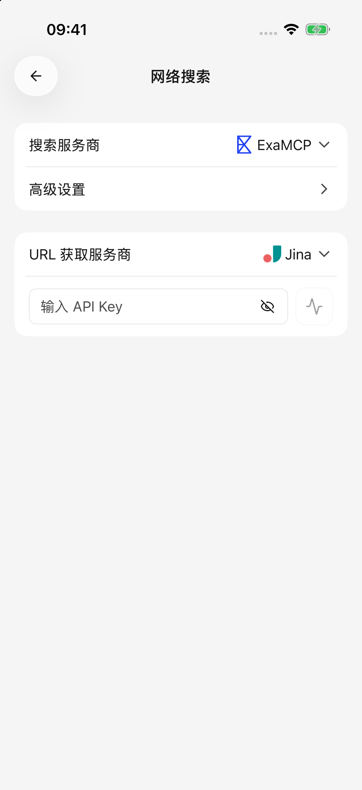

# 联网搜索与网页阅读

想了解最新信息，或让 AI 阅读一个网页时，可以使用联网工具。搜索负责“找到相关页面”，网页阅读负责“取出指定链接里的正文”，两者可以使用不同服务。

## 先试一次搜索

1. 选择支持工具调用的文字模型，并确认当前智能体编辑页的 **网络搜索** 已开启。
2. 发送“搜索一下这个项目最近发布了什么，并附上来源”，或“阅读这个链接并总结要点：[网页链接]”。
3. 在回答中查看搜索过程与来源，点击来源打开原网页。

新安装通常已预选 ExaMCP 搜索和 Jina 网页阅读，不要求先填写个人密钥。已有用户保留自己的选择。默认服务也受网络和服务自身限制影响，失败时可到设置中检查或更换。

当前输入框没有独立的联网搜索开关；在智能体编辑页开启 **网络搜索**、配置好服务后，直接在消息中要求搜索即可。是否真正使用了搜索，应看回答中的工具过程和来源，不能只看模型说“我查到了”。

## 更换搜索或网页阅读服务

打开 **设置 → 网络搜索**：

* **搜索服务商**：根据关键词寻找资料。
* **URL 获取服务商**：URL 就是网页链接，这里决定由谁读取网页正文。

1. 选择所需服务。
2. 页面要求密钥或地址时，填写该搜索服务提供的内容。
3. 使用 **检查** 确认配置，再回到对话发送新的问题。

选择服务商会立即保存；密钥输入结束、离开输入框时提交。高级设置中的选项和有效数字也会在选择或结束编辑后保存，没有单独的页面保存按钮。遇到错误提示时先修正再试。

模型服务商密钥和搜索服务密钥通常不是一回事。使用智谱搜索时，页面会引导你到模型服务中配置智谱密钥；其他服务按各自表单填写。

<figure data-mobile-shot="phone"><figcaption>
<strong>iPhone</strong> · 搜索与网页阅读分别配置；图中为默认服务
</figcaption></figure>

## 高级设置需要改吗？

初次使用保留默认即可。搜索效果有明确问题时，再调整：

| 设置 | 作用 | 取舍 |
| --- | --- | --- |
| 搜索结果个数 | 一次返回多少条结果 | 更多结果可能提供不同视角，也会增加需要处理的材料 |
| 搜索结果压缩 | 决定是否截断送给模型的搜索正文 | 截断可减少用量；不压缩不表示模型能读无限长内容 |
| 搜索正文总量 | 限制保留下来的正文总长度 | 限制较小时，更容易遗漏网页后面的信息 |

网页阅读也有自己的内容上限，长页面可能只读取一部分。需要逐项核对时，打开原网页查看；反复读取同一链接不会自动接着读取后半部分。

## 为什么模型能聊天，却不能搜索？

对话模型、搜索服务和网页阅读服务是分别连接的。对话可用不代表另外两个服务的网络和凭据正常。

按这个顺序排查：

1. 模型是否支持工具调用，当前智能体的 **网络搜索** 是否开启。
2. 网络搜索设置中是否选了可用服务，检查能否通过。
3. 问题是否需要搜索，是否明确给出了关键词或链接。
4. 查看工具错误：网络、密钥、账户权限、额度或网页访问限制分别处理。

某次搜索或网页读取失败后，这轮回答会停止新的联网尝试，尽量使用已取得的资料并说明缺失信息，不会悄悄换成另一个搜索服务。修复问题后发送一条新消息再试。

## 为什么无法读取登录后的网页？

网页阅读服务从自己的网络访问链接，不会自动带上你手机浏览器中的登录状态。需要登录、企业权限或有访问限制的页面，可能无法读取。

飞书、Notion 等账号里的资料，优先使用[对应插件](plugins.md)。也可以把自己有权使用的内容导出为文件，按[对话与文件](chat-and-files.md)中的步骤添加。

## 数据会发给谁？

搜索关键词和待读取的链接会发给所选搜索或阅读服务，得到的资料会参与模型回答。不要在搜索关键词里加入密钥或不需要公开检索的内部内容。有关其他数据用途，见[数据、隐私与权限](data-privacy.md)。
